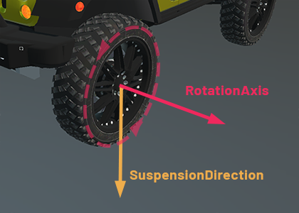
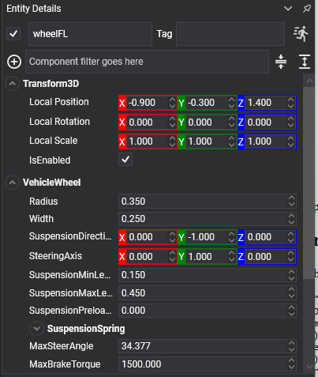

# Vehicle Wheel



`VehicleWheel` is one wheel of a [vehicle](index.md). It goes on a **child entity** of the chassis, and the entity's local position is where the wheel is mounted.

A wheel is **not a body and has no collider**. It is a probe: a ray or a shape cast sent down the suspension direction, looking for the ground, with a spring between what it found and the chassis. That is what makes a vehicle stable at speed where four bolted-on bodies would shake themselves apart.

The controller finds its wheels by walking its descendants, and the order it finds them in is the index its properties refer to.

## Wheel Properties



| Property | Default | Description |
| --- | --- | --- |
| **Radius** | 0.35 | The wheel's radius, in metres. It decides where the chassis rides and how far one turn carries the vehicle. |
| **Width** | 0.25 | Its width. Used by the sphere and cylinder collision testers. |
| **MaxSteerAngle** | 0 | The furthest this wheel steers, in radians. **Zero means it does not steer**, which is what a rear wheel wants. |
| **SteeringAxis** | 0,1,0 | The axis it steers about, in the chassis's space. |
| **Inertia** | 0.9 | The wheel's rotational inertia. Higher takes longer to spin up and longer to lock under braking. |
| **AngularDamping** | 0.2 | How quickly a free-spinning wheel slows down. |
| **UpdateEntityTransform** | true | Whether the controller writes the wheel's pose back onto its entity, so the drawn wheel steers and spins. |

## Suspension

| Property | Default | Description |
| --- | --- | --- |
| **SuspensionDirection** | 0,-1,0 | Which way the suspension travels, in the chassis's space. |
| **SuspensionMinLength** | 0.15 | Fully compressed. |
| **SuspensionMaxLength** | 0.45 | Fully extended. The difference between the two is the wheel's travel. |
| **SuspensionPreloadLength** | 0 | How much the spring is already compressed at rest. |
| **SuspensionSpring** | 1.5 Hz, damping 0.5 | The spring itself. See [Springs](../constraints/index.md#springs). |

The spring's **frequency** is how many times a second the vehicle wants to bounce, and it is the number to reach for first: around 1 Hz is a soft saloon, 2 Hz is sporty, 3 Hz and above is a racing car. **Damping** near 0.5 lets it settle in a bounce or two; near 1 it settles dead.

```csharp
// A stiff, well-damped car: it stays flat in corners and does not float over crests.
wheel.SuspensionSpring = SpringParameters.FromFrequency(2.4f, 0.7f);
wheel.SuspensionMinLength = 0.1f;
wheel.SuspensionMaxLength = 0.3f;
```

## Braking

| Property | Default | Description |
| --- | --- | --- |
| **MaxBrakeTorque** | 1500 | The strongest braking torque this wheel can apply, in newton-metres. |
| **MaxHandBrakeTorque** | 0 | The same for the hand brake. Zero on the front wheels and high on the rear is what makes a hand brake turn the car. |

## Grip

| Property | Default | Description |
| --- | --- | --- |
| **LongitudinalFrictionScale** | 1 | Scales grip along the wheel's rolling direction: acceleration and braking. |
| **LateralFrictionScale** | 1 | Scales grip sideways: cornering. |

These two are the handling dials. More lateral grip at the rear than the front gives understeer — the car pushes wide; more at the front gives oversteer — the back steps out.

> [!NOTE]
> On a wheeled vehicle the two scales reshape the tyre's friction **curves** — grip against slip. On a [tracked](tracked_vehicles.md) one a track's grip is a single number rather than a curve, so the same two properties simply multiply it. Either way, `1` leaves the simulation's own model untouched.

## Telemetry

Read-only, and updated every step. Everything a HUD, a tyre-smoke effect or a suspension animation needs:

| Property | Description |
| --- | --- |
| **HasContact** | Whether the wheel is touching anything. |
| **SuspensionLength** | How far the suspension is currently extended. |
| **SteerAngle** | The angle it is currently steered to. |
| **AngularVelocity** | How fast it is spinning. |
| **ContactNormal** | The normal of the surface under it. |
| **ContactPosition** | Where it touches. |
| **LongitudinalSlip** | How much it is spinning up or locking, from 0 to 1. |
| **LateralSlip** | How much it is sliding sideways. |
| **CombinedLongitudinalFriction** | The grip actually available along the rolling direction. |
| **CombinedLateralFriction** | And sideways. |
| **BrakeImpulse** | The braking impulse applied last step. |
| **Index** | This wheel's index on its controller, or `-1` if it has not been assigned. |

> [!NOTE]
> The five tyre values — the two slips and the two frictions, plus `BrakeImpulse` — are only meaningful on a **wheeled** vehicle. On a [tracked](tracked_vehicles.md) one they read zero, because a track's grip is not modelled per wheel.

```csharp
public class TyreSmoke : Behavior
{
    [BindComponent]
    private VehicleWheel wheel = null;

    protected override void Update(TimeSpan gameTime)
    {
        // Slip, not speed: a wheel spinning up on the spot and a wheel sliding sideways in a corner
        // both smoke, and neither of them is about how fast the car is going.
        float slip = Math.Max(Math.Abs(this.wheel.LongitudinalSlip), Math.Abs(this.wheel.LateralSlip));

        this.emitter.IsEnabled = this.wheel.HasContact && slip > 0.35f;
        this.emitter.Position = this.wheel.ContactPosition;
    }
}
```

> [!TIP]
> Leave `UpdateEntityTransform` on and make the wheel's visual a **child** of the wheel entity, not the wheel entity itself. The controller owns that entity's pose, so any rotation authored on it — laying a `CylinderMesh` on its side, for instance — is overwritten every step.
