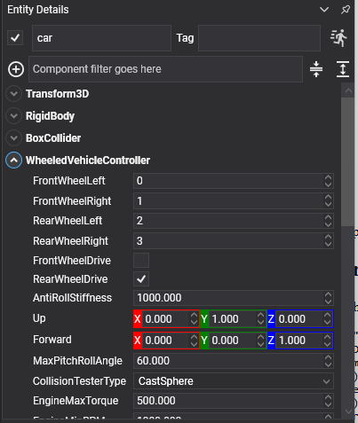

# Wheeled Vehicles

<video autoplay loop muted playsinline width="100%" height="auto">
  <source src="images/vehicle_drive.mp4" type="video/mp4">
</video>

`WheeledVehicleController` drives anything with steered wheels: cars, trucks, buggies, motorbikes. It sits on the chassis entity beside the chassis's [`RigidBody`](../physics_bodies/rigid_body.md), and drives the [`VehicleWheel`](vehicle_wheel.md) components on its child entities.

Everything in [Vehicles](index.md) about the engine, the gearbox and the collision testers applies here. This page is what a wheeled vehicle adds on top.

## Wheel Assignment



The controller finds its wheels by walking its descendants, and the order it finds them in gives each one its index. These four properties say which index is which corner:

| Property | Default | Description |
| --- | --- | --- |
| **FrontWheelLeft** | 0 | The index of the front left wheel. Negative means there is none. |
| **FrontWheelRight** | 1 | The front right. |
| **RearWheelLeft** | 2 | The rear left. |
| **RearWheelRight** | 3 | The rear right. |
| **FrontWheelDrive** | true | Whether the front axle receives engine torque. |
| **RearWheelDrive** | true | Whether the rear axle does. |
| **AntiRollStiffness** | 0 | An anti-roll bar across each axle, in newtons per metre. It ties the two sides together so the body leans less in a corner. |

Leave both drive flags on for four-wheel drive; turn one off for a front- or rear-wheel-drive car. A three-wheeler sets one of the four indices to a negative number.

| Property | Description |
| --- | --- |
| **ForwardInput** | *Read-only.* The throttle the controller is currently acting on. |
| **RightInput** | *Read-only.* The steering it is currently acting on. |

## Driving the Vehicle

Everything the driver does goes through one call, once per frame:

```csharp
vehicle.SetDriverInput(forward, right, brake, handBrake);
```

| Argument | Range | Meaning |
| --- | --- | --- |
| **forward** | -1 to 1 | Throttle. Negative is reverse: with an automatic gearbox, asking for negative throttle while stopped selects reverse. |
| **right** | -1 to 1 | Steering, from full left to full right. |
| **brake** | 0 to 1 | The brake pedal. |
| **handBrake** | 0 to 1 | The hand brake, which acts on whichever wheels have a `MaxHandBrakeTorque`. |

```csharp
public class CarInput : Behavior
{
    [BindComponent]
    private WheeledVehicleController vehicle = null;

    protected override void Update(TimeSpan gameTime)
    {
        KeyboardDispatcher keyboard = this.Managers.RenderManager.ActiveCamera3D?.Display?.KeyboardDispatcher;

        if (keyboard == null)
        {
            return;
        }

        float forward = (keyboard.IsKeyDown(Keys.W) ? 1f : 0f) - (keyboard.IsKeyDown(Keys.S) ? 1f : 0f);
        float right = (keyboard.IsKeyDown(Keys.D) ? 1f : 0f) - (keyboard.IsKeyDown(Keys.A) ? 1f : 0f);
        float handBrake = keyboard.IsKeyDown(Keys.LeftShift) ? 1f : 0f;

        // S is the brake while rolling forwards and reverse once stopped, which is how a car with an
        // automatic gearbox behaves and saves the scene needing a separate reverse key.
        float brake = 0f;

        if (forward < 0f && this.vehicle.ForwardInput > 0.1f)
        {
            brake = 1f;
            forward = 0f;
        }

        this.vehicle.SetDriverInput(forward, right, brake, handBrake);
    }
}
```

<video autoplay loop muted playsinline width="100%" height="auto">
  <source src="images/vehicle_handbrake.mp4" type="video/mp4">
</video>

*The hand brake locks the rear wheels, which is what lets the back end come round.*

## Building a Car, Step by Step


### 1. The chassis

One dynamic body, one or two colliders, and a low centre of mass:

```csharp
Entity car = new Entity("car")
    .AddComponent(new Transform3D() { Position = start })
    .AddComponent(new RigidBody()
    {
        Mass = 1200f,
        CenterOfMassOffset = new Vector3(0f, -0.4f, 0f),
        Friction = 0.5f,
    })
    .AddComponent(new BoxCollider() { Size = new Vector3(1.8f, 0.8f, 4f) });
```

> [!IMPORTANT]
> `CenterOfMassOffset` matters more than anything else here. Left at the middle of the collider, a car rolls over in the first corner it takes at speed. Real cars carry their mass low, and the simulation needs to be told.

### 2. The controller

```csharp
car.AddComponent(new WheeledVehicleController()
{
    FrontWheelLeft = 0,
    FrontWheelRight = 1,
    RearWheelLeft = 2,
    RearWheelRight = 3,
    FrontWheelDrive = false,
    RearWheelDrive = true,
    EngineMaxTorque = 500f,
    AntiRollStiffness = 1000f,
    GearRatios = new[] { 2.66f, 1.78f, 1.3f, 1.0f, 0.74f },
    ReverseGearRatios = new[] { -2.9f },
});
```

### 3. The wheels

Four children, **in index order**. Each one's local position is where the wheel is mounted on the chassis:

```csharp
var layout = new[]
{
    ("wheelFL", new Vector3(-0.9f, -0.3f, 1.4f), 0.6f),
    ("wheelFR", new Vector3(0.9f, -0.3f, 1.4f), 0.6f),
    ("wheelRL", new Vector3(-0.9f, -0.3f, -1.4f), 0f),
    ("wheelRR", new Vector3(0.9f, -0.3f, -1.4f), 0f),
};

foreach (var (name, offset, steer) in layout)
{
    Entity wheel = new Entity(name)
        .AddComponent(new Transform3D() { LocalPosition = offset })
        .AddComponent(new VehicleWheel()
        {
            Radius = 0.35f,
            Width = 0.25f,
            MaxSteerAngle = steer,

            // The hand brake acts on the rear only, which is what makes the back end step out.
            MaxHandBrakeTorque = steer == 0f ? 4000f : 0f,
        });

    // The tyre is a child of the wheel, turned on its side, because the wheel entity is placed and
    // spun by the controller and must not carry a rotation of its own.
    wheel.AddChild(new Entity("tyre")
        .AddComponent(new Transform3D() { LocalOrientation = Quaternion.CreateFromAxisAngle(Vector3.UnitZ, MathHelper.PiOver2) })
        .AddComponent(new MaterialComponent() { Material = tyreMaterial })
        .AddComponent(new CylinderMesh() { Diameter = 0.7f, Height = 0.25f })
        .AddComponent(new MeshRenderer()));

    car.AddChild(wheel);
}
```

### 4. The body shell

The chassis entity itself must stay unscaled, because its scale would reach the wheels that the controller places itself, so the drawn body goes on a child of its own:

```csharp
car.AddChild(new Entity("shell")
    .AddComponent(new Transform3D() { LocalScale = new Vector3(1.8f, 0.8f, 4f) })
    .AddComponent(new MaterialComponent() { Material = bodyMaterial })
    .AddComponent(new CubeMesh() { Size = 1f })
    .AddComponent(new MeshRenderer()));
```

> [!TIP]
> A car that will not turn usually has too little `MaxSteerAngle` or too much grip at the back; one that spins on every corner has too much steering or too little. `LateralFrictionScale` on the rear wheels is the dial for that, and it is on [`VehicleWheel`](vehicle_wheel.md).
