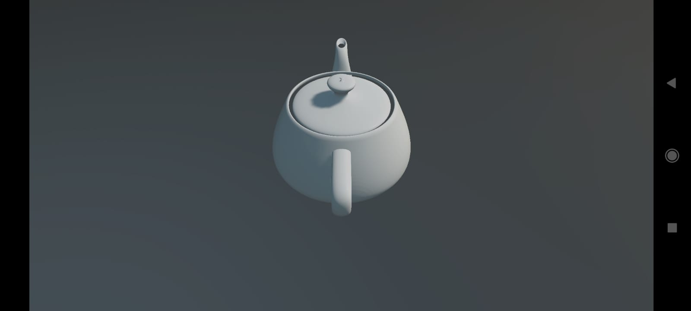
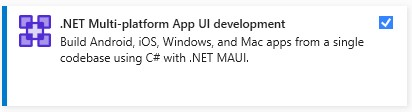
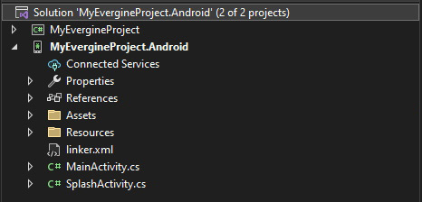

# Android

---



Evergine runs on Android through **.NET for Android** (`net10.0-android`), renders with **Vulkan** and plays audio with **OpenAL**. Three templates target Android: a phone and tablet launcher, and two OpenXR launchers for the Meta Quest and Pico standalone headsets. All three share your application project with the Windows launcher, so the scene you edit in Evergine Studio is the one that runs on the device.

## Templates

| Template | Profile | Minimum Android version | Extra packages | Entry activity |
|----------|---------|-------------------------|----------------|----------------|
| Android | `Android` | API 21 (`SupportedOSPlatformVersion` 21) | None | `SplashActivity`, which opens `MainActivity` |
| Android Meta Quest (OpenXR) | `Quest` | API 23 | `Evergine.OpenXR`, `Evergine.OpenXR.Natives.Quest` | `MainActivity` |
| Android Pico (OpenXR) | `Pico` | API 23 | `Evergine.OpenXR`, `Evergine.OpenXR.Natives.Pico` | `MainActivity` |

Every Android launcher references `Evergine.Android` (window system), `Evergine.Vulkan` (graphics), `Evergine.OpenAL` (audio), `Evergine.Targets` and `Evergine.Targets.Android` (asset export), and the native Bullet library `Evergine.LibBulletc.Natives`.

> [!IMPORTANT]
> The project builds for API 21, but Vulkan is only part of Android from **Android 7.0 (API 24)**, and it also needs a GPU driver that exposes it. On older devices or on devices without Vulkan, the application installs but cannot create its graphics device. The Quest and Pico manifests declare `android.hardware.vulkan.level` and `android.hardware.vulkan.compute` as required features so that stores filter out unsupported hardware.

Add Android to a project when you create it in Evergine Launcher, or later from **Settings > Project Settings** in Evergine Studio (see [Manage profiles](../../evergine_studio/settings/project_profiles.md)).

## Prerequisites

* The **.NET 10 SDK** with the **Android workload**:

  ```powershell
  dotnet workload install android
  ```

* The Android SDK and a Java JDK. The easiest way to get both is the **.NET Multi-platform App UI development** workload in the Visual Studio 2026 installer, which also installs the Android workload and an emulator:

  

  Without Visual Studio, follow Microsoft's [.NET for Android installation guide](https://learn.microsoft.com/en-us/dotnet/android/getting-started/installation/).

## Project structure

Adding the Android profile creates a solution with your application project and one launcher project, `<Project>.Android`:



| File | Purpose |
|------|---------|
| `MainActivity.cs` | Creates the application, the surface, the Vulkan context and the audio device, and runs the loop. |
| `SplashActivity.cs` | Launcher activity of the phone template. Shows the splash theme, then starts `MainActivity` with a fade. |
| `Resources/layout/Main.axml` | A full-screen `RelativeLayout` with the id `evergineContainer`. The Evergine surface is added to it at runtime, so you can place native Android views on top. |
| `AndroidManifest.xml` | Application manifest. The XR templates add the headset metadata, required features and permissions here. |
| `linker.xml` | Types the trimmer must keep because Evergine creates them by reflection: asset loaders and importers, binding attributes and the default services. |
| `<Project>.Android.csproj` | Target framework, minimum API and package references. |

The launcher project file of the phone template:

```xml
<Project Sdk="Microsoft.NET.Sdk">
  <PropertyGroup>
    <TargetFramework>net10.0-android</TargetFramework>
    <SupportedOSPlatformVersion>21</SupportedOSPlatformVersion>
    <OutputType>Exe</OutputType>
    <Nullable>enable</Nullable>
    <ImplicitUsings>enable</ImplicitUsings>
    <ApplicationId>com.companyname.MyProject.Android</ApplicationId>
    <ApplicationVersion>1</ApplicationVersion>
    <ApplicationDisplayVersion>1.0</ApplicationDisplayVersion>
  </PropertyGroup>
  <ItemGroup>
    <PackageReference Include="Evergine.Android" Version="..." />
    <PackageReference Include="Evergine.Vulkan" Version="..." />
    <PackageReference Include="Evergine.OpenAL" Version="..." />
    <PackageReference Include="Evergine.Targets" Version="..." />
    <PackageReference Include="Evergine.Targets.Android" Version="..." />
    <PackageReference Include="Evergine.LibBulletc.Natives" Version="..." />
  </ItemGroup>
  <ItemGroup>
    <ProjectReference Include="..\MyProject\MyProject.csproj" />
  </ItemGroup>
  <ItemGroup>
    <LinkDescription Include="linker.xml" />
  </ItemGroup>
</Project>
```

Change `ApplicationId` before you publish: it is the package name that identifies your app on the device and in the store.

## MainActivity walkthrough

This is the `MainActivity` of the phone template, with the project name `MyProject`:

```csharp
using Android.Content.PM;
using Android.Views;
using Evergine.Common.Graphics;
using Evergine.Common.Helpers;
using Evergine.Framework.Services;
using Evergine.Vulkan;
using System.Diagnostics;
using Display = Evergine.Framework.Graphics.Display;
using Surface = Evergine.Common.Graphics.Surface;

namespace MyProject.Android
{
    [Activity(Label = "@string/app_name",
        ConfigurationChanges = ConfigChanges.KeyboardHidden | ConfigChanges.Orientation,
        ScreenOrientation = ScreenOrientation.Sensor,
        LaunchMode = LaunchMode.SingleTask)]
    public class MainActivity : global::Android.App.Activity
    {
        private SwapChain? swapChain;
        private Evergine.Android.AndroidSurface? surface;

        protected override void OnCreate(Bundle? savedInstanceState)
        {
            base.OnCreate(savedInstanceState);

            // Full-screen window without a title bar.
            this.RequestWindowFeature(WindowFeatures.NoTitle);
            this.Window!.AddFlags(WindowManagerFlags.Fullscreen);
            this.SetContentView(Resource.Layout.Main);

            var application = new MyApplication();

            // The window system wraps the activity and creates the native surface.
            var windowsSystem = new global::Evergine.Android.AndroidWindowsSystem(this);
            application.Container.RegisterInstance(windowsSystem);
            this.surface = windowsSystem.CreateSurface(0, 0) as global::Evergine.Android.AndroidSurface;
            this.surface!.OnSurfaceInfoChanged += this.Surface_OnSurfaceInfoChanged;
            this.surface!.Closing += this.Surface_OnClosing;
            this.surface!.OnScreenSizeChanged += this.Surface_OnScreenSizeChanged;

            // Put the surface inside the layout container.
            var view = this.FindViewById<RelativeLayout>(Resource.Id.evergineContainer);
            view!.AddView(surface.NativeSurface);

            // OpenAL audio device.
            var audioDevice = new global::Evergine.OpenAL.ALAudioDevice();
            application.Container.RegisterInstance(audioDevice);

            Stopwatch clockTimer = Stopwatch.StartNew();
            windowsSystem.Run(
            () =>
            {
                // Vulkan needs a native window, which exists only once the surface is created,
                // so the graphics context is configured here and not in OnCreate.
                ConfigureGraphicsContext(application, surface);
                application.Initialize();
            },
            () =>
            {
                var gameTime = clockTimer.Elapsed;
                clockTimer.Restart();

                application.UpdateFrame(gameTime);
                application.DrawFrame(gameTime);
            });
        }

        // Android destroys the native window when the app goes to the background and
        // creates a new one when it returns. The swap chain must be rebuilt on the new window.
        private void Surface_OnSurfaceInfoChanged(object? sender, SurfaceInfo surfaceInfo)
        {
            this.swapChain!.RefreshSurfaceInfo(surfaceInfo);
            this.swapChain!.ResizeSwapChain(this.surface!.Width, this.surface!.Height);
            this.surface!.OnScreenSizeChanged -= this.Surface_OnScreenSizeChanged;
            this.surface!.OnScreenSizeChanged += this.Surface_OnScreenSizeChanged;
        }

        // Stop resizing while there is no window to present to.
        private void Surface_OnClosing(object? sender, EventArgs e)
        {
            this.surface!.OnScreenSizeChanged -= this.Surface_OnScreenSizeChanged;
        }

        // Rotation and multi-window changes arrive here.
        private void Surface_OnScreenSizeChanged(object? sender, SizeEventArgs e)
        {
            this.swapChain?.ResizeSwapChain(e.Width, e.Height);
        }

        private void ConfigureGraphicsContext(MyApplication application, Surface surface)
        {
            GraphicsContext graphicsContext = new VKGraphicsContext();
            graphicsContext.CreateDevice();
            var swapChainDescription = new SwapChainDescription()
            {
                SurfaceInfo = surface.SurfaceInfo,
                Width = surface.Width,
                Height = surface.Height,
                ColorTargetFormat = PixelFormat.R8G8B8A8_UNorm_SRgb,
                ColorTargetFlags = TextureFlags.RenderTarget | TextureFlags.ShaderResource,
                DepthStencilTargetFormat = PixelFormat.D32_Float_S8X24_UInt,
                DepthStencilTargetFlags = TextureFlags.DepthStencil,
                SampleCount = TextureSampleCount.None,
                IsWindowed = true,
                RefreshRate = 60
            };

            this.swapChain = graphicsContext.CreateSwapChain(swapChainDescription);
            this.swapChain.VerticalSync = true;

            var graphicsPresenter = application.Container.Resolve<GraphicsPresenter>();
            var firstDisplay = new Display(surface, this.swapChain);
            graphicsPresenter.AddDisplay("DefaultDisplay", firstDisplay);

            application.Container.RegisterInstance(graphicsContext);
        }
    }
}
```

Three details are specific to Android:

* **The graphics context is created inside the load action** of `windowsSystem.Run`. The first callback runs once the native surface exists, which Vulkan needs to create the swap chain.
* **The surface can be replaced while the app is alive.** `OnSurfaceInfoChanged` fires with the new native window after the app returns from the background, and the swap chain is pointed at it with `RefreshSurfaceInfo`.
* **`LaunchMode.SingleTask`** keeps a single instance of the activity, so tapping the launcher icon again brings the running app back instead of starting a second Evergine application.

## Meta Quest and Pico

The two headset templates keep the same structure and change four things:

* **The Vulkan context enables the extensions OpenXR needs.** `VKGraphicsContext` receives `VK_KHR_multiview`, `VK_KHR_external_memory`, `VK_KHR_external_memory_fd` and `VK_KHR_get_memory_requirements2` as device extensions, and `VK_KHR_get_physical_device_properties2` and `VK_KHR_external_memory_capabilities` as instance extensions.
* **An `OpenXRPlatform` owns the headset display.** It is registered in the container, its `Display` is added as `"DefaultDisplay"` and the surface becomes a `"MirrorDisplay"`. The loop calls `openXRPlatform?.Update()` before `UpdateFrame`.
* **The interaction profile and extensions depend on the vendor.** The Quest template enables `XR_EXT_hand_tracking`, `XR_FB_hand_tracking_aim` and `XR_FB_hand_tracking_mesh` with `DefaultInteractionProfiles.OculusTouchProfile`, and leaves passthrough extensions commented out. The Pico template enables `XR_EXT_hand_tracking` with `DefaultInteractionProfiles.PicoNeo3Profile`.
* **The manifest marks the app as VR.** The Quest manifest adds the `com.oculus.intent.category.VR` category and headset metadata; the Pico manifest adds `pvr.app.type` with the value `vr`. Both request head tracking and the hand-tracking permission.

The XR section explains how to configure them: [Meta Quest](../../xr/openxr/metaquest.md) and [Pico](../../xr/openxr/pico.md).

## Texture compression and shaders

The Android, Quest and Pico profiles export assets with these defaults:

| Setting | Default | Why |
|---------|---------|-----|
| Non-alpha compression | `ETC1_RGB8` | Supported by practically every Android GPU and a quarter the size of 16-bit color. |
| Alpha compression | `R4G4B4A4` | ETC1 has no alpha channel, so textures with transparency use 16-bit color instead. |
| Compile effects | Yes | Shaders are compiled at export time, so the device does not compile HLSL at startup. |
| Directive combinations | `LOW_PROFILE`, `GAMMA_COLORSPACE`, shadow, point and spot light variants | Precompiles the cheaper mobile variants of the standard effects. Quest and Pico also add `MULTIVIEW_VI` to render both eyes in one pass. |

You can change any of these per profile in [Project Settings > Profiles](../../evergine_studio/settings/project_profiles.md), and override the format or size of individual textures in the [texture editor](../../graphics/textures/texture_editor.md).

## Deploy and debug

Connect a device with USB debugging enabled (see [Set up Android devices for debugging](https://learn.microsoft.com/en-us/dotnet/maui/android/device/setup)) or start an emulator (see [Android emulator](https://learn.microsoft.com/en-us/dotnet/maui/android/emulator/)). Then:

* **Visual Studio.** Open the solution with **File > Open C# editor > Android** in Evergine Studio, set `<Project>.Android` as the startup project, pick the device in the run target list and press F5.
* **Command line.** Build, install and launch with the `Run` target:

  ```powershell
  dotnet build .\MyProject.Android\MyProject.Android.csproj -t:Run -f net10.0-android
  ```

> [!TIP]
> Emulators often expose Vulkan through a software or host-translated driver. Use them to check that the app starts, but measure performance and verify rendering on a real device.

For Meta Quest, enable developer mode on the headset first (see Meta's [device setup guide](https://developer.oculus.com/documentation/native/android/mobile-device-setup/)); the headset then appears in the run target list like any other Android device.
