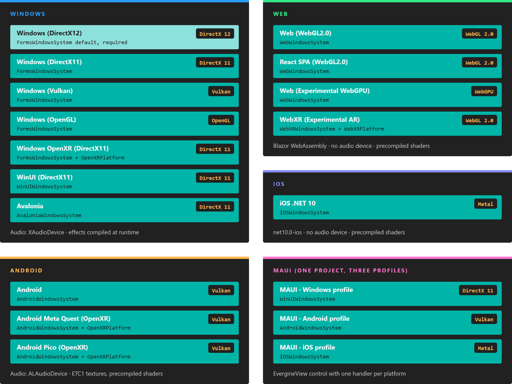
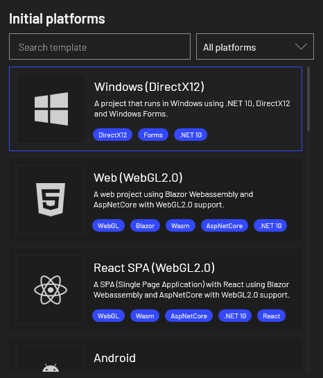
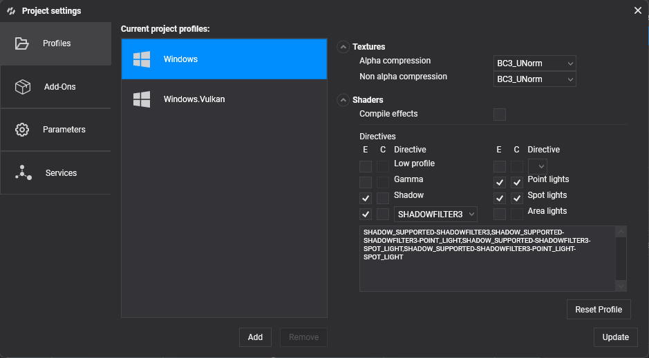

# Platforms

---



*Every template is a launcher project: it hosts the same application project with a different window system, graphics backend and audio device.*

An Evergine project is one shared application project plus one small **launcher project per platform**. The launcher creates the window or surface, the graphics context and the audio device, and then runs your `MyApplication` class. Your scenes, components and assets stay the same everywhere; only the launcher changes.

Each launcher comes from a template. You pick templates when you create the project in Evergine Launcher, or later from **Settings > Project Settings** in Evergine Studio. Each template adds one or more **profiles**, and each profile has its own export settings for textures and shaders.



## Platform matrix

These are the templates that ship with Evergine, as defined in the project tool's `templates.json`. The window system, graphics context and audio device are the ones each template's launcher code creates.

| Template | Profile | Window system | Graphics backend | Audio device |
|----------|---------|---------------|------------------|--------------|
| Windows (DirectX12) | `Windows` | `FormsWindowsSystem` | DirectX 12 (`DX12GraphicsContext`) | `XAudioDevice` |
| Windows (DirectX11) | `Windows.DirectX11` | `FormsWindowsSystem` | DirectX 11 (`DX11GraphicsContext`) | `XAudioDevice` |
| Windows (Vulkan) | `Windows.Vulkan` | `FormsWindowsSystem` | Vulkan (`VKGraphicsContext`) | `XAudioDevice` |
| Windows (OpenGL) | `Windows.OpenGL` | `FormsWindowsSystem` | OpenGL (`GLGraphicsContext`) | `XAudioDevice` |
| Windows OpenXR (DirectX11) | `Windows.OpenXR` | `FormsWindowsSystem` + `OpenXRPlatform` | DirectX 11 (`DX11GraphicsContext`) | `XAudioDevice` |
| WinUI (DirectX11) | `WinUI` | `WinUIWindowsSystem` | DirectX 11 (`DX11GraphicsContext`) | `XAudioDevice` |
| Avalonia | `Avalonia` | `AvaloniaWindowsSystem` | DirectX 11 (`DX11GraphicsContext`) | `XAudioDevice` |
| Web (WebGL2.0) | `Web` | `WebWindowsSystem` | WebGL 2.0 (`GLGraphicsContext`) | None |
| React SPA (WebGL2.0) | `WebReact` | `WebWindowsSystem` | WebGL 2.0 (`GLGraphicsContext`) | None |
| Web (Experimental WebGPU) | `WebGPU` | `WebWindowsSystem` | WebGPU (`WGPUGraphicsContext`) | None |
| WebXR (Experimental AR) | `WebXR` | `WebXRWindowsSystem` + `WebXRPlatform` | WebGL 2.0 (`GLGraphicsContext`) | None |
| Android | `Android` | `AndroidWindowsSystem` | Vulkan (`VKGraphicsContext`) | `ALAudioDevice` |
| Android Meta Quest (OpenXR) | `Quest` | `AndroidWindowsSystem` + `OpenXRPlatform` | Vulkan (`VKGraphicsContext`) | `ALAudioDevice` |
| Android Pico (OpenXR) | `Pico` | `AndroidWindowsSystem` + `OpenXRPlatform` | Vulkan (`VKGraphicsContext`) | `ALAudioDevice` |
| iOS .NET 10 | `iOS` | `IOSWindowsSystem` | Metal (`MTLGraphicsContext`) | None |
| MAUI | `Windows` | `WinUIWindowsSystem` | DirectX 11 (`DX11GraphicsContext`) | None |
| | `Android` | `AndroidWindowsSystem` | Vulkan (`VKGraphicsContext`) | `ALAudioDevice` |
| | `iOS` | `IOSWindowsSystem` | Metal (`MTLGraphicsContext`) | None |

"None" means the template does not register an audio device, so audio components have nothing to play through until you register one. `XAudioDevice` comes from the `Evergine.XAudio2` package and `ALAudioDevice` from `Evergine.OpenAL`. See [Audio](../audio/index.md).

> [!IMPORTANT]
> Every project must include **Windows (DirectX12)** or **Windows OpenXR (DirectX11)**. Evergine Studio runs your project through a Windows launcher, so the Launcher does not let you create a project without one of them. Windows (DirectX12) is selected by default.

## Export settings per profile

Each profile stores how its assets are exported: the texture compression formats and whether shaders are compiled ahead of time. The template sets these defaults, and you can change them in [Project Settings > Profiles](../evergine_studio/settings/project_profiles.md).

| Profile | Target framework | Alpha compression | Non-alpha compression | Compile effects |
|---------|------------------|-------------------|-----------------------|-----------------|
| `Windows`, `Windows.DirectX11`, `Windows.OpenXR` | `net10.0-windows` | `BC3_UNorm` | `BC3_UNorm` | No |
| `Windows.Vulkan`, `Windows.OpenGL` | `net10.0-windows` | `R8G8B8A8_UNorm` | `R8G8B8A8_UNorm` | No |
| `WinUI` | `net10.0-windows10.0.19041.0` | `BC3_UNorm` | `BC3_UNorm` | No |
| `Avalonia` | `net10.0` | `BC3_UNorm` | `BC3_UNorm` | No |
| `Web`, `WebReact`, `WebGPU`, `WebXR` | `net10.0` (Blazor WebAssembly) | `R8G8B8A8_UNorm` | `R8G8B8A8_UNorm` | Yes |
| `Android`, `Quest`, `Pico` | `net10.0-android` | `R4G4B4A4` | `ETC1_RGB8` | Yes |
| `iOS` (iOS .NET 10) | `net10.0-ios` | `BC3_UNorm` | `BC3_UNorm` | Yes |
| MAUI `Windows` / `Android` / `iOS` | one multi-targeted project | `BC3_UNorm` / `R4G4B4A4` / `R4G4B4A4` | `BC3_UNorm` / `ETC1_RGB8` / `ETC1_RGB8` | No / Yes / Yes |

When **Compile effects** is off, effects are compiled at runtime the first time a material needs them, which is fine on a desktop GPU. When it is on, the exporter compiles every directive combination that your materials use, plus the ones listed in the profile, and ships the compiled bytecode. Mobile and web profiles also add `LOW_PROFILE` and `GAMMA_COLORSPACE` combinations, and the XR profiles add `MULTIVIEW_VI` for single-pass stereo rendering.



## How a launcher starts your application

All launchers follow the same four steps, whatever the platform: create the application, register a window system, create the graphics context and display, and run the loop. This is the Windows (DirectX12) launcher, without its command-line parsing:

```csharp
using Evergine.Common.Graphics;
using Evergine.Framework;
using Evergine.Framework.Graphics;
using Evergine.Framework.Services;
using System.Diagnostics;

namespace MyProject.Windows
{
    class Program
    {
        static void Main(string[] args)
        {
            // 1. The shared application, defined in the MyProject project.
            MyApplication application = new MyApplication();

            // 2. The window system owns the native window and the message loop.
            WindowsSystem windowsSystem = new Evergine.Forms.FormsWindowsSystem();
            application.Container.RegisterInstance(windowsSystem);
            var window = windowsSystem.CreateWindow("MyProject - DX12", 1280, 720);

            // 3. Graphics and audio. Swapping these two lines is most of what
            //    distinguishes one Windows template from another.
            ConfigureGraphicsContext(application, window);
            application.Container.RegisterInstance(new Evergine.XAudio2.XAudioDevice());

            // 4. Initialize once, then update and draw every frame.
            Stopwatch clockTimer = Stopwatch.StartNew();
            windowsSystem.Run(
                () => application.Initialize(),
                () =>
                {
                    var gameTime = clockTimer.Elapsed;
                    clockTimer.Restart();

                    application.UpdateFrame(gameTime);
                    application.DrawFrame(gameTime);
                });

            application.Dispose();
        }

        private static void ConfigureGraphicsContext(Application application, Window window)
        {
            GraphicsContext graphicsContext = new Evergine.DirectX12.DX12GraphicsContext();
            graphicsContext.CreateDevice();

            SwapChainDescription swapChainDescription = new SwapChainDescription()
            {
                SurfaceInfo = window.SurfaceInfo,
                Width = window.Width,
                Height = window.Height,
                ColorTargetFormat = PixelFormat.R8G8B8A8_UNorm_SRgb,
                ColorTargetFlags = TextureFlags.RenderTarget | TextureFlags.ShaderResource,
                DepthStencilTargetFormat = PixelFormat.D32_Float_S8X24_UInt,
                DepthStencilTargetFlags = TextureFlags.DepthStencil,
                SampleCount = TextureSampleCount.None,
                IsWindowed = true,
                RefreshRate = 60,
            };
            var swapChain = graphicsContext.CreateSwapChain(swapChainDescription);
            swapChain.VerticalSync = true;

            // A camera with an empty DisplayTag renders to the first registered display.
            var graphicsPresenter = application.Container.Resolve<GraphicsPresenter>();
            graphicsPresenter.AddDisplay("DefaultDisplay", new Display(window, swapChain));

            application.Container.RegisterInstance(graphicsContext);
        }
    }
}
```

The other templates swap the window system (`AndroidWindowsSystem`, `WebWindowsSystem`, `IOSWindowsSystem` and so on) and the `GraphicsContext` class, but keep this shape. The platform pages walk through each launcher in detail.

## In this section

* [Android](android/index.md): Android phones and tablets, Meta Quest and Pico headsets.
* [iOS](ios/index.md): iPhone and iPad with Metal.
* [Web](web/index.md): browsers with Blazor WebAssembly and WebGL 2.0 or WebGPU.

Related pages elsewhere in the manual:

* [Supported graphics backends](../graphics/supported_backends/index.md)
* [OpenXR on Meta Quest](../xr/openxr/metaquest.md) and [Pico](../xr/openxr/pico.md)
* [Manage profiles](../evergine_studio/settings/project_profiles.md)
