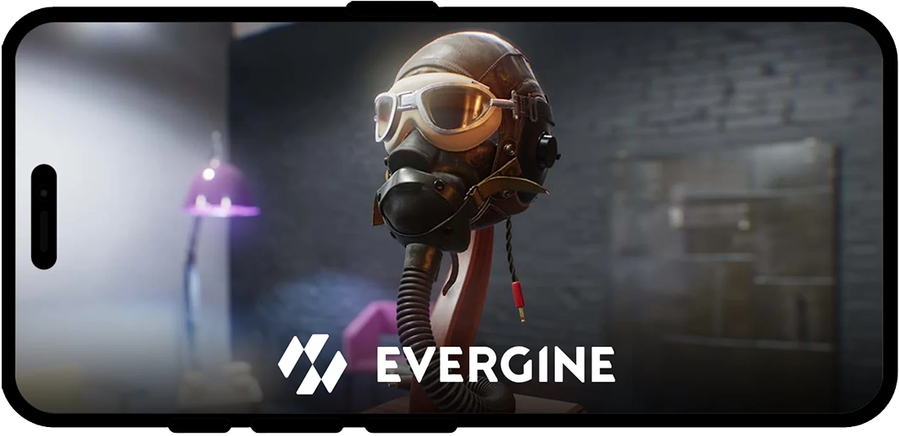
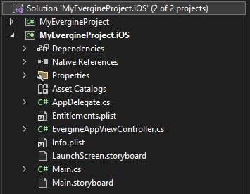
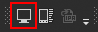
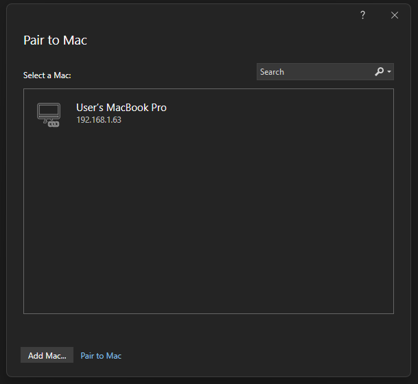
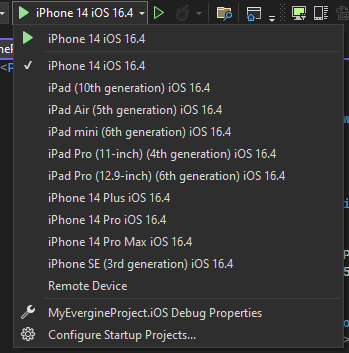
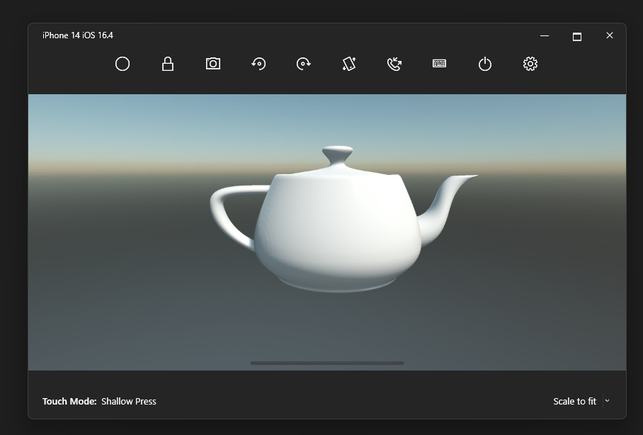

# iOS

---



Evergine runs on iPhone and iPad through **.NET for iOS** (`net10.0-ios`) and renders with **Metal**. The **iOS .NET 10** template creates a native iOS launcher that hosts an Evergine view in a storyboard, so you can combine it with your own UIKit interface. If you also need Android and Windows from one project with a shared UI, use the **MAUI** template instead (see [Alternative: .NET MAUI](#alternative-net-maui)).

## Create the iOS profile

Select **iOS .NET 10** when you create the project in Evergine Launcher, or add it later from **Settings > Project Settings** in Evergine Studio (see [Manage profiles](../../evergine_studio/settings/project_profiles.md)). The template adds a launcher project named `<Project>.iOS`.

| Setting | Value in the template |
|---------|-----------------------|
| Target framework | `net10.0-ios` |
| Minimum iOS version | 15.4 (`SupportedOSPlatformVersion` in the project, `MinimumOSVersion` in `Info.plist`) |
| Devices | iPhone and iPad (`UIDeviceFamily` 1 and 2) |
| Graphics | Metal (`MTLGraphicsContext`, package `Evergine.Metal`) |
| Window system | `IOSWindowsSystem` (package `Evergine.iOS`) |
| Audio | None registered by the template |
| Compile effects | Yes |

## Prerequisites

* **Visual Studio 2026 on Windows.** The launcher project is set up to be built from Visual Studio for Windows. Opening the solution on a Mac is not supported.
* **The iOS workload for .NET 10:**

  ```powershell
  dotnet workload install ios
  ```

* **A Mac build host.** Apple's tools only run on macOS, so Visual Studio compiles and signs the app on a paired Mac with Xcode installed. Microsoft's [Pair to Mac guide](https://learn.microsoft.com/en-us/dotnet/maui/ios/pair-to-mac) lists the Xcode and remote login requirements.

## Project structure



| File | Purpose |
|------|---------|
| `Main.cs` | Entry point. Calls `UIApplication.Main` with `AppDelegate`. |
| `AppDelegate.cs` | Standard iOS application delegate. Handle app lifecycle events (background, foreground) here. |
| `Main.storyboard` | Main storyboard. Its root view controller is `EvergineAppViewController`. |
| `EvergineAppViewController.cs` | Creates the Evergine application, the Metal context and the display, and runs the loop. |
| `LaunchScreen.storyboard` | Launch screen shown while the app loads. |
| `Info.plist` | Bundle identifier, minimum OS version, supported orientations and storyboards. |
| `Entitlements.plist` | App capabilities. Empty by default. |

`EvergineAppViewController` derives from `EvergineViewController` (in `Evergine.iOS`), which provides the Metal-backed view. Its `ViewDidLoad` follows the same steps as every other launcher:

```csharp
using Evergine.Common.Graphics;
using Evergine.Framework.Graphics;
using Evergine.Framework.Services;
using Evergine.iOS;
using System.Diagnostics;

namespace MyProject.iOS
{
    public partial class EvergineAppViewController : EvergineViewController
    {
        private IOSWindowsSystem windowsSystem;

        public EvergineAppViewController(ObjCRuntime.NativeHandle handle)
            : base(handle)
        {
        }

        public override void ViewDidLoad()
        {
            base.ViewDidLoad();

            MyApplication application = new MyApplication();

            // The window system is registered as the base WindowsSystem type so that
            // platform-agnostic code can resolve it.
            this.windowsSystem = new IOSWindowsSystem(this);
            application.Container.RegisterInstance(this.windowsSystem as WindowsSystem);
            var surface = this.windowsSystem.CreateSurface(0, 0);

            ConfigureGraphicsContext(application, surface);

            Stopwatch clockTimer = Stopwatch.StartNew();
            this.windowsSystem.Run(
                () => application.Initialize(),
                () =>
                {
                    var gameTime = clockTimer.Elapsed;
                    clockTimer.Restart();

                    application.UpdateFrame(gameTime);
                    application.DrawFrame(gameTime);
                });

            this.LoadAction?.Invoke();
        }

        private static void ConfigureGraphicsContext(MyApplication application, Surface surface)
        {
            GraphicsContext graphicsContext = new global::Evergine.Metal.MTLGraphicsContext();
            graphicsContext.CreateDevice();
            SwapChainDescription swapChainDescription = new SwapChainDescription()
            {
                SurfaceInfo = surface.SurfaceInfo,
                Width = surface.Width,
                Height = surface.Height,
                ColorTargetFormat = PixelFormat.R8G8B8A8_UNorm_SRgb,
                ColorTargetFlags = TextureFlags.RenderTarget | TextureFlags.ShaderResource,
                DepthStencilTargetFormat = PixelFormat.D32_Float,
                DepthStencilTargetFlags = TextureFlags.DepthStencil,
                SampleCount = TextureSampleCount.None,
                IsWindowed = true,
                RefreshRate = 60
            };
            var swapChain = graphicsContext.CreateSwapChain(swapChainDescription);
            swapChain.VerticalSync = true;
            swapChain.FrameBuffer.IntermediateBufferAssociated = false;

            var graphicsPresenter = application.Container.Resolve<GraphicsPresenter>();
            graphicsPresenter.AddDisplay("DefaultDisplay", new Display(surface, swapChain));

            application.Container.RegisterInstance(graphicsContext);
        }
    }
}
```

Notice that the Metal swap chain uses a `D32_Float` depth buffer, where the desktop and Android launchers use `D32_Float_S8X24_UInt`.

> [!NOTE]
> The template does not register an audio device, so audio components are silent on iOS unless you register one yourself. See [Audio](../../audio/index.md).

> [!NOTE]
> The iOS .NET 10 profile exports textures as `BC3_UNorm`, while the iOS profile of the MAUI template uses `ETC1_RGB8` and `R4G4B4A4`. BC formats are only available on Apple GPUs that support BC texture compression. If textures fail to load or look wrong on your target devices, change the compression formats of the profile in [Project Settings > Profiles](../../evergine_studio/settings/project_profiles.md).

## Connect Visual Studio to a Mac

1. Open the iOS solution in Visual Studio and press the **Pair to Mac** button on the iOS toolbar:

   

2. The **Pair to Mac** dialog lists the Mac build hosts it finds on your network. Select one and press **Connect**. Visual Studio asks for the Mac user credentials the first time.

   

## Deploy to the iOS Simulator

With a Mac paired, the run target list shows the simulators available on the Mac:



Pick one and press F5. Visual Studio builds on the Mac, starts the simulator and mirrors it in a window on your Windows desktop, where you can debug the app as usual.



## Deploy to a device

Running on a physical iPhone or iPad needs an Apple developer account and a provisioning profile that matches the bundle identifier. Change `ApplicationId` in the project file (it defaults to `com.companyname.<Project>.iOS`) to an identifier you own, then set up provisioning following [Device provisioning for iOS](https://learn.microsoft.com/en-us/dotnet/maui/ios/device-provisioning/). The [automatic provisioning](https://learn.microsoft.com/en-us/dotnet/maui/ios/device-provisioning/automatic-provisioning) option is the quickest way to start.

Once provisioning is set up, connect the device, select it in the run target list and run. To distribute the app, see [Publish an iOS app](https://learn.microsoft.com/en-us/dotnet/maui/ios/deployment/).

## Alternative: .NET MAUI

The **MAUI** template creates one multi-targeted .NET MAUI project that builds for `net10.0-android`, `net10.0-ios` and, on Windows, `net10.0-windows10.0.19041.0`. It adds an `EvergineView` control you place in XAML pages, with one handler per platform:

| MAUI profile | Handler | Window system | Graphics |
|--------------|---------|---------------|----------|
| `Windows` | `EvergineViewHandler.Windows.cs` | `WinUIWindowsSystem` | DirectX 11 |
| `Android` | `EvergineViewHandler.Android.cs` | `AndroidWindowsSystem` | Vulkan |
| `iOS` | `EvergineViewHandler.iOS.cs` | `IOSWindowsSystem` | Metal |

Choose MAUI when your application is mostly native UI with a 3D view inside it, and you want to write that UI once. Choose the iOS .NET 10 template when you need full control of the iOS app or only target Apple devices. The MAUI template sets its minimum iOS version to 12.2. See the [.NET MAUI documentation](https://learn.microsoft.com/en-us/dotnet/maui/) and the [.NET for iOS documentation](https://learn.microsoft.com/en-us/dotnet/ios/) for platform setup.
