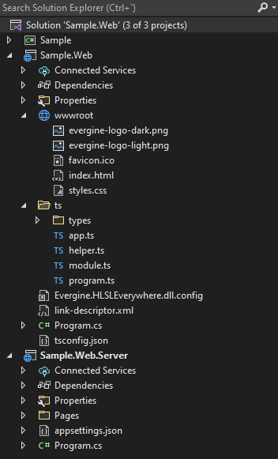
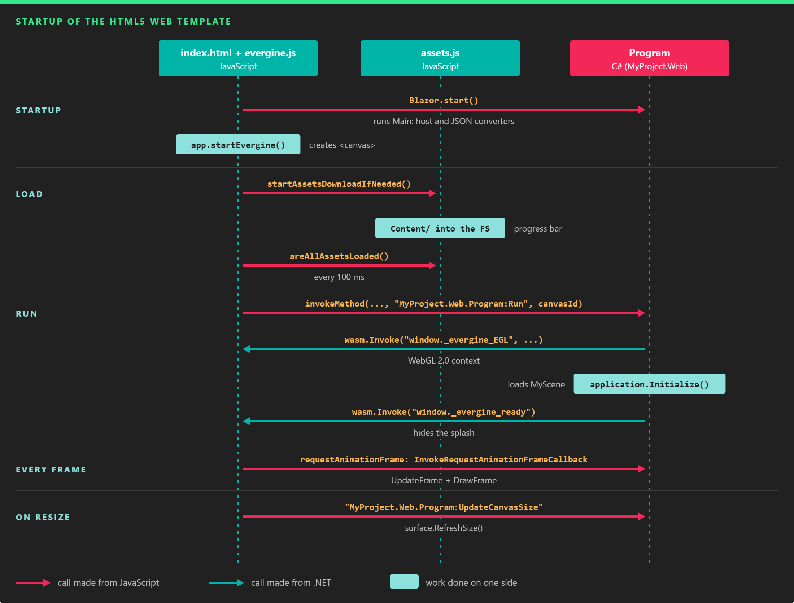

# Getting started with a web application

---

<!-- CAPTURE: images/web_app_browser.png; the default Web (WebGL2.0) template running at https://localhost:5001 in the integrated browser (Edge), address bar visible, scene fully loaded after the splash screen -->

This page creates an Evergine web application, explains what each file of the two main templates does, and shows how to call C# from JavaScript and JavaScript from C#. Read [Web](index.md) first for the prerequisites and the overall architecture.

## Create the project

In Evergine Launcher, create a project and select a web template in **Initial platforms**. To add the web profile to an existing project, open **Settings > Project Settings** in Evergine Studio and add it there (see [Manage profiles](../../evergine_studio/settings/project_profiles.md)).

* **Web (WebGL2.0)** is the default HTML5 template. Start here unless your site is already a React application.
* **React SPA (WebGL2.0)** embeds the canvas in a React single-page application.
* **Web (Experimental WebGPU)** and **WebXR (Experimental AR)** follow the structure of the HTML5 template.

After you edit your scene in Evergine Studio, open the web solution with **File > Open C# editor** and run it from Visual Studio 2026. [DevOps](ops.md) covers the command line.

## The HTML5 template

The **Web (WebGL2.0)** template adds two projects next to your application project. With a project named `MyProject`, they are:



| Project | SDK | Role |
|---------|-----|------|
| `MyProject.Web` | `Microsoft.NET.Sdk.BlazorWebAssembly` | The client. Compiles your application to WebAssembly, exports the assets and generates the page scripts. You can run it on its own during development. |
| `MyProject.Web.Server` | `Microsoft.NET.Sdk.Web` | Optional ASP.NET Core server that hosts the client with response compression. Use it to publish (see [DevOps](ops.md)). |

The client project contains:

| File | Purpose |
|------|---------|
| `Program.cs` | The launcher. `Main` starts the WebAssembly host; `Run`, `Destroy` and `UpdateCanvasSize` are `[JSInvokable]` methods the page calls. |
| `wwwroot/index.html` | The page: a canvas container, a splash screen with a progress bar, and the startup script. |
| `ts/app.ts` | Class `App`: creates the canvas, waits for the assets, calls `Run`, and forwards window resizes. |
| `ts/program.ts` | Class `Program`: a thin wrapper around `DotNet.invokeMethod` that builds the method identifiers. |
| `ts/helper.ts` | The functions the engine calls from C#: event listeners, `_evergine_EGL` (WebGL context), `_evergine_setRequestAnimationFrameCallback` (frame loop), `_evergine_ready` (hides the splash). |
| `ts/module.ts` | Class `EvergineModule`: binds the canvas to the WebAssembly runtime and updates the progress bar. |
| `tsconfig.json` | Compiles all of `ts/` into a single `wwwroot/evergine.js` at build time. |
| `link-descriptor.xml` | Types the trimmer must keep. See [Tips](tips.md#keep-types-the-trimmer-cannot-see). |

### Startup sequence



*JavaScript drives the start (it decides when to call `Run`), and C# drives every frame through `requestAnimationFrame`.*

The page loads the Blazor script with `autostart="false"`, then `assets.js`, and only then starts Blazor and Evergine:

```html
<!-- First we load web assembly code -->
<script src="_framework/blazor.webassembly.js" autostart="false"></script>

<!-- Then, start loading the assets into the vfs -->
<script src="assets.js"></script>

<!-- Finally, run evergine -->
<script type="text/javascript">
  var app = new App(
    "MyProject.Web",
    "MyProject.Web.Program",
    new EvergineModule()
  );
  Blazor.start().then(function () {
    // It is not mandatory to run Evergine now, but it must run after blazor is started
    app.startEvergine();
  });

  //// It is possible to delete the Evergine instance by running
  // app.destroyEvergine();
</script>
```

1. `Blazor.start()` loads the runtime and calls `Program.Main`, which creates the WebAssembly host through `Evergine.Web.WebAssembly.GetInstance()` and registers the JSON converters (see [Serialization](serialization.md)). It does not create the application yet.
2. `app.startEvergine()` creates a `<canvas id="evergine-canvas">` inside `evergine-canvas-container` and sizes it to the window times `devicePixelRatio`.
3. `waitAndRun()` starts the asset download and polls `areAllAssetsLoaded()` every 100 ms. While it waits, `assets.js` reports progress to the splash screen.
4. When every asset is in the virtual file system, `program.Run(canvasId)` calls the C# `Run` method.
5. `Run` creates `MyApplication`, the `WebWindowsSystem`, the surface for the canvas and the `GLGraphicsContext` for WebGL 2.0. When `application.Initialize()` finishes, it calls `window._evergine_ready` to hide the splash.
6. From then on, the window system asks the browser for an animation frame on every frame and runs `UpdateFrame` and `DrawFrame` in the callback. Window resizes call `UpdateCanvasSize`.

The C# half of that sequence is the launcher's `Program` class (with the project name `MyProject`):

```csharp
using Evergine.Common.Graphics;
using Evergine.Framework;
using Evergine.Framework.Graphics;
using Evergine.Framework.Services;
using Evergine.OpenGL;
using Evergine.Serialization.Converters;
using Evergine.Web;
using Microsoft.AspNetCore.Components.WebAssembly.Hosting;
using Microsoft.JSInterop;
using System;
using System.Collections.Generic;
using System.Diagnostics;
using System.Text.Json.Serialization;

namespace MyProject.Web
{
    public class Program
    {
        private static readonly Dictionary<string, WebSurface> appCanvas = new Dictionary<string, WebSurface>();

        private static WindowsSystem windowsSystem;
        private static MyApplication application;
        private static global::Evergine.Web.WebAssembly wasm;

        public static void Main()
        {
            // Referencing a type from Evergine.Components keeps that assembly in AOT builds.
            var cp = new global::Evergine.Components.Graphics3D.Spinner();

            // The WebAssembly instance must be created here for the debugger to attach.
            global::Evergine.Web.WebAssembly.HostConfiguration = new HostConfiguration();
            wasm = global::Evergine.Web.WebAssembly.GetInstance();
        }

        [JSInvokable("MyProject.Web.Program:Run")]
        public static void Run(string canvasId)
        {
            // Send Trace output to the browser console.
            Trace.Listeners.Add(new TextWriterTraceListener(Console.Out));
            Trace.AutoFlush = true;

            application = new MyApplication();

            windowsSystem = new WebWindowsSystem();
            application.Container.RegisterInstance(windowsSystem);

            var canvas = wasm.GetElementById(canvasId);
            var surface = (WebSurface)windowsSystem.CreateSurface(canvas);
            appCanvas[canvasId] = surface;
            ConfigureGraphicsContext(application, surface, canvasId);

            Stopwatch clockTimer = Stopwatch.StartNew();
            windowsSystem.Run(
                () =>
                {
                    application.Initialize();
                    wasm.Invoke("window._evergine_ready");
                },
                () =>
                {
                    var gameTime = clockTimer.Elapsed;
                    clockTimer.Restart();

                    application.UpdateFrame(gameTime);
                    application.DrawFrame(gameTime);
                });
        }

        [JSInvokable("MyProject.Web.Program:Destroy")]
        public static void Destroy(string canvasId)
        {
            application.Dispose();
            application = null;
        }

        [JSInvokable("MyProject.Web.Program:UpdateCanvasSize")]
        public static void UpdateCanvasSize(string canvasId)
        {
            if (appCanvas.TryGetValue(canvasId, out var surface))
            {
                surface.RefreshSize();
            }
        }

        private static void ConfigureGraphicsContext(Application application, Surface surface, string canvasId)
        {
            // Create the WebGL 2.0 context with the attributes set in helper.ts (antialias, no alpha).
            wasm.Invoke("window._evergine_EGL", false, "webgl2", canvasId);

            GraphicsContext graphicsContext = new GLGraphicsContext(GraphicsBackend.WebGL2);
            graphicsContext.CreateDevice();
            SwapChainDescription swapChainDescription = new SwapChainDescription()
            {
                SurfaceInfo = surface.SurfaceInfo,
                Width = surface.Width,
                Height = surface.Height,
                ColorTargetFormat = PixelFormat.R8G8B8A8_UNorm,
                ColorTargetFlags = TextureFlags.RenderTarget | TextureFlags.ShaderResource,
                DepthStencilTargetFormat = PixelFormat.D32_Float_S8X24_UInt,
                DepthStencilTargetFlags = TextureFlags.DepthStencil,
                SampleCount = TextureSampleCount.None,
                IsWindowed = true,
                RefreshRate = 60
            };
            var swapChain = graphicsContext.CreateSwapChain(swapChainDescription);
            swapChain.VerticalSync = true;

            var graphicsPresenter = application.Container.Resolve<GraphicsPresenter>();
            graphicsPresenter.AddDisplay("DefaultDisplay", new Display(surface, swapChain));

            application.Container.RegisterInstance(graphicsContext);
        }

        private class HostConfiguration : IWasmHostConfiguration
        {
            public void ConfigureHost(WebAssemblyHostBuilder builder)
            {
            }

            public void RegisterJsonConverters(IList<JsonConverter> converters)
            {
                converters.AddEvergineConverters();
            }
        }
    }
}
```

### How the method identifiers are built

Blazor finds a static `[JSInvokable]` method by **assembly name** and **method identifier**. The template names every identifier `<Namespace>.Program:<Method>`, and `ts/program.ts` builds the same string from the two values passed to `new App(...)` in `index.html`:

```typescript
invoke(methodName: string, ...args: any[]) {
  return DotNet.invokeMethod(
    `${this.assemblyName}`,              // "MyProject.Web"
    `${this.className}:${methodName}`,   // "MyProject.Web.Program:Run"
    ...args);
}
```

The launcher's assembly and namespace are both `<Project>.<Profile>`, so a project `MyProject` with the profile `Web` uses `MyProject.Web`. If you rename the project or the namespace, update the attribute strings and the two arguments of `new App(...)` together.

## Call C# from JavaScript

Add a `[JSInvokable]` method to `Program` with an identifier that follows the same pattern. This one finds an entity and changes the speed of its `Spinner` component. The `Vector3` parameter arrives as a plain JavaScript object thanks to the Evergine converters:

```csharp
// Add to MyProject.Web/Program.cs, inside the Program class.
// Requires: using Evergine.Components.Graphics3D; using Evergine.Mathematics;
[JSInvokable("MyProject.Web.Program:SetSpin")]
public static bool SetSpin(string entityPath, Vector3 axisIncrease)
{
    var scene = application?.Container.Resolve<ScreenContextManager>()
        .CurrentContext?.FindScene<MyScene>();
    var spinner = scene?.Managers.EntityManager.Find(entityPath)?.FindComponent<Spinner>();
    if (spinner == null)
    {
        // Returning a value lets the page know the call did nothing.
        return false;
    }

    spinner.AxisIncrease = axisIncrease;
    return true;
}
```

From the page, call it through the `app` object that `index.html` creates. `invoke` is synchronous, which is allowed in Blazor WebAssembly because JavaScript and .NET share the same thread:

```javascript
// Spin the entity "Cube" around its Y axis. Keys are camelCase.
const changed = app.program.invoke("SetSpin", "Cube", { x: 0, y: 2, z: 0 });
console.log(changed ? "Spinner updated" : "Entity or Spinner not found");
```

Call it only after `_evergine_ready` has run: before `Run` there is no application, and the method returns `false`.

## Call JavaScript from C#

Use the same `WebAssembly` instance the template keeps in the `wasm` field. `Invoke` takes the function path, a `warn` flag that logs a warning instead of throwing when the call fails, and the arguments:

```csharp
// Add to MyProject.Web/Program.cs, inside the Program class.
public static void NotifySpinChanged(string entityPath, Vector3 axisIncrease)
{
    wasm.Invoke("window.onSpinChanged", true, entityPath, axisIncrease);
}
```

`Invoke<T>` returns a value, and `Invoke<JSObject>` returns a handle to a JavaScript object. Define the function in the page, for example in `index.html` before the startup script:

```html
<script type="text/javascript">
  // Called from C#. The Vector3 arrives as { x, y, z }.
  window.onSpinChanged = function (entityPath, axisIncrease) {
    console.log(`${entityPath} now spins at ${axisIncrease.y} rad/s on Y`);
  };
</script>
```

Call `NotifySpinChanged` from anywhere in your launcher code, such as at the end of `SetSpin`. To call it from a component in the shared application project, which does not reference `Evergine.Web`, define an interface or event in the shared project and implement it in the launcher.

## The React template

The **React SPA (WebGL2.0)** template splits the web application in three projects:

| Project | Role |
|---------|------|
| `MyProject.WebReact` | Blazor WebAssembly project with the launcher: `Program.cs`, `CanvasLifecycle.cs`, `WebIntegration.cs`, `WebReactApplication.cs` and the JavaScript bridge in `js/evergine.js`. |
| `myproject.react.spa` | The React 19 application, built with Vite. It uses the [evergine-react](https://www.npmjs.com/package/evergine-react) package. Building it copies `_framework`, `Content`, `assets.js` and `evergine.js` from the WebReact output into its `public` folder. |
| `MyProject.Host` | ASP.NET Core host for production, with response compression. |

Build the solution once, then run the `myproject.react.spa` project: it starts the Vite development server, and React hot reload works for `.tsx` files. Changes to C# need a new build of `MyProject.WebReact`. The `README.md` generated in the WebReact project explains how to debug the C# code.

### Who initializes what

There is no configuration file with assembly names on the React side. The C# `Program.Main` calls `CanvasLifecycle.Initialize()`, which hands a .NET object reference to the page, and the page drives the canvas through that reference. The sequence is:

1. `src/main.tsx` runs `Blazor.start().then(() => initializeEvergine())`.
2. `initializeEvergine` (in `src/evergine/evergine-initialize.ts`) sets `window.Evergine` and calls `initializeEvergineBase` from `evergine-react`. That defines `window.initializeCanvasLifecycle`, adds `Evergine.notifyEvergineReady`, and starts the asset download. When all assets are loaded, the store sets `webAssemblyLoaded` to `true`.
3. In C#, `Program.Main` calls `CanvasLifecycle.Initialize()`, which calls `initializeCanvasLifecycle` with a `DotNetObjectReference<CanvasLifecycle>`. The page keeps it as `window.Evergine.canvasLifecycle`.
4. When `webAssemblyLoaded` becomes `true`, the `<EvergineCanvas>` component calls `canvasLifecycle.initializeEvergineCanvas(canvasId)`, which invokes `StartEvergineOnCanvas` in C#, which calls `Program.Run(canvasId)`.
5. `WebReactApplication` registers the `WebIntegration` service. When the service starts, it calls `Evergine.initialize` with its own .NET reference, keeps the JavaScript object that function returns, and sets `IsEvergineReady`. That calls `Evergine.notifyEvergineReady(true)`, so the store sets `evergineReady`, and calls `onEvergineReadyChanged(true)` on the returned object.
6. When `<EvergineCanvas>` unmounts, it calls `StopEvergineOnCanvas`, which disposes the surface, the window system and the application. Size changes call `RefreshCanvasSize`.

`useEvergineStore()` exposes `webAssemblyLoaded` and `evergineReady`. Wait for both before you call into Evergine. This is the template's `App.tsx`:

```tsx
import { useEvergineStore, EvergineCanvas } from "evergine-react";
import { useContainerSize } from "./evergine/useContainerSize";
import { useRef } from "react";
import './App.css'

function App() {
    const { webAssemblyLoaded, evergineReady } = useEvergineStore();
    const canvasContainer = useRef<HTMLDivElement>(null) as React.RefObject<HTMLDivElement>;

    return (
        <div className="App">
            {(!webAssemblyLoaded || !evergineReady) && (<div className="loading">Loading Evergine...</div>)}
            <div className="canvas-container" ref={canvasContainer}>
                <EvergineCanvas
                    canvasId="evergine-canvas"
                    width={useContainerSize(canvasContainer).width}
                    height={useContainerSize(canvasContainer).height}
                />
            </div>
        </div>
    );
}

export default App;
```

### Call between React and C#

`WebIntegration` is the place for your own calls, because it holds both directions: its .NET reference is what the page receives in `Evergine.initialize`, and the object the page returns is what C# calls back.

**Step 1. Add the methods in C#.** Extend `WebIntegration.cs` in the WebReact project:

```csharp
using Evergine.Framework.Services;
using Microsoft.JSInterop;
using Microsoft.JSInterop.Implementation;
using System;
using System.Threading.Tasks;

namespace MyProject.WebReact
{
    public class WebIntegration : Service, IDisposable
    {
        private JSObjectReference reference;
        private DotNetObjectReference<WebIntegration> dotnetReference;

        private bool isEvergineReady;

        public bool IsEvergineReady
        {
            get => this.isEvergineReady;
            set
            {
                if (this.isEvergineReady != value)
                {
                    this.isEvergineReady = value;
                    Program.Wasm.Runtime.Invoke<JSObjectReference>("Evergine.notifyEvergineReady", this.isEvergineReady);
                    this.reference.InvokeVoidAsync("onEvergineReadyChanged", this.isEvergineReady);
                }
            }
        }

        // Called from React through the .NET reference passed to Evergine.initialize.
        [JSInvokable]
        public ValueTask HelloFromSpa()
        {
            Console.WriteLine("Received a hello from the SPA");
            return this.SayHelloToSpa();
        }

        // Calls a function on the object that Evergine.initialize returned.
        public ValueTask SayHelloToSpa() => this.reference.InvokeVoidAsync("helloFromCSharp");

        public void Dispose()
        {
            this.dotnetReference?.Dispose();
        }

        protected override void Start()
        {
            base.Start();

            if (this.dotnetReference == null)
            {
                this.dotnetReference = DotNetObjectReference.Create(this);
                this.reference = Program.Wasm.Runtime.Invoke<JSObjectReference>("Evergine.initialize", this.dotnetReference);
            }

            this.IsEvergineReady = true;
        }
    }
}
```

Instance methods on a `DotNetObjectReference` need only `[JSInvokable]`: the page calls them by method name, without an assembly name.

**Step 2. Add the functions in the SPA.** In `src/evergine/evergine-initialize.ts`, extend the `WebIntegration` type that `evergine-react` declares, and add the two functions to the object you return:

```typescript
import { initializeEvergineBase } from "evergine-react";

declare global {
  let Blazor: { start(): Promise<void> };

  interface MyWebIntegration extends WebIntegration {
    helloFromCSharp: () => void;
    sayHelloToCSharp: () => void;
  }

  interface Window {
    App: MyWebIntegration;
  }
}

const initializeEvergine = (): void => {
  window.Evergine = {
    initialize: (dotNetReference: DotNet.DotNetObject) => {
      const evergineApp: MyWebIntegration = {
        onEvergineReadyChanged: (isReady: boolean) => {
          console.log(`Evergine ready ${isReady}`);
        },
        // Called from C# by WebIntegration.SayHelloToSpa.
        helloFromCSharp: () => console.log("Received a hello from C#"),
        // Calls the [JSInvokable] instance method on the WebIntegration service.
        sayHelloToCSharp: () => dotNetReference.invokeMethod("HelloFromSpa"),
      };

      window.App = evergineApp;

      return window.DotNet.createJSObjectReference(evergineApp);
    },
    onEvergineAssetLoaded: (asset: EvergineAsset) => {
      console.log(`Evergine asset ${asset.name} loaded`);
    },
    onEvergineAllAssetsLoaded: () => {
      console.log("Evergine assets loaded");
    },
  };

  initializeEvergineBase(window.Evergine);
};

export { initializeEvergine };
```

**Step 3. Call it from a component.** Add a button to `App.tsx`, enabled only when Evergine is ready:

```tsx
<button
    disabled={!evergineReady}
    onClick={() => window.App?.sayHelloToCSharp()}>
    Say hello to C#
</button>
```

Clicking the button prints both messages in the browser console:

```text
Received a hello from the SPA
Received a hello from C#
```

To pass Evergine types such as `Vector3` or `Color` in either direction, see [Serialization](serialization.md). Next, read how to [build and publish the app](ops.md) and how to [make it load faster](tips.md).
