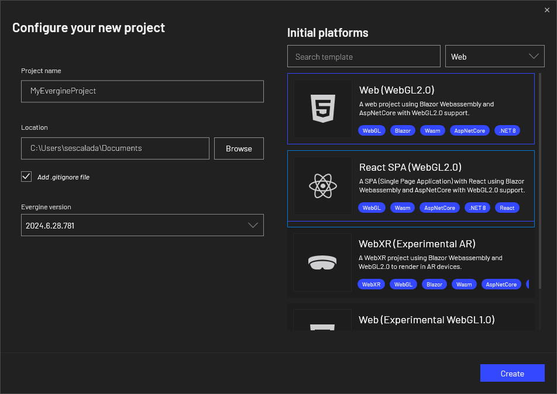

# Getting Started with an Evergine Web Application

---

## Create a New Application

From the Evergine launcher, you can create a Web (WebGL 2.0) project or add the web profile from the Evergine Studio.



Evergine now offers two web templates: an HTML5 web template and a ReactJS web template. Both options are designed to execute Evergine in a web canvas, allowing for flexibility in your web development approach.

This template adds two projects to the web solution: the _Web_ project, which is the web application client that uses TypeScript to execute Evergine in a web canvas, and an optional _Server_ project, which is an ASP server application that implements some optimizations for asset loading that can only be done from the server side.


After editing your scene in Evergine Studio as usual, run the _Web.Server_ project or the _Web_ project from Visual Studio 2022 to see it running in the browser.


For the ReactJS template, the web solution includes a different set of projects: the Host project (equivalent to the Server project in the HTML5 template), the WebReact project (similar to the Web project), and an additional react.spa project, which holds the code for the single-page application (SPA).


Finally, check out [how to deploy the app](ops.md) and [improve its performance](tips.md).

### ReactJS Web Template

The ReactJS template for Evergine uses the **evergine-react** NPM package, which is registered on [npmjs.com/package/evergine-react](https://www.npmjs.com/package/evergine-react). This package contains a set of helper components designed to facilitate interaction with Evergine within a ReactJS single-page application (SPA).

The main component provided by this package is the _EvergineCanvas_, which is used in the _App.tsx_ file. This component renders the HTML5 canvas where Evergine will be executed. Another important file is _evergine-initialize.ts_, which is responsible for managing communication between the SPA and Evergine via a WebAssembly (WASM) JavaScript bridge.

The **evergine-react** package also includes a state store for Evergine, which holds two key values:

- **webAssemblyLoaded**: Becomes **true** once WASM has been successfully loaded.
- **evergineReady**: Becomes **true** once Evergine has initialized all necessary assets.

It’s recommended to wait for both of these values to be **true** before initiating any custom communication between the SPA and Evergine. This helps prevent potential race conditions that could occur if communication is attempted too early.

For example, following code snippet modifies the _App.tsx_ file to include a text message that will be displayed while Evergine is loading.

```typescript
import './App.css';
import { useEvergineStore, EvergineCanvas } from "evergine-react";
import { EVERGINE_CANVAS_ID } from "evergine/config";
import { useWindowSize } from "evergine/useWindowSize";

function App() {
    const { webAssemblyLoaded, evergineReady } = useEvergineStore();

    return (
        <div className="App">
            {(!webAssemblyLoaded || !evergineReady) && (<div>Loading Evergine...</div>)}
            <EvergineCanvas
                canvasId={EVERGINE_CANVAS_ID}
                width={useWindowSize().width}
                height={useWindowSize().height}
            />
        </div>
    );
}

export default App;
```

When you build the SPA (react.spa) project, all required code and dependencies will be copied into the **public** folder. This folder contains the SPA code that embeds the Evergine canvas and can be deployed as a static website.


### Invoking Functions Between SPA and Evergine

In Evergine, communication between the single-page application (SPA) and the engine is facilitated through function invocations in both directions: from the SPA to Evergine and from Evergine to the SPA. This process enables dynamic interactions, such as triggering engine events from the UI or responding to engine updates in real-time.

Evergine also includes [built-in JSON serializers](serialization.md) to manage the serialization and deserialization of objects exchanged across the JavaScript and .NET boundary via the JS bridge. These serializers ensure that data structures are accurately converted, making it straightforward to pass complex objects between JavaScript and .NET in both directions.

In the following steps, we will demonstrate how to set up these function invocations, starting with calls from the SPA to Evergine and then covering calls from Evergine back to the SPA. Each step is accompanied by code examples to illustrate the process.

#### Step 1: Add communication methods in C#

To handle communication between the SPA and Evergine, you can modify or extend the `WebIntegration` service. This is the recommended place to add custom invokes and callbacks.

If you prefer, you can also use a custom SceneManager as an alternative (similar to older versions of this documentation). Both approaches are valid, but using WebIntegration is simpler in most cases.

Here’s an example:

```csharp
public class WebIntegration : Service, IDisposable
{
        // Displaying just added code from original class

        [JSInvokable]
        public ValueTask HelloFromSpa()
        {
            Console.WriteLine("Received a hello from SPA!");
            return SayHelloToSpa();
        }

        public ValueTask SayHelloToSpa() => this.reference.InvokeVoidAsync("helloFromCSharp");
}
```

If you use custom scene manager approach, remember to register it within the _MyScene_.

```csharp
public class MyScene : Scene
{
    public override void RegisterManagers()
    {
        base.RegisterManagers();
        
        this.Managers.AddManager(new global::Evergine.Bullet.BulletPhysicManager3D());
        this.Managers.AddManager(new MySceneManager());
    }

    protected override void CreateScene()
    {
    }
}
```

#### Step 2: Add communication methods in SPA

To complete the communication setup between the SPA and Evergine, update the evergine-initialize.ts file.
Now you can directly extend the `window.App` object type and define custom methods.
Notice that `initializeEvergine` is simplified, using `initializeEvergineBase` with fewer parameters.

```typescript
import { initializeEvergineBase } from "evergine-react";

import {
  EVERGINE_ASSEMBLY_NAME,
} from "../evergine/config";

declare global {
  let Blazor: { start(): Promise<void> };

  interface Window {
    App: MyExtendedIntegration;
  }

  interface MyExtendedIntegration extends WebIntegration {
      helloFromCSharp: () => void;
      sayHelloToCsharp: () => string;
  }
}

const initializeEvergine = (): void => {
  window.Evergine = {
    initialize: (dotNetReference: DotNet.DotNetObject) => {
        const evergineApp: MyExtendedIntegration = {
            onEvergineReadyChanged: (isReady: boolean) => {
                console.log(`Evergine ready ${isReady}`);
            },
            helloFromCSharp: () => console.log("Received a hello from C#"),
            sayHelloToCsharp: () => dotNetReference.invokeMethod("HelloFromSpa"),
        };

        window.App = evergineApp;

        return window.DotNet.createJSObjectReference(evergineApp);
    },
    initializeCanvasLifecycle: () => window.DotNet?.invokeMethod(EVERGINE_ASSEMBLY_NAME, `${EVERGINE_ASSEMBLY_NAME}.CanvasLifecycle:Initialize`),
    onEvergineAssetLoaded: (asset: EvergineAsset) => {
        console.log(`Evergine asset ${asset.name} loaded`);
    },
    onEvergineAllAssetsLoaded: () => {
        console.log("Evergine assets loaded");
    },
  };

  initializeEvergineBase(window.Evergine);
};

export { initializeEvergine };
```

#### Step 3: Testing Communication

With the new initialization in place, you can test SPA ↔ C# calls from your React app.

App.tsx (excerpt): the button triggers `window.App.sayHelloToCsharp()` which calls the .NET method `HelloFromSpa`.

```tsx
import { useEvergineStore, EvergineCanvas } from "evergine-react";
import { EVERGINE_CANVAS_ID } from "./evergine/config";
import { useContainerSize } from "./evergine/useContainerSize";
import { useRef } from "react";
import './App.css'

function App() {
  const { webAssemblyLoaded, evergineReady } = useEvergineStore();
  const canvasContainer = useRef<HTMLDivElement>(null) as React.RefObject<HTMLDivElement>;

  const handleButtonClick = () => {
    window.App?.sayHelloToCsharp();
  };

  return (
    <div className="App">
      {(!webAssemblyLoaded || !evergineReady) && (<div className="loading">Loading Evergine...</div>)}
      <div className="canvas-container" ref={canvasContainer}>
        <EvergineCanvas
          canvasId={EVERGINE_CANVAS_ID}
          width={useContainerSize(canvasContainer).width}
          height={useContainerSize(canvasContainer).height}
        />
      </div>
      <div style={{ position: "absolute", left: 0, top: 0 }}>
        <button onClick={handleButtonClick}>Say Hello to C#</button>
      </div>
    </div>
  );
}

export default App;
```

With this setup in place, you can test the communication by invoking the method clicking the button. You may see the following in the console:

```javascript
Received a hello from SPA!
Received a hello from C#
```

This is only one possible approach to setting up communication between the SPA and Evergine. You are free to define your own method for handling this interaction based on your specific requirements.