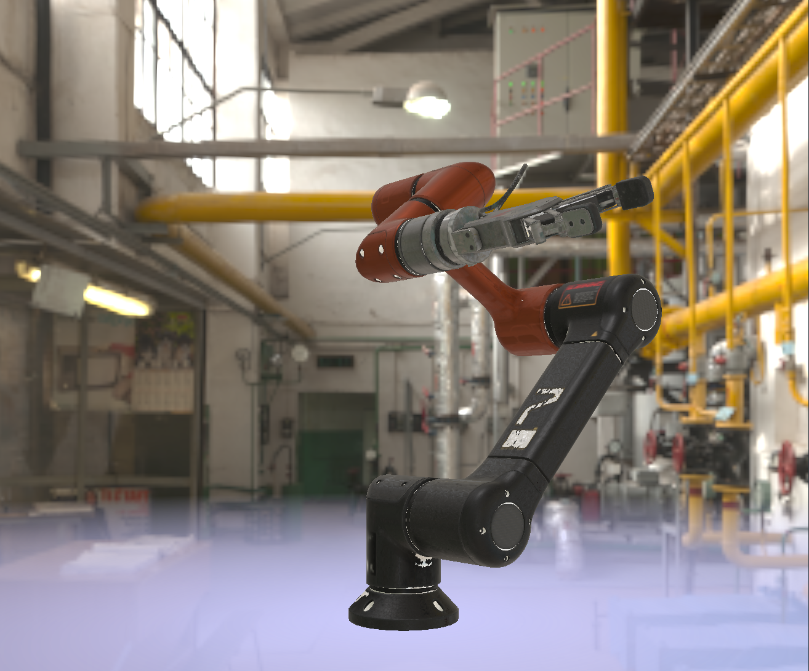
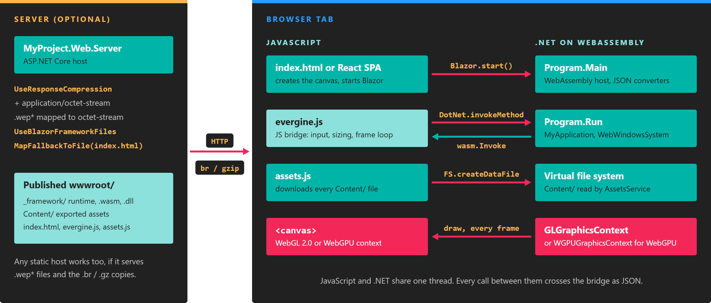

# Web

---



An Evergine application can run in a browser. The same .NET application project you use on Windows is compiled for **Blazor WebAssembly** and draws into an HTML `<canvas>` with **WebGL 2.0**, or with **WebGPU** in the experimental template. Nothing needs to be installed on the user's machine: the browser downloads the .NET runtime, your assemblies and the exported assets, and runs them locally.

## How a web application is put together



*The page and the .NET code talk only through the JavaScript bridge; the server just delivers files, so any static host works once they are published.*

* **The page** (`index.html`, or the React single-page application) creates the canvas and starts Blazor.
* **The JavaScript bridge** is `evergine.js`. It holds the helper functions the engine calls for input, canvas sizing, the WebGL context and the frame loop, and the functions that call into .NET.
* **The .NET side** runs in the Blazor WebAssembly runtime. The launcher's `Program` class creates `MyApplication`, a `WebWindowsSystem` and the graphics context, and exposes `[JSInvokable]` methods to the page.
* **Assets** are exported for the web profile into `Content/`. The generated `assets.js` downloads all of them in parallel into the in-memory file system of the WebAssembly runtime before the application starts.
* **The server** is optional. The template's ASP.NET Core project serves the files with response compression and the right content type for Evergine assets. In production you can publish to any static host instead.

## Web templates

| Template | Profile | Graphics | Page | Notes |
|----------|---------|----------|------|-------|
| Web (WebGL2.0) | `Web` | WebGL 2.0 | HTML5 and TypeScript | The default web template, with an ASP.NET Core server project. |
| React SPA (WebGL2.0) | `WebReact` | WebGL 2.0 | React 19 and Vite, with the `evergine-react` package | Adds a React project and an ASP.NET Core host. |
| Web (Experimental WebGPU) | `WebGPU` | WebGPU | HTML5 and TypeScript | Same structure as the default template, with `WGPUGraphicsContext`. |
| WebXR (Experimental AR) | `WebXR` | WebGL 2.0 | HTML5 and TypeScript | Adds `WebXRPlatform` and `EnterImmersive`/`ExitImmersive` methods for AR sessions. |

All web profiles precompile shaders and export textures as uncompressed `R8G8B8A8_UNorm`, because WebGL 2.0 does not guarantee any compressed texture format.

## Prerequisites

* **.NET 10 SDK.** Visual Studio 2026 installs it, or [download it](https://dotnet.microsoft.com/download/dotnet/10.0).
* **WebAssembly build tools.** In the Visual Studio installer, add the **ASP.NET and web development** workload and the **.NET WebAssembly build tools** component. From a terminal with administrator rights:

  ```powershell
  dotnet workload install wasm-tools
  ```

* **Node.js and npm**, only for the React template.
* **A browser with WebGL 2.0**, or with WebGPU for the WebGPU template. Current versions of Edge, Chrome, Firefox and Safari support WebGL 2.0.

> [!NOTE]
> WebGPU and WebXR support in Evergine is experimental. Some features may not work yet, and browser support for both APIs is still uneven.

## In this section

- [Getting started](getting_started.md): create a web project, walk through the HTML5 and React templates, and call between JavaScript and C#.
- [DevOps](ops.md): build, run, debug and publish, and what each project setting does.
- [Serialization](serialization.md): the JSON converters that pass Evergine types across the JavaScript bridge.
- [Tips](tips.md): reduce download size and startup time, and keep the frame rate up in the browser.
