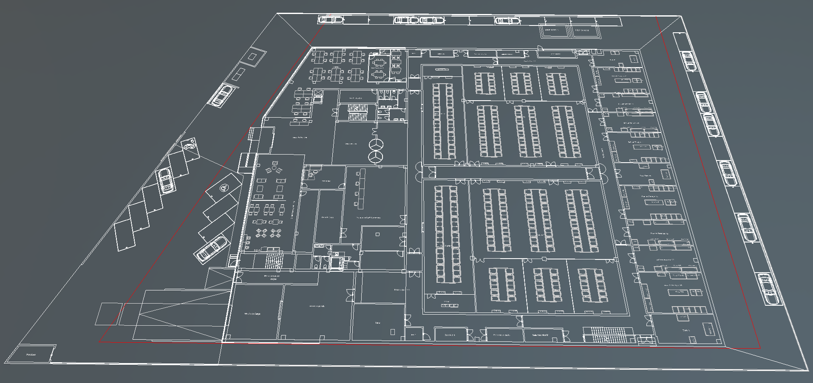
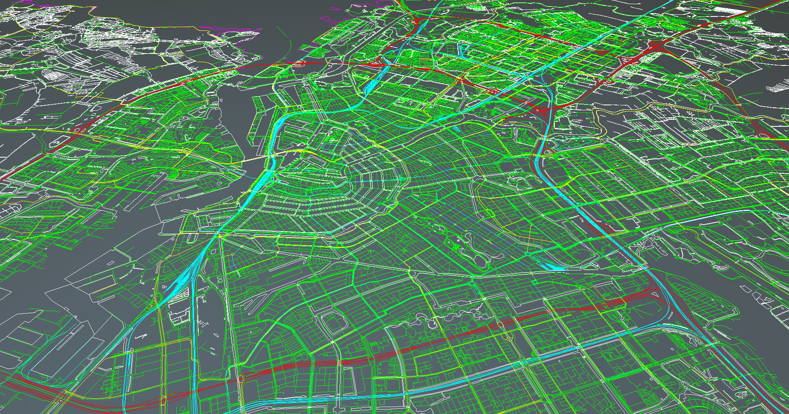
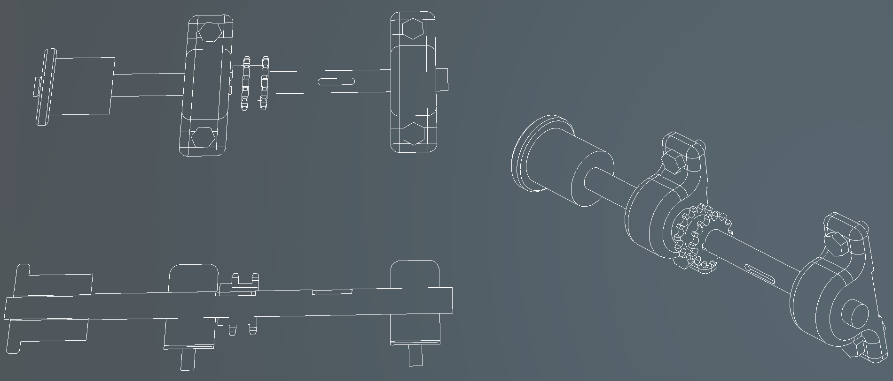

# CAD Runtime Models  

---



The **Evergine.Runtime.CAD** NuGet package provides a **powerful and efficient solution** for dynamically loading CAD files at runtime. It is designed for real-time applications and integrates seamlessly into your Evergine projects.

## Supported CAD Features

The `Evergine.Runtimes.CAD` namespace includes a robust CAD file loader that supports a comprehensive range of features:

### ✅ Features

#### 1. Supported CAD File Types
- **DXF**: R12 through R2024 (ASCII & Binary)
- **DWG**: R14 through R2024
- Uses **ACadSharp** for reading and processing CAD documents.  

#### 2. Geometry & Entities
- **Geometry**: Point, Line, Circle, Arc, Ellipse, Spline, 2D Polylines, Ray, XLine, Solid, Face3D  
- **Text**: `TextEntity`, `MText` with alignment, rotation and background rectangles  
- **Hatches**: Solid fills.  
- **Blocks & Inserts**: Nested blocks with transformation, color and layer inheritance  
- **Metadata**: Layers (name, color, visibility, frozen), extended data (XData), block attributes  

#### 3. Efficient Rendering (Line Batching)
- Implements CAD element rendering via a `DrawableLineBatch` system for all geometry and `Text3D` for text entities.  

#### 4. Runtime Customization
- Configure the CAD reader via optional parameters:
  - `precision` (int): tessellation precision for curves (default: 32)  
  - `maxMTextSize` (float): maximum height for multiline text (`MText`) in DXF files (default: 0.5f)  
  - `metersPerUnit` (float?): manual scale factor converting CAD units to meters; if `null`, uses the units defined in the CAD document 
```csharp
var model = await CADRuntime.Instance.Read(
    filepath,
    precision:       32,
    maxMTextSize:    0.5f,
    metersPerUnit:   0.01f
);
```
---
### Limitations
#### 1. CAD Entities Limitations  
- Visual line styles (dashed, dotted, varying line weights, linetypes) are not currently supported—everything is rendered as simple solid lines.  
- Hatch rendering is limited: complex patterns and gradient fills are exploded into basic line geometry.  
- No support for 3D CAD models: only 2D geometry (planar entities) is processed and rendered.

#### 2. CAD File Handling Limitations
Based on the capabilities of the **ACadSharp**.
##### Supported DXF/DWG Versions
| Version | DxfReader | DxfWriter | DwgReader | DwgWriter |
|---------|-----------|-----------|-----------|-----------|
| AC1009  | ❌        | ❌        | ❌        | ❌        |
| AC1012  | ✔️        | ✔️        | ❌        | ❌        |
| AC1014  | ✔️        | ✔️        | ✔️        | ✔️        |
| AC1015  | ✔️        | ✔️        | ✔️        | ✔️        |
| AC1018  | ✔️        | ✔️        | ✔️        | ✔️        |
| AC1021  | ✔️        | ✔️        | ✔️        | ❌        |
| AC1024  | ✔️        | ✔️        | ✔️        | ✔️        |
| AC1027  | ✔️        | ✔️        | ✔️        | ✔️        |
| AC1032  | ✔️        | ✔️        | ✔️        | ✔️        |

⚠️ *These limitations are subject to change in future updates.*

---
## Getting Started  

To start using the **Evergine.Runtimes.CAD** libraries, simply install the NuGet package and use the following code to load your assets:  

```csharp
protected async override void CreateScene()
{    
    var assetsService = Application.Current.Container.Resolve<AssetsService>();
    var entity = await CADRuntime.Instance.Read("myCADFile.dxf");
    this.manager.EntityManager.Add(entity);
}
```

</br>

## Samples

The CAD Runtime has been tested with the following publicly available datasets:
 - [CADMAPPER](https://cadmapper.com/#metro)
 - [Autodesk Samples](https://www.autodesk.com/support/technical/article/caas/tsarticles/ts/01em4r6LLJgnQQVBlk5GqD.html)

These tests help ensure compatibility with a wide range of DXF & DWG files. 
Below are several representative screenshots of CAD files successfully loaded and rendered at runtime:

### Sample screenshots

  
*Amsterdam map (DXF).*

  
*AutoCAD Samples (DWG)*