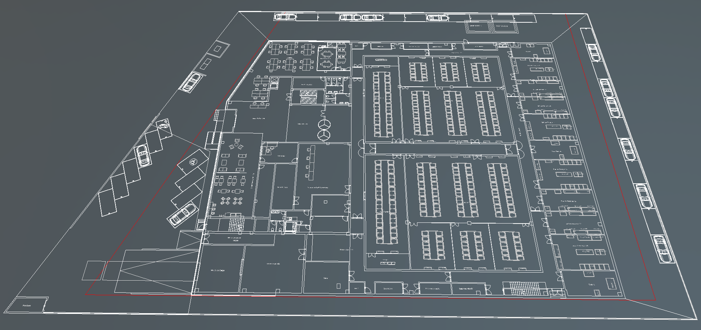
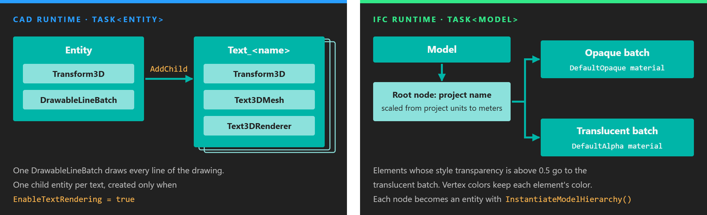
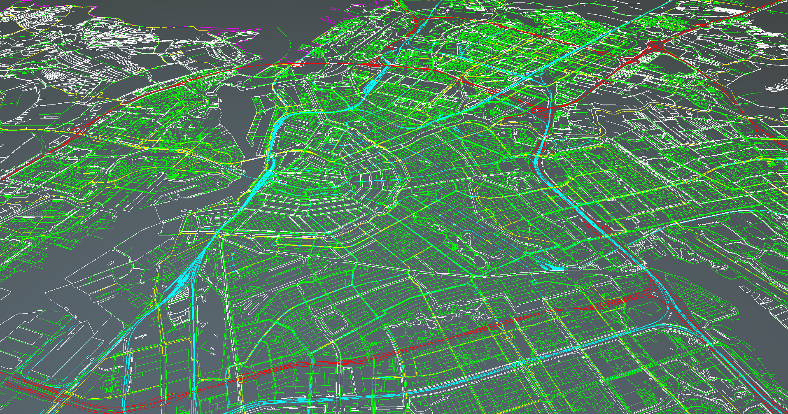
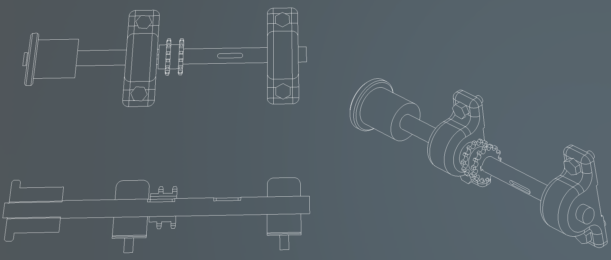

# CAD Runtime

---



The **Evergine.Runtimes.CAD** package reads AutoCAD drawings (`.dwg` and `.dxf`) while the application runs and turns them into an entity you can add to the scene. Use it to show floor plans, site maps or technical drawings as 3D line work, for example under a BIM model or as the base of a digital twin.

Unlike the model runtimes, the CAD runtime does not return a `Model`. A drawing is mostly lines and text, so it returns a ready-made `Entity` that draws every line in one batch and adds a child entity for each text.

<!-- CAPTURE: cad_runtime_app.png; a Windows desktop app showing a DWG or DXF floor plan loaded with CADRuntime and EnableTextRendering = true, seen from above with a few room labels readable -->

| | |
| --- | --- |
| **Package** | `Evergine.Runtimes.CAD` |
| **Namespace** | `Evergine.Runtimes.CAD` |
| **Class** | `CADRuntime` |
| **Formats** | DWG and DXF (ASCII and binary) |
| **Returns** | `Task<Entity>` |
| **Dependencies** | [ACadSharp](https://github.com/DomCR/ACadSharp) 3.4.9 (managed) |

## What the runtime returns



*A drawing becomes one entity. All geometry shares a single line batch, and texts are only created when you ask for them.*

The root entity has a `Transform3D` and a `DrawableLineBatch` (namespace `Evergine.Runtimes.CAD.CustomLineBatch`), a `Drawable3D` that renders every line of the drawing in its own color. When text rendering is on, each text becomes a child entity named `Text_<name>` with a `Transform3D`, a `Text3DMesh` and a `Text3DRenderer`.

## Supported content

**File versions**

The runtime reads every version that ACadSharp can read:

| Version code | AutoCAD release | DXF | DWG |
| --- | --- | --- | --- |
| AC1009 | R11 and R12 | No | No |
| AC1012 | R13 | Yes | No |
| AC1014 | R14 | Yes | Yes |
| AC1015 | 2000 | Yes | Yes |
| AC1018 | 2004 | Yes | Yes |
| AC1021 | 2007 | Yes | Yes |
| AC1024 | 2010 | Yes | Yes |
| AC1027 | 2013 | Yes | Yes |
| AC1032 | 2018 and later | Yes | Yes |

**Entities**

* Geometry: point, line, arc, circle, ellipse, spline, lightweight polyline, 2D and 3D polylines, ray, construction line (XLine) and solid.
* Text: `TextEntity`, `MText` and block attributes, with position, rotation, alignment and color.
* Hatches, exploded into their boundary lines.
* Blocks: inserts are expanded with their transform, including nested blocks and their attributes.
* Layers: entities on layers that are off or frozen are skipped, and colors set to *ByLayer* or *ByBlock* are resolved from the layer or the block insert.

Curves are tessellated into line segments, and entities of any other type are ignored.

**Limitations**

* Everything is drawn as thin solid lines. Line types (dashed, dotted), line weights, and hatch fills and gradients are not rendered.
* Only planar 2D geometry is processed. 3D solids, surfaces and meshes are ignored.
* Extended data (XData) is not read.

## Options

Pass a `CADReadOptions` to either `Read` overload to control how the drawing is converted.

| Property | Default | Description |
| --- | --- | --- |
| **Precision** | `32` | Number of segments used to tessellate curves such as circles, arcs, ellipses and splines. Raise it for smoother curves, lower it for large drawings. |
| **DXFMTextSize** | `0.5` | Height used for multiline texts (`MText`) in DXF files. |
| **MetersPerUnit** | `null` | Scale from drawing units to meters. When `null`, the units stored in the drawing are used. |
| **Font** | `null` | `Font` asset for the texts. When `null`, the default font of `Text3DMesh` is used. |
| **EnableTextRendering** | `false` | Creates the text entities. Off by default because drawings with thousands of labels take much longer to load and render. |

## Load a drawing from a file

`Read(string filePath, CADReadOptions options = null)` combines the path with the `Content` folder of the running application, so a relative path is resolved inside `Content` and an absolute path is used as it is. The file extension selects the reader. Mark drawings you ship in `Content` with **Set to export as raw** in the [Assets Details panel](../evergine_studio/assets/edit.md) so they are copied unchanged.

```csharp
using Evergine.Framework;
using Evergine.Framework.Graphics;
using Evergine.Framework.Services;
using Evergine.Runtimes.CAD;

public class MyScene : Scene
{
    protected override async void CreateScene()
    {
        var assetsService = Application.Current.Container.Resolve<AssetsService>();

        var options = new CADReadOptions
        {
            // The plan is drawn in centimeters but does not declare its units.
            MetersPerUnit = 0.01f,
            EnableTextRendering = true,
            Font = assetsService.Load<Font>(EvergineContent.Fonts.Roboto_Regular_ttf),
        };

        Entity plan = await CADRuntime.Instance.Read("Drawings/FloorPlan.dwg", options);
        this.Managers.EntityManager.Add(plan);
    }
}
```

`EvergineContent.Fonts.Roboto_Regular_ttf` stands for the identifier Evergine Studio generates for a font in your project.

## Load a drawing from a stream

`Read(Stream stream, CADReadOptions options = null)` copies the stream to a temporary file, reads it, and deletes the file. It detects DWG files from the version code at the start of the file and falls back to the other reader if the first attempt fails, so the stream does not need a file name. It does need to be seekable, because the runtime rewinds it after peeking at that version code. The following scene downloads a drawing over HTTP:

```csharp
using System.IO;
using System.Net.Http;
using Evergine.Framework;
using Evergine.Framework.Threading;
using Evergine.Runtimes.CAD;

public class MyScene : Scene
{
    private static readonly HttpClient httpClient = new HttpClient();

    protected override async void CreateScene()
    {
        using var response = await httpClient.GetAsync("https://example.com/drawings/site.dxf");
        response.EnsureSuccessStatusCode();

        // The runtime rewinds the stream after reading the file header, and a network stream cannot seek.
        using var buffer = new MemoryStream();
        await response.Content.CopyToAsync(buffer);
        buffer.Position = 0;

        Entity site = await CADRuntime.Instance.Read(buffer, new CADReadOptions { Precision = 16 });

        // Scene changes must happen on the Evergine main thread.
        await EvergineForegroundTask.Run(() => this.Managers.EntityManager.Add(site));
    }
}
```

> [!NOTE]
> Both overloads work with files: the path overload reads from disk, and the stream overload writes a temporary file to `Path.GetTempPath()`. Use the CAD runtime on platforms that give the application a writable file system, such as desktop.

## Samples

The CAD runtime has been tested with these public datasets:

* [CADMAPPER](https://cadmapper.com/#metro) city maps.
* [Autodesk sample files](https://www.autodesk.com/support/technical/article/caas/tsarticles/ts/01em4r6LLJgnQQVBlk5GqD.html).


*Amsterdam map from CADMAPPER (DXF).*


*AutoCAD sample drawings (DWG).*
