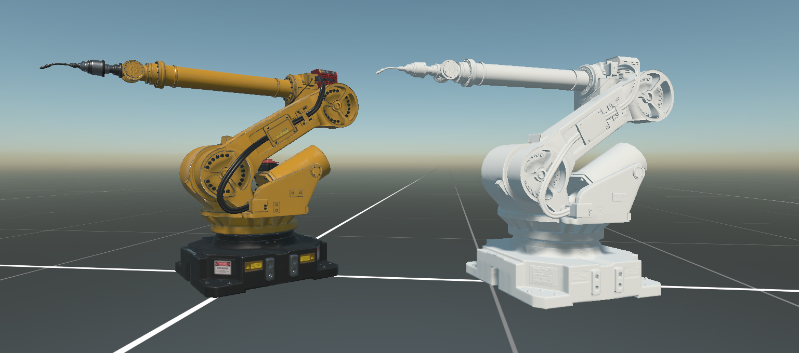
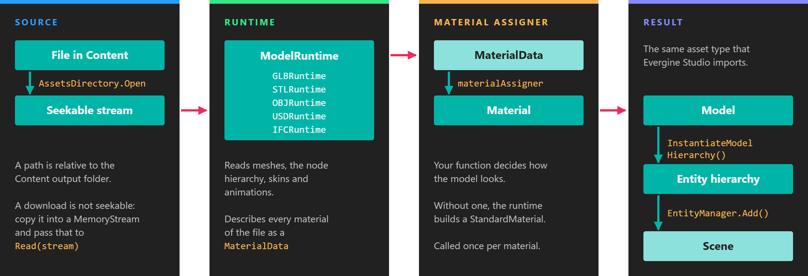

# GLB Runtime

---



The **Evergine.Runtimes.GLB** package reads `.glb` files while the application runs and turns them into a `Model`, the same asset type that Evergine Studio produces when it imports a model. Use it when the model is not known at build time: a file the user picks, a catalog downloaded from your server, or content that changes more often than you publish the application. glTF is the format most 3D tools and online libraries export, so this is the runtime to reach for first.

| | |
| --- | --- |
| **Package** | `Evergine.Runtimes.GLB` |
| **Namespace** | `Evergine.Runtimes.GLB` |
| **Class** | `GLBRuntime` (derives from `ModelRuntime`) |
| **Formats** | Binary glTF 2.0 (`.glb`) |
| **Returns** | `Task<Model>` |
| **Platforms** | All Evergine platforms |

`ModelRuntime` lives in `Evergine.Framework.Runtimes`. `GLBRuntime.Instance` is a ready-to-use singleton that resolves the graphics context and the assets service from the application container the first time it reads a file.

## What the runtime reads

`GLBRuntime` reads the binary form of glTF 2.0. It checks the `glTF` magic number at the start of the file, so a text `.gltf` file with a separate `.bin` buffer is rejected; convert it to `.glb` first.

* **Scene hierarchy.** Every node becomes an entity with its own `Transform3D` when you call `InstantiateModelHierarchy`.
* **Meshes** with triangle lists, triangle strips, lines and line strips. Other primitive modes are skipped.
* **Draco-compressed geometry.** Primitives that use the `KHR_draco_mesh_compression` extension are decompressed with the `Evergine.Bindings.Draco` package, a dependency of the GLB runtime that ships native decoders for Windows, Linux, macOS, Android, iOS and WebAssembly. No setup is needed.
* **PBR metallic-roughness materials** with base color, metallic-roughness, normal, emissive and occlusion textures, plus the base color of `KHR_materials_pbrSpecularGlossiness` materials.
* **Embedded textures** in PNG, JPEG or KTX, decoded by the [Image runtime](image_runtime.md).
* **Skins and animations.** When the file has animations, the root entity gets an `Animation3D` component that references the model.

## Load a model from a file

`Read(string filePath, ...)` opens the file through the application's `AssetsDirectory`, so the path is **relative to the `Content` folder of the running application**. Absolute paths are rejected with an `ArgumentException`.

A `.glb` file placed in the project's `Content` folder is normally imported by Evergine Studio and exported in the Evergine asset format. To read the original file with the runtime, mark the file with **Set to export as raw** in the [Assets Details panel](../evergine_studio/assets/edit.md). Raw assets keep their name and folder in the output, so `Content/Models/DamagedHelmet.glb` is read with the path `Models/DamagedHelmet.glb`.

```csharp
using Evergine.Framework;
using Evergine.Framework.Graphics;
using Evergine.Framework.Services;
using Evergine.Runtimes.GLB;

public class MyScene : Scene
{
    protected override async void CreateScene()
    {
        var assetsService = Application.Current.Container.Resolve<AssetsService>();

        Model helmet = await GLBRuntime.Instance.Read("Models/DamagedHelmet.glb");

        // A Model is only data: InstantiateModelHierarchy builds the entities that render it.
        Entity helmetEntity = helmet.InstantiateModelHierarchy("helmet", assetsService);
        this.Managers.EntityManager.Add(helmetEntity);
    }
}
```

> [!TIP]
> `CreateScene` is `async void`, so an exception thrown by `Read` does not reach any caller. Wrap the loading code in `try`/`catch` and log the error, or the model silently fails to appear.

## Load a model from a stream

`Read(Stream stream, ...)` reads from any stream that is **readable and seekable**. Use it for files outside the `Content` folder and for downloads.

For a file anywhere on disk, open it with `File.OpenRead`, which returns a seekable `FileStream`:

```csharp
using var stream = File.OpenRead(@"C:\Models\DamagedHelmet.glb");
Model model = await GLBRuntime.Instance.Read(stream);
```

A network stream is not seekable, so copy the response into a `MemoryStream` before reading it. The following scene downloads a GLB file with `HttpClient` and adds it to the scene:

```csharp
using System.IO;
using System.Net.Http;
using Evergine.Framework;
using Evergine.Framework.Graphics;
using Evergine.Framework.Services;
using Evergine.Framework.Threading;
using Evergine.Runtimes.GLB;

public class MyScene : Scene
{
    // HttpClient is designed to be created once and reused.
    private static readonly HttpClient httpClient = new HttpClient();

    protected override async void CreateScene()
    {
        const string url = "https://example.com/models/DamagedHelmet.glb";

        using var response = await httpClient.GetAsync(url);
        response.EnsureSuccessStatusCode();

        // The GLB reader seeks inside the file, and a network stream cannot seek.
        using var buffer = new MemoryStream();
        await response.Content.CopyToAsync(buffer);
        buffer.Position = 0;

        Model model = await GLBRuntime.Instance.Read(buffer);

        var assetsService = Application.Current.Container.Resolve<AssetsService>();
        Entity entity = model.InstantiateModelHierarchy("downloaded", assetsService);

        // After awaiting the download the code may run on a thread-pool thread.
        // Scene changes must happen on the Evergine main thread.
        await EvergineForegroundTask.Run(() => this.Managers.EntityManager.Add(entity));
    }
}
```

## Play the animations

To play an animation, find the `Animation3D` on the root entity after adding it to the scene:

```csharp
using System.Linq;
using Evergine.Components.Animation;

Entity entity = model.InstantiateModelHierarchy("robot", assetsService);
this.Managers.EntityManager.Add(entity);

var animation = entity.FindComponent<Animation3D>();
string firstClip = animation?.AnimationNames.FirstOrDefault();
if (firstClip != null)
{
    animation.PlayAnimation(firstClip, loop: true);
}
```

## Materials and the material assigner

Model files describe materials in their own terms. The runtime translates each one into a `MaterialData` object and then asks a **material assigner** to turn it into an Evergine `Material`. When you pass no assigner, the runtime creates a `StandardMaterial` for you.



*The runtime owns geometry, hierarchy and animation. The material assigner is the one point where your code decides how the model looks.*

`MaterialData` lives in `Evergine.Framework.Runtimes` and is shared by every model runtime:

| Member | Type | Description |
| --- | --- | --- |
| **Name** | `string` | Material name from the file. |
| **BaseColor** | `Color` | Base (diffuse) color, including alpha. |
| **AlphaMode** | `AlphaMode` | `Opaque`, `Mask` (alpha test) or `Blend` (alpha blending). |
| **AlphaCutoff** | `float` | Alpha test threshold used with `AlphaMode.Mask`. |
| **MetallicFactor** | `float` | Metallic factor. |
| **RoughnessFactor** | `float` | Roughness factor. |
| **EmissiveColor** | `LinearColor` | Emissive color. |
| **HasVertexColor** | `bool` | The mesh has a vertex color channel. |
| **HasVertexTexcoord** | `bool` | The mesh has texture coordinates. |
| **HasVertexNormal** | `bool` | The mesh has normals. Without them, lighting has nothing to work with. |
| **HasVertexTangent** | `bool` | The mesh has tangents, which normal mapping needs. |
| **HasDoubleSided** | `bool` | The material is rendered from both sides. |
| **GetBaseColorTextureAndSampler()** | `Task<(Texture, SamplerState)>` | Base color texture and its sampler, or `null` values when the material has none. |
| **GetMetallicRoughnessTextureAndSampler()** | `Task<(Texture, SamplerState)>` | Metallic-roughness texture and sampler. |
| **GetNormalTextureAndSampler()** | `Task<(Texture, SamplerState)>` | Normal map and sampler. |
| **GetEmissiveTextureAndSampler()** | `Task<(Texture, SamplerState)>` | Emissive texture and sampler. |
| **GetOcclusionTextureAndSampler()** | `Task<(Texture, SamplerState)>` | Ambient occlusion texture and sampler. |

The texture methods are asynchronous because a texture is only decoded when an assigner asks for it. An assigner that ignores the normal map never pays for decoding it.

An assigner is any `Func<MaterialData, Task<Material>>`. Pass it as the second argument of `Read`; both the path and the stream overloads accept it. The runtime calls it once for every distinct material in the file, and registers the returned materials in the `AssetsService` so that `InstantiateModelHierarchy` can find them.

### Example: a product configurator

The assigner below builds the same kind of `StandardMaterial` the GLB runtime builds by default, with one change: any material named `Paint` takes the color the user picked instead of the color in the file. Everything a material needs comes from the `MaterialData`.

```csharp
using System.Threading.Tasks;
using Evergine.Common.Graphics;
using Evergine.Framework;
using Evergine.Framework.Graphics;
using Evergine.Framework.Graphics.Effects;
using Evergine.Framework.Graphics.Materials;
using Evergine.Framework.Runtimes;
using Evergine.Framework.Services;
using Evergine.Runtimes.GLB;

public class ConfiguratorScene : Scene
{
    public Color PaintColor { get; set; } = Color.Red;

    protected override async void CreateScene()
    {
        var assetsService = Application.Current.Container.Resolve<AssetsService>();

        Model model = await GLBRuntime.Instance.Read("Models/Car.glb", this.AssignMaterial);

        this.Managers.EntityManager.Add(model.InstantiateModelHierarchy("car", assetsService));
    }

    private async Task<Material> AssignMaterial(MaterialData data)
    {
        var assetsService = Application.Current.Container.Resolve<AssetsService>();
        var effect = assetsService.Load<Effect>(DefaultResourcesIDs.StandardEffectID);

        var baseColor = await data.GetBaseColorTextureAndSampler();
        var metallicRoughness = await data.GetMetallicRoughnessTextureAndSampler();
        var emissive = await data.GetEmissiveTextureAndSampler();
        var occlusion = await data.GetOcclusionTextureAndSampler();

        // Blended materials go to the alpha layer so they are sorted and drawn after opaque geometry.
        RenderLayerDescription layer;
        if (data.AlphaMode == AlphaMode.Blend)
        {
            layer = assetsService.Load<RenderLayerDescription>(data.HasDoubleSided
                ? DefaultResourcesIDs.AlphaDoubleSidedRenderLayerID
                : DefaultResourcesIDs.AlphaRenderLayerID);
        }
        else
        {
            layer = assetsService.Load<RenderLayerDescription>(DefaultResourcesIDs.OpaqueRenderLayerID);
        }

        bool isPaint = data.Name == "Paint";

        var material = new StandardMaterial(effect)
        {
            // Lighting needs normals. Unlit is the only sensible choice for a mesh without them.
            LightingEnabled = data.HasVertexNormal,
            IBLEnabled = data.HasVertexNormal,
            BaseColor = isPaint ? this.PaintColor : data.BaseColor,
            Alpha = data.BaseColor.A / 255.0f,
            BaseColorTexture = isPaint ? null : baseColor.Texture,
            BaseColorSampler = baseColor.Sampler,
            Metallic = data.MetallicFactor,
            Roughness = data.RoughnessFactor,
            MetallicRoughnessTexture = metallicRoughness.Texture,
            MetallicRoughnessSampler = metallicRoughness.Sampler,
            EmissiveColor = data.EmissiveColor.ToColor(),
            EmissiveTexture = emissive.Texture,
            EmissiveSampler = emissive.Sampler,
            OcclusionTexture = occlusion.Texture,
            OcclusionSampler = occlusion.Sampler,
            VertexColorEnabled = data.HasVertexColor,
            LayerDescription = layer,
        };

        // A normal map is meaningless without tangents to orient it.
        if (data.HasVertexTangent)
        {
            var normal = await data.GetNormalTextureAndSampler();
            material.NormalTexture = normal.Texture;
            material.NormalSampler = normal.Sampler;
        }

        if (data.AlphaMode == AlphaMode.Mask)
        {
            material.AlphaCutout = data.AlphaCutoff;
        }

        return material.Material;
    }
}
```

The assigner can return a material built from any effect, including one of your own. Build a [material decorator](../graphics/materials/material_decorators.md) for your effect and fill it from `MaterialData` in the same way.

When you need information that `MaterialData` does not expose, cast it to the format-specific class. `GLBMaterialData.GLBMaterial` is the material exactly as the glTF file describes it, and `VertexAttributes` lists the attributes of the primitive that uses it:

```csharp
if (data is GLBMaterialData glb && glb.GLBMaterial.Extensions?.ContainsKey("KHR_materials_unlit") == true)
{
    // The file asks for an unlit material: honor it.
}
```

> [!NOTE]
> The material assigner replaces the default material creation entirely, so it must return a material for every call. The runtime registers each returned material in the `AssetsService`.
