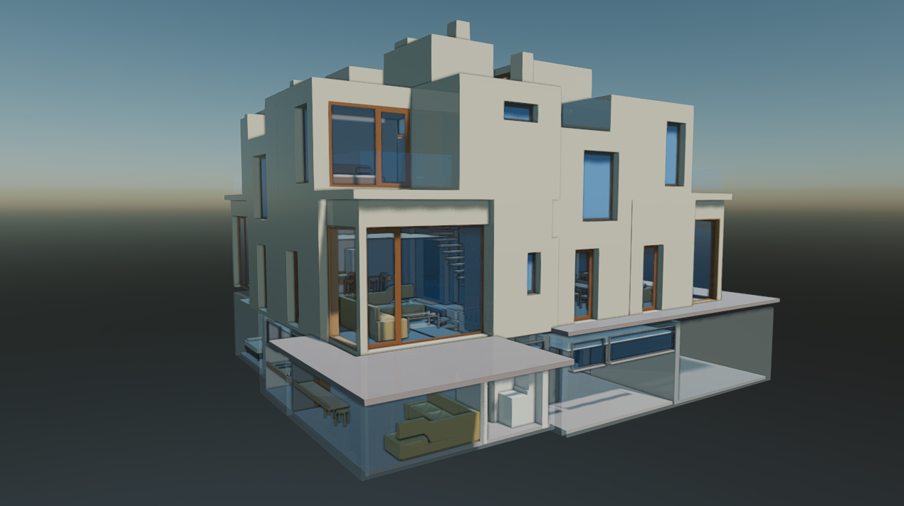
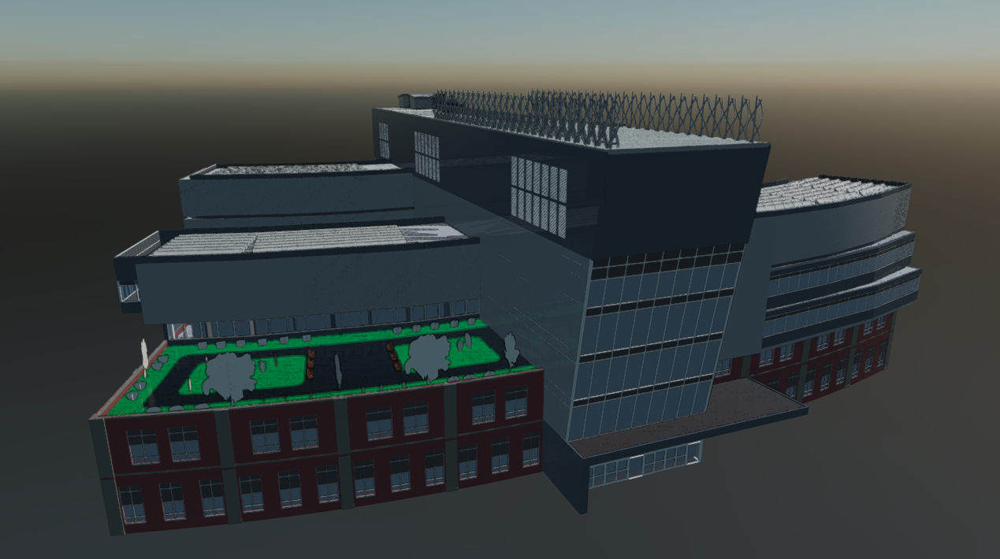
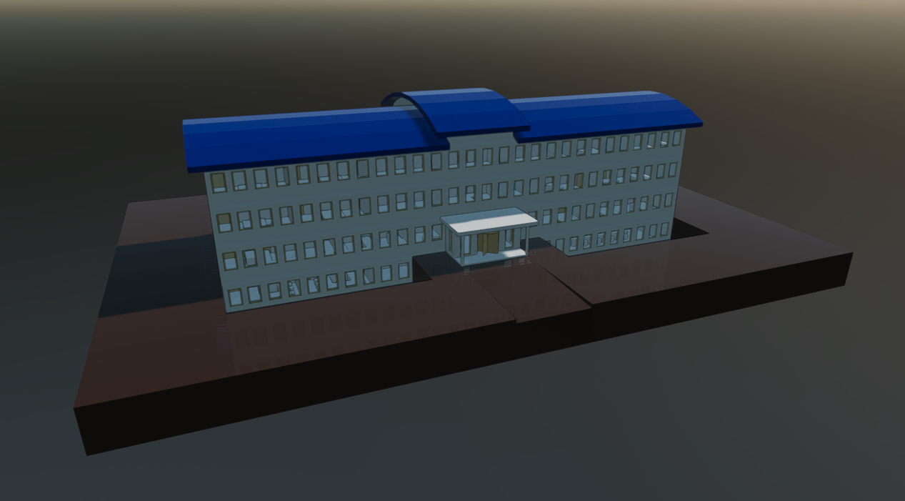
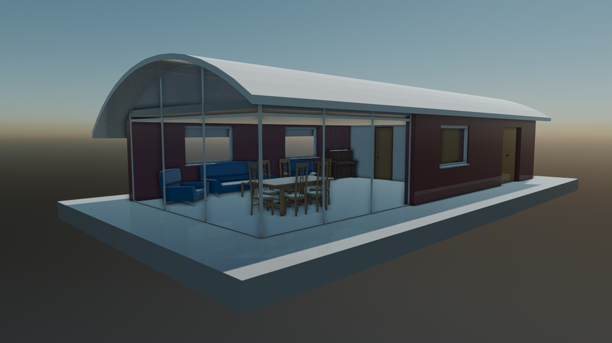

# IFC Runtime Models  

---



The **Evergine.Runtime.IFC** NuGet package provides a **powerful and efficient solution** for dynamically loading IFC models at runtime. It is designed for real-time 3D applications and integrates seamlessly into your Evergine projects.

## Supported IFC Features

The `Evergine.Runtime.IFC` namespace includes a robust IFC file loader that supports a comprehensive range of mesh features:

### ✅ Features

#### 1. Supported IFC File Types
- Supports `.ifc` files in both **IFC2x3** and **IFC4** schema versions.
- Data processing is based on the **XBim Toolkit**.

#### 2. Geometry
- Supports multiple geometric representations:
  - **Triangulated face sets**: direct 3D meshes based on triangle lists.
  - **Extruded solids**: generated from parametric IFC solid extrusions.
  - **Boolean operations**: geometry resulting from boolean operations (union, difference, intersection).
- Generated meshes include: **vertex positions**, **triangle indices**, **vertex normals**, **vertex color**.
- Normal generation can be configured using the `useSmoothNormals` flag in the runtime:
  - When set to `false` (default), geometry is generated with **flat normals** (per face), resulting in a faceted appearance and better performance.
  - When set to `true`, geometry is generated with **smooth normals** (per vertex), producing visually smoother surfaces.
- Mesh generation is optimized for direct integration into Evergine scenes.

#### 3. Basic Materials
- Supports default **opaque** materials.
- Supports **translucent** materials by interpreting properties related to glass or semi-transparent materials.

#### 4. Efficient Rendering (Batching)
- Implements an intelligent batching system that groups meshes by material type. 
Reduces the total number of draw calls to just two main calls:
  - One for **opaque** objects.
  - One for **translucent** objects.

---
### Limitations  
#### 1. Platform
- The IFC runtime is currently supported only on Windows desktop platforms.

#### 2. IFC File Handling
- Supported file types include **IFC2x3** and **IFC4**, based on the capabilities of the **XBim Toolkit**.

⚠️ *These limitations are subject to change in future updates.*

---
## Getting Started  

To start using the **Evergine.Runtimes.IFC** libraries, simply install the NuGet package and use the following code to load your assets:  

```csharp
protected async override void CreateScene()
{    
    var assetsService = Application.Current.Container.Resolve<AssetsService>();
    var model = await IFCRuntime.Instance.Read("MyModel.ifc", useSmoothNormals: true);
    var entity = model.InstantiateModelHierarchy(assetsService);
    this.manager.EntityManager.Add(entity);
}
```

</br>

### Custom Shader Support

By default, models are loaded using the Standard Effect (Evergine’s built-in shader). However, if you want to load models using your custom shader, you must pass an additional **CustomMaterialAssigner** function to the Read method:

```csharp
protected async override void CreateScene()
{
    var assetsService = Application.Current.Container.Resolve<AssetsService>();
    var model = await IFCRuntime.Instance.Read("Models/buildingExample.ifc", this.CustomMaterialAssigner);
    var entity = model.InstantiateModelHierarchy(assetsService);
    this.Managers.EntityManager.Add(entity);
}
```

## Samples

The IFC Runtime has been extensively tested with the following publicly available datasets:
 - [OpenIFC Model Repository](https://openifcmodel.cs.auckland.ac.nz/)
 - [Steptools Samples](https://www.steptools.com/docs/stpfiles/ifc/)
 - [BIM Whale Sample Files](https://github.com/andrewisen/bim-whale-ifc-samples)

These tests help ensure compatibility with a wide range of real-world meshes, materials, and topology configurations. 
Below are several representative screenshots of models successfully loaded and rendered at runtime:

### Sample screenshots

  
*OpenIFC Model Repository.*

  
*Karlsruhe Institute of Technology (KIT), Institute for Automation and Applied Informatics*

  
*BIM Whale Sample: BasicHouse*