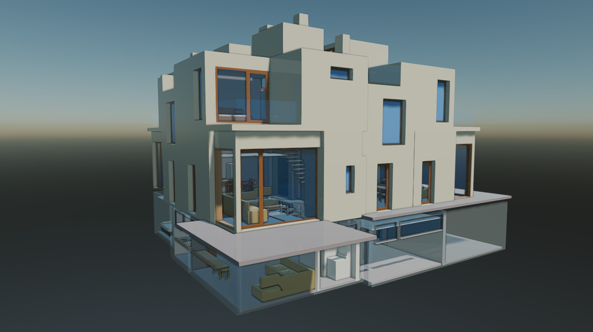
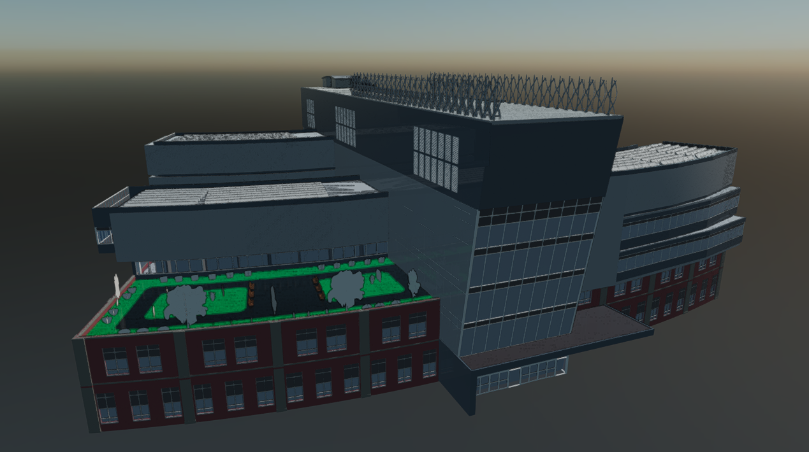
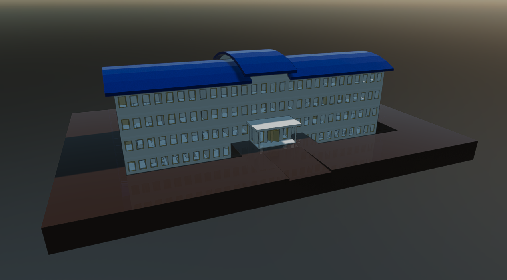
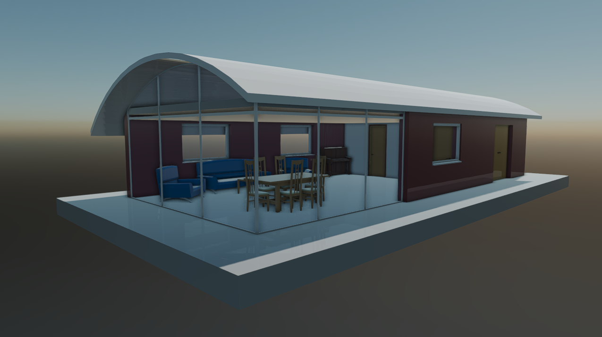

# IFC Runtime

---



The **Evergine.Runtimes.IFC** package reads Industry Foundation Classes (`.ifc`) files, the open exchange format of BIM tools such as Revit, ArchiCAD and Tekla, while the application runs. It returns a `Model` built for fast display of whole buildings: all geometry is merged into at most two meshes, one opaque and one translucent.

| | |
| --- | --- |
| **Package** | `Evergine.Runtimes.IFC` |
| **Namespace** | `Evergine.Runtimes.IFC` |
| **Class** | `IFCRuntime` (derives from `ModelRuntime`) |
| **Formats** | `.ifc` with the IFC2x3 or IFC4 schema |
| **Returns** | `Task<Model>` |
| **Platforms** | Windows desktop |
| **Dependencies** | [xBIM Toolkit](https://docs.xbim.net/): `Xbim.Essentials` 6.0.578, `Xbim.Geometry` 6.1.801, `Xbim.Tessellator` 6.0.521 |

The runtime is Windows only because the xBIM geometry engine that tessellates IFC solids is a native Windows library.

## What the runtime returns


*The building arrives as a Model with two meshes at most, which keeps it to two draw calls however many elements it has.*

The xBIM engine turns every product in the file (walls, slabs, windows, and so on) into a triangle mesh, whether the IFC describes it as a triangulated face set, an extruded solid or the result of boolean operations. The runtime then:

1. Colors each vertex with the surface style of its element, taking the transparency of the style as alpha.
2. Sorts the elements into two groups: **translucent** when the transparency of their style is above 0.5, **opaque** otherwise.
3. Transforms every element to its world position and merges each group into one mesh.
4. Places both meshes under a root node named after the IFC project, scaled by the length unit of the project so that the model is in meters.

Two built-in `StandardMaterial` instances render the result: `DefaultOpaque` and `DefaultAlpha` (alpha 0.2), both with vertex colors enabled so each element keeps its own color.

Because the elements are merged, the model has no entity per wall or window, and the IFC properties of the elements are not kept. Use this runtime to show a building, not to query it.

## Normals

| Parameter | Default | Description |
| --- | --- | --- |
| **useSmoothNormals** | `false` | Off, every face gets its own normal: a faceted look and the fastest load. On, normals are averaged per vertex, which gives curved elements a smoother look. |

The parameter is only available on the file path overload. The stream overload always uses flat normals.

## Progress reporting

Opening a large IFC file takes seconds. `IFCRuntime` reports the progress of each stage through three `IProgress<int>` properties, all `null` by default. Each receives a percentage from 0 to 100.

| Property | Stage |
| --- | --- |
| **OpenProgress** | Opening and parsing the file. |
| **ContextProgress** | Building the geometry context of the model. |
| **GeometryProgress** | Generating the meshes. |

Set them on the runtime before calling `Read`.

## Load a model from a file

`Read(string filePath, Func<MaterialData, Task<Material>> materialAssigner = null, bool useSmoothNormals = false)` combines the path with the `Content` folder of the running application, so a relative path is resolved inside `Content` and an absolute path is used as it is. Mark IFC files that you ship in `Content` with **Set to export as raw** in the [Assets Details panel](../evergine_studio/assets/edit.md) so they are copied unchanged.

```csharp
using System;
using Evergine.Framework;
using Evergine.Framework.Graphics;
using Evergine.Framework.Services;
using Evergine.Runtimes.IFC;

public class MyScene : Scene
{
    protected override async void CreateScene()
    {
        var assetsService = Application.Current.Container.Resolve<AssetsService>();

        IFCRuntime.Instance.OpenProgress = new Progress<int>(p => Console.WriteLine($"Open: {p}%"));
        IFCRuntime.Instance.ContextProgress = new Progress<int>(p => Console.WriteLine($"Context: {p}%"));
        IFCRuntime.Instance.GeometryProgress = new Progress<int>(p => Console.WriteLine($"Geometry: {p}%"));

        Model model = await IFCRuntime.Instance.Read("Models/AC20-Institute.ifc", useSmoothNormals: true);

        Entity building = model.InstantiateModelHierarchy("building", assetsService);
        this.Managers.EntityManager.Add(building);
    }
}
```

> [!TIP]
> Loading runs on background threads, and `Progress<int>` only returns to the calling thread when that thread has a synchronization context. To update scene or UI state from a progress callback, queue the change with `EvergineForegroundTask.Run`.

## Load a model from a stream

`Read(Stream stream, ...)` copies the stream to a temporary `.ifc` file, reads it and deletes the file. The stream is read once from start to end, so a network stream works without buffering it first:

```csharp
using System.Net.Http;
using Evergine.Framework;
using Evergine.Framework.Graphics;
using Evergine.Framework.Services;
using Evergine.Framework.Threading;
using Evergine.Runtimes.IFC;

public class MyScene : Scene
{
    private static readonly HttpClient httpClient = new HttpClient();

    protected override async void CreateScene()
    {
        using var response = await httpClient.GetAsync("https://example.com/bim/BasicHouse.ifc", HttpCompletionOption.ResponseHeadersRead);
        response.EnsureSuccessStatusCode();

        using var stream = await response.Content.ReadAsStreamAsync();
        Model model = await IFCRuntime.Instance.Read(stream);

        var assetsService = Application.Current.Container.Resolve<AssetsService>();
        Entity building = model.InstantiateModelHierarchy("house", assetsService);

        // Scene changes must happen on the Evergine main thread.
        await EvergineForegroundTask.Run(() => this.Managers.EntityManager.Add(building));
    }
}
```

## Materials

Both `Read` overloads accept a `materialAssigner` argument because `IFCRuntime` shares the `ModelRuntime` signature, but the IFC runtime does not call it: the model always uses the two built-in materials described above. To change how the building looks, replace the `Material` of the `MaterialComponent` on the two mesh entities of the instantiated hierarchy after loading. The [GLB and STL page](models_runtime.md#materials-and-the-material-assigner) explains the material assigner used by the other model runtimes.

## Samples

The IFC runtime has been tested with these public datasets:

* [Open IFC Model Repository](https://openifcmodel.cs.auckland.ac.nz/)
* [STEP Tools IFC samples](https://www.steptools.com/docs/stpfiles/ifc/)
* [BIM Whale sample files](https://github.com/andrewisen/bim-whale-ifc-samples)


*Model from the Open IFC Model Repository.*


*Karlsruhe Institute of Technology (KIT), Institute for Automation and Applied Informatics.*


*BIM Whale sample: BasicHouse.*
