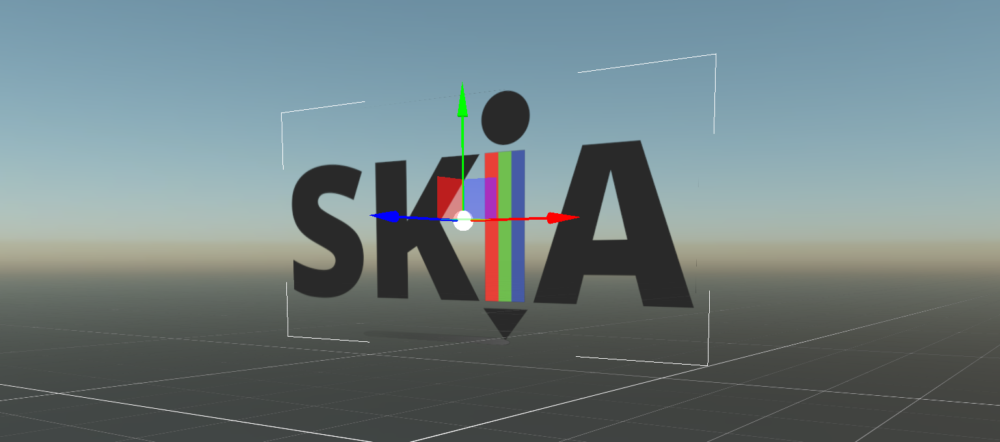

# Evergine.Runtimes.Images

---



The **Evergine Runtimes Images** NuGet package provides a powerful and efficient solution for loading images at runtime in your projects.

[SkiaSharp](https://github.com/mono/SkiaSharp) is a cross-platform, high-performance 2D graphics API built on [Google's Skia Graphics Library](https://skia.org/). It offers extensive image format support, hardware acceleration, and optimized image processing capabilities across multiple platforms, ensuring consistent rendering quality and performance efficiency.

## Features

The Evergine.Runtimes.Images library enables fast, real-time texture loading in a variety of formats, including:
✅ BMP
✅ JPEG / JPG
✅ PNG
✅ WEBP

Unlike previous implementations that required precompiled Evergine content assets, this runtime allows dynamic texture creation directly from images obtained through:

- Internet downloads
- Cloud storage
- User-generated uploads

This enhancement significantly expands the possibilities for dynamic content integration within your Evergine applications.

## Getting Started

Integrating **Evergine.Runtimes.Image** into your project is simple. Just include the NuGet package and follow the implementation example below:

```csharp
Texture texture = await ImageRuntime.Instance.Read("Textures/my_image.png", true, false);
```

> [!Note]
>  · The first boolean parameter specifies whether you want to create a mipmap texture.<br/>
>  · The second boolean parameter determines whether the image has premultiplied alpha.

> [!Note]
> If you're using this library in a web-based project you must also add the following NuGet package to your web project:
> ```<PackageReference Include="SkiaSharp.Views.Blazor" Version="3.116.1" />```