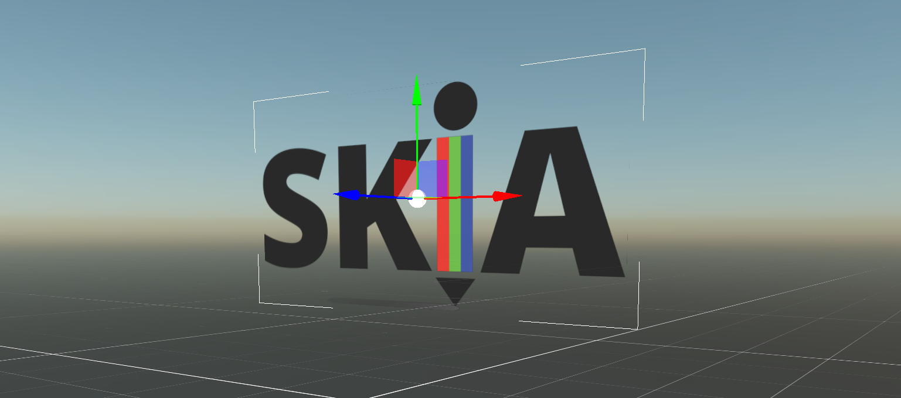

# Image Runtime

---



The **Evergine.Runtimes.Image** package creates GPU textures from image files while the application runs. Use it for pictures that are not part of your content: user avatars, product photos from a catalog service, screenshots, or images uploaded by users.

Images are decoded with [SkiaSharp](https://github.com/mono/SkiaSharp), the .NET binding of Google's Skia graphics library, and KTX containers are uploaded as they are. The other runtimes use this package to decode the textures inside model files, so the formats listed here are also the texture formats of the [GLB](models_runtime.md), [OBJ](obj_runtime.md) and [USD](usd_runtime.md) runtimes.

| | |
| --- | --- |
| **Package** | `Evergine.Runtimes.Image` |
| **Namespace** | `Evergine.Runtimes.Images` |
| **Class** | `ImageRuntime` |
| **Formats** | PNG, JPEG, BMP, WebP, GIF (first frame) and any other format Skia decodes; KTX and KTX2 |
| **Returns** | `Task<Texture>` |
| **Dependencies** | SkiaSharp 3.119.2 |
| **Platforms** | All Evergine platforms (Web needs [one extra package](#web-projects)) |

> [!NOTE]
> The package is `Evergine.Runtimes.Image` (singular), but its namespace is `Evergine.Runtimes.Images` (plural).

## Read parameters

`ImageRuntime` has two overloads with the same optional parameters:

```csharp
Task<Texture> Read(string filePath, bool generateMipmap = true, bool premulAlpha = true, bool? isGamma = null);
Task<Texture> Read(Stream stream, bool generateMipmap = true, bool premulAlpha = true, bool? isGamma = null, string debugId = null);
```

| Parameter | Default | Description |
| --- | --- | --- |
| **generateMipmap** | `true` | Builds the full mipmap chain on the CPU. Keep it for textures drawn at different sizes, such as on 3D surfaces; turn it off for UI images shown at their own size, which then load faster and use a quarter less memory. |
| **premulAlpha** | `true` | Multiplies the color channels by alpha while decoding (premultiplied alpha). Turn it off when the shader that samples the texture expects straight alpha. |
| **isGamma** | `null` | Color space of the texture. `true` creates an sRGB texture, for color images. `false` creates a linear texture, for data such as normal maps, masks or roughness. `null` follows the color profile stored in the image. |
| **debugId** | `null` | Name given to KTX textures in graphics debuggers. |

KTX and KTX2 files skip the decoder: their data, mipmaps and format are uploaded as stored in the file, and the three options above have no effect.

> [!IMPORTANT]
> The file path overload only forwards `generateMipmap` to the decoder. `premulAlpha` and `isGamma` are ignored, so the texture always uses premultiplied alpha and the color space stored in the image. Open the file as a stream and use the stream overload when you need to control them.

## Load an image from a file

`Read(string filePath, ...)` opens the file through the application's `AssetsDirectory`, so the path is relative to the `Content` folder of the running application; absolute paths throw an `ArgumentException`. Images in `Content` are normally imported as texture assets, so mark the ones you want to read with **Set to export as raw** in the [Assets Details panel](../evergine_studio/assets/edit.md).

The following scene shows an image on a plane:

```csharp
using Evergine.Common.Graphics;
using Evergine.Components.Graphics3D;
using Evergine.Framework;
using Evergine.Framework.Graphics;
using Evergine.Framework.Graphics.Effects;
using Evergine.Framework.Graphics.Materials;
using Evergine.Framework.Services;
using Evergine.Runtimes.Images;

public class MyScene : Scene
{
    protected override async void CreateScene()
    {
        Texture texture = await ImageRuntime.Instance.Read("Images/poster.png");

        var assetsService = Application.Current.Container.Resolve<AssetsService>();
        var effect = assetsService.Load<Effect>(DefaultResourcesIDs.StandardEffectID);

        var material = new StandardMaterial(effect)
        {
            // A poster should show its own colors, not the scene lighting.
            LightingEnabled = false,
            BaseColorTexture = texture,
            BaseColorSampler = assetsService.Load<SamplerState>(DefaultResourcesIDs.LinearClampSamplerID),
            LayerDescription = assetsService.Load<RenderLayerDescription>(DefaultResourcesIDs.OpaqueRenderLayerID),
        };

        Entity poster = new Entity("poster")
            .AddComponent(new Transform3D())
            .AddComponent(new MaterialComponent() { Material = material.Material })
            .AddComponent(new PlaneMesh() { PlaneNormal = PlaneMesh.NormalAxis.ZPositive, Width = texture.Description.Width / (float)texture.Description.Height, Height = 1 })
            .AddComponent(new MeshRenderer());

        this.Managers.EntityManager.Add(poster);
    }
}
```

## Load an image from the Internet

`Read(Stream stream, ...)` accepts any readable stream. SkiaSharp may need to look ahead in the data to identify the format, so give it a seekable stream: copy downloads into a `MemoryStream` first.

```csharp
using System.IO;
using System.Net.Http;
using System.Threading.Tasks;
using Evergine.Common.Graphics;
using Evergine.Runtimes.Images;

public class AvatarLoader
{
    private static readonly HttpClient httpClient = new HttpClient();

    public async Task<Texture> LoadAvatarAsync(string url)
    {
        using var buffer = new MemoryStream(await httpClient.GetByteArrayAsync(url));

        // A photo shown at a fixed size in the UI: no mipmaps, sRGB color.
        return await ImageRuntime.Instance.Read(buffer, generateMipmap: false, isGamma: true);
    }
}
```

## Release textures

Textures created by `ImageRuntime` are not assets: the `AssetsService` does not track or unload them. Call `Dispose()` on the texture when you no longer need it, after removing it from every material that uses it.

## Web projects

SkiaSharp brings its native library for Windows, Android and iOS with it. A web project also needs the WebAssembly build of Skia: add `SkiaSharp.Views.Blazor`, which includes it, to the web launcher project, with the same version the runtime uses (3.119.2):

```xml
<ItemGroup>
  <PackageReference Include="SkiaSharp.Views.Blazor" Version="3.119.2" />
</ItemGroup>
```
