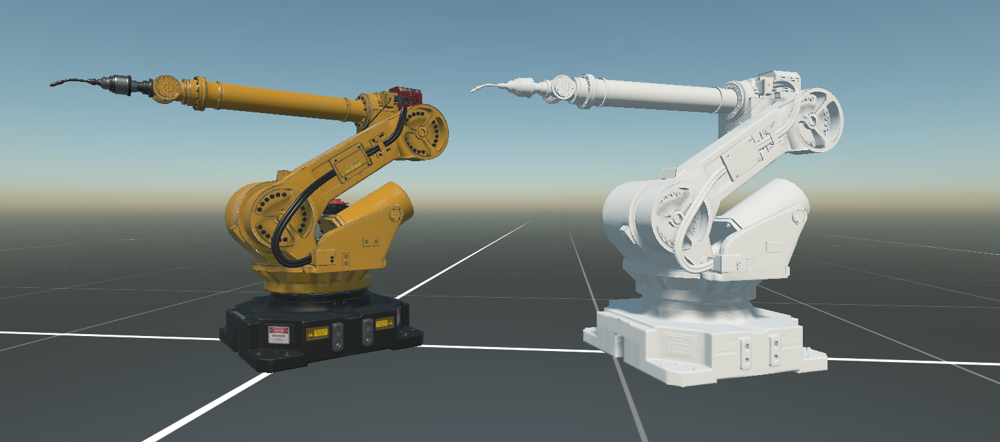

# Runtimes Models  

---

  

The **Evergine.Runtimes.GLB** and **Evergine.Runtimes.STL** NuGet packages provide a **powerful and efficient solution** for loading 3D models dynamically at runtime.  

## Dynamic Model Loading  

Loading dynamic models has always been a challenge. To address this, Evergine introduces **runtime packages** that support the _GLB_ and _STL_ formats. These packages allow you to manage scenarios where your models:  

✔️ Are **not** included in the initial application bundle.  
✔️ Are **not** static application assets.  
✔️ Are marked as **raw assets**.  

With the **Evergine.Runtimes** libraries, you can now **download models dynamically** from the internet and display them seamlessly to users. This feature is particularly useful for applications requiring **real-time model updates** or **user-generated content integration**.  

These advancements empower developers to build **more dynamic and interactive applications**, ensuring users have access to the latest content **without** frequent updates or large initial downloads.  

🚀 **More industrial formats will be supported** in future updates as part of this new approach!  

## Getting Started  

To start using the **Evergine.Runtimes.GLB** or **Evergine.Runtimes.STL** libraries, simply install the NuGet package and use the following code to load your assets:  

```csharp
protected async override void CreateScene()
{    
    var model = await GLBRuntime.Instance.Read("MyModel.glb");
    // or
    var model = await GLBRuntime.Instance.Read("MyModel.stl");

    var assetsService = Application.Current.Container.Resolve<AssetsService>();
    var entity = model.InstantiateModelHierarchy(assetsService);
    this.manager.EntityManager.Add(entity);
}
```

</br>

### Custom Shader Support

By default, models are loaded using the Standard Effect (Evergine’s built-in shader). However, if you want to load models using your custom shader, you must pass an additional **CustomMaterialAssigner** function to the Read method:

```csharp
protected async override void CreateScene()
{
    var assetsService = Application.Current.Container.Resolve<AssetsService>();

    var model = await GLBRuntime.Instance.Read("Scenes/DamagedHelmet.glb", this.CustomMaterialAssigner);
    //var model = await STLRuntime.Instance.Read("Scenes/Star_Destroyer_Fixed.stl");

    var entity = model.InstantiateModelHierarchy(assetsService);
    this.Managers.EntityManager.Add(entity);
}
```

To use a custom shader, define a CustomMaterialAssigner function that assigns the correct textures, materials, and properties:

```csharp
private async Task<Material> CustomMaterialAssigner(MaterialData data)
{
    var assetsService = Application.Current.Container.Resolve<AssetsService>();

    // Get textures            
    var baseColor = await data.GetBaseColorTextureAndSampler();
    var metallicRoughness = await data.GetMetallicRoughnessTextureAndSampler();
    var normalTex = await data.GetNormalTextureAndSampler();  
    var emissive = await data.GetEmissiveTextureAndSampler();
    var occlussion = await data.GetOcclusionTextureAndSampler();            

    // Get Layer
    var opaqueLayer = assetsService.Load<RenderLayerDescription>(DefaultResourcesIDs.OpaqueRenderLayerID);
    var alphaLayer = assetsService.Load<RenderLayerDescription>(DefaultResourcesIDs.AlphaRenderLayerID);
    RenderLayerDescription layer;
    float alpha = data.BaseColor.A / 255.0f;
    switch (data.AlphaMode)
    {
        default:
        case Evergine.Framework.Runtimes.AlphaMode.Mask:
        case Evergine.Framework.Runtimes.AlphaMode.Opaque:
            layer = opaqueLayer;
            break;
        case Evergine.Framework.Runtimes.AlphaMode.Blend:
            layer = alphaLayer;
            break;
    }

    // Create standard material            
    var effect = assetsService.Load<Effect>(DefaultResourcesIDs.StandardEffectID);            
    StandardMaterial standard = new StandardMaterial(effect)
    {
        LightingEnabled = data.HasVertexNormal,
        IBLEnabled = data.HasVertexNormal,
        BaseColor = data.BaseColor,
        Alpha = alpha,
        BaseColorTexture = baseColor.Texture,
        BaseColorSampler = baseColor.Sampler,
        Metallic = data.MetallicFactor,
        Roughness = data.RoughnessFactor,
        MetallicRoughnessTexture = metallicRoughness.Texture,
        MetallicRoughnessSampler = metallicRoughness.Sampler,
        EmissiveColor = data.EmissiveColor.ToColor(),
        EmissiveTexture = emissive.Texture,
        EmissiveSampler = emissive.Sampler,
        OcclusionTexture = occlussion.Texture,
        OcclusionSampler = occlussion.Sampler,
        LayerDescription = layer,                
    };

    // Normal textures
    if (data.HasVertexTangent)
    {
        standard.NormalTexture = normalTex.Texture;
        standard.NormalSampler = normalTex.Sampler;
    }

    // Alpha test
    if (data.AlphaMode == Evergine.Framework.Runtimes.AlphaMode.Mask)
    {
        standard.AlphaCutout = data.AlphaCutoff;
    }

    // Vertex Color
    if (data.HasVertexColor)
    {
        if (standard.ActiveDirectivesNames.Contains("VCOLOR"))
        {
            var directivesArray = standard.ActiveDirectivesNames;
            Array.Resize(ref directivesArray, directivesArray.Length + 1);
            directivesArray[directivesArray.Length - 1] = "VCOLOR";
            standard.ActiveDirectivesNames = directivesArray;
        }
    }

    return standard.Material;
}
```