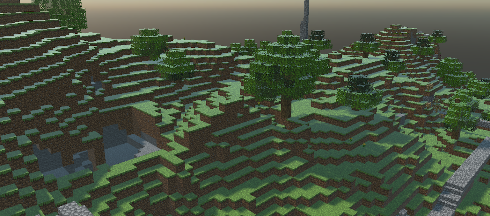
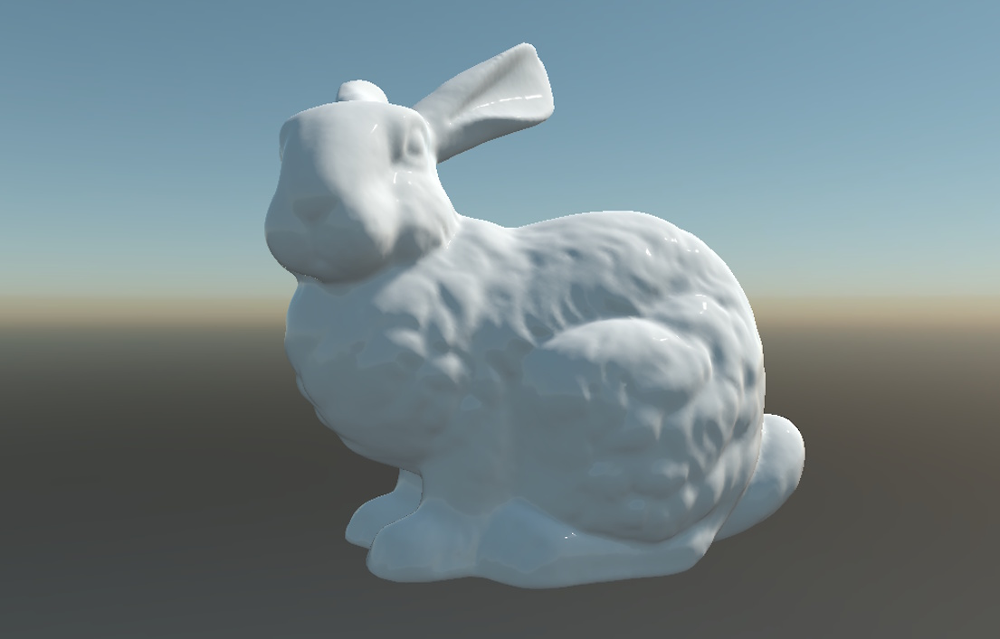
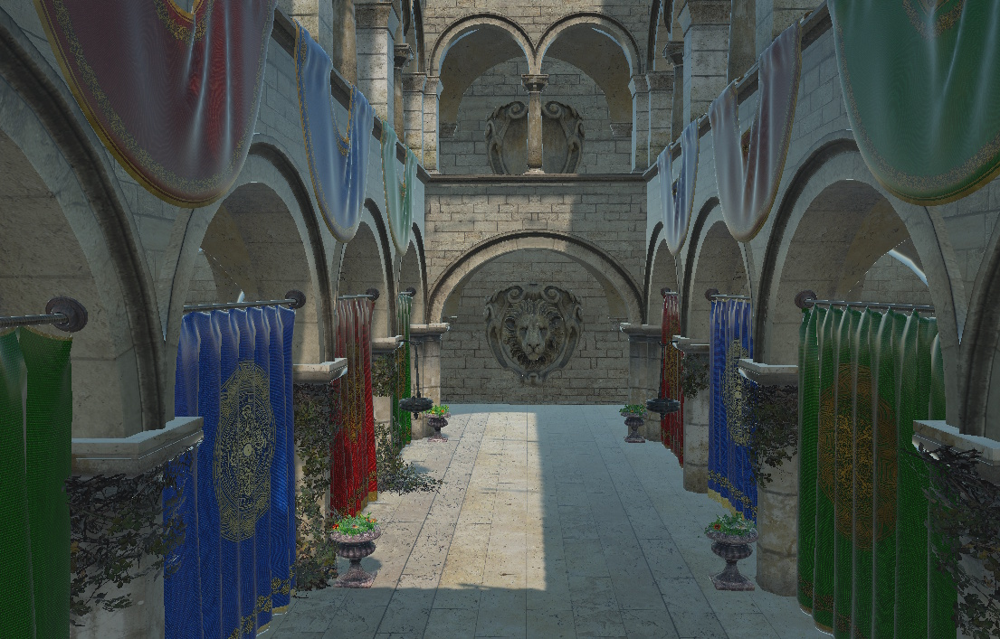
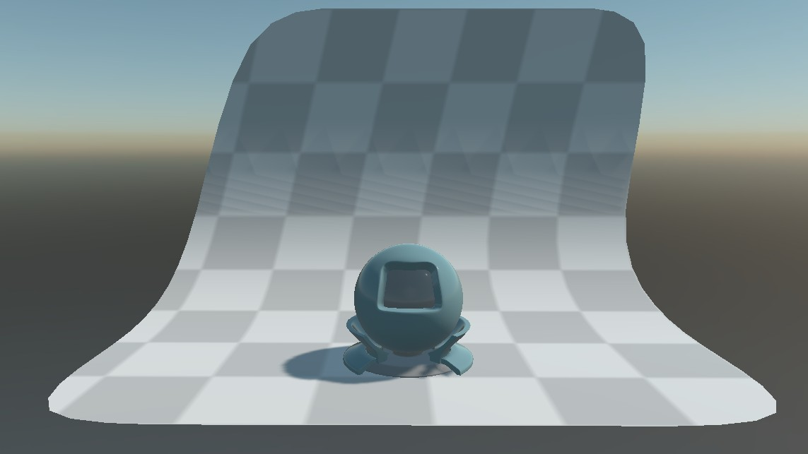
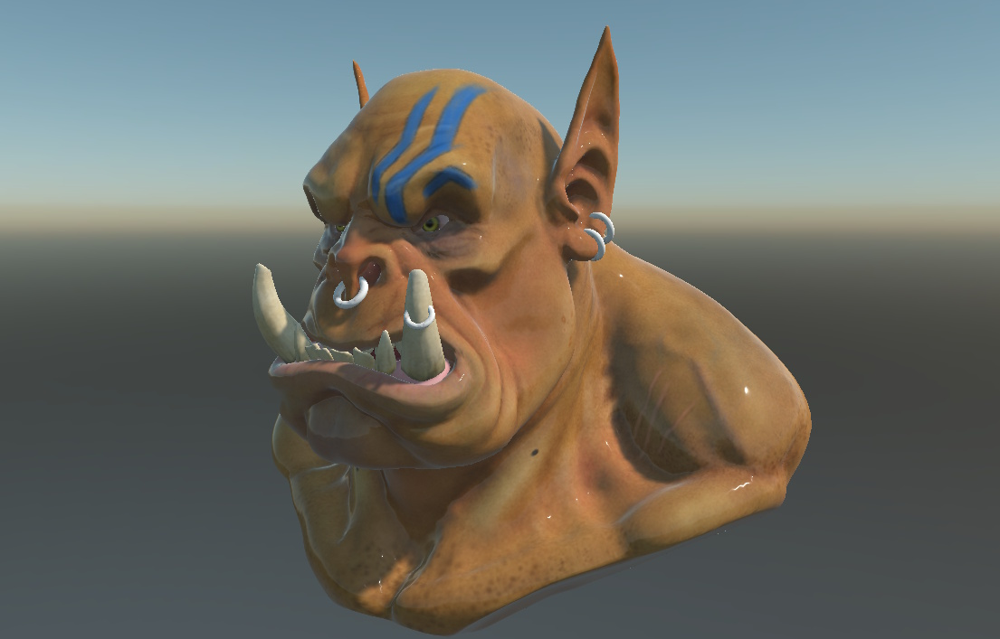

# OBJ Runtime

---



The **Evergine.Runtimes.OBJ** package reads Wavefront `.obj` files, together with their `.mtl` material libraries and textures, while the application runs. It returns a `Model`, so an OBJ file ends up in the scene exactly like a model imported by Evergine Studio. OBJ is the lowest common denominator of 3D formats, which makes this runtime a good fallback for files exported from scanners, older tools and online repositories.

| | |
| --- | --- |
| **Package** | `Evergine.Runtimes.OBJ` |
| **Namespace** | `Evergine.Runtimes.OBJ` |
| **Class** | `OBJRuntime` (derives from `ModelRuntime`) |
| **Formats** | `.obj` with optional `.mtl` material libraries |
| **Returns** | `Task<Model>` |
| **Platforms** | All Evergine platforms |

## What the runtime reads

**Geometry**

* Vertex positions, normals and texture coordinates.
* Triangles, quads and larger polygons. Faces with more than three vertices are triangulated.
* Several groups and objects in one file. Each one becomes a mesh of the model.
* Files without normals get flat face normals computed on load.

Only faces are turned into meshes. Point (`p`) and line (`l`) elements are parsed but not rendered.

**Materials**

* The `.mtl` files referenced by `mtllib` statements, resolved relative to the folder of the `.obj` file.
* Diffuse color (`Kd`) and dissolve (`d`, or `Tr` as its inverse) as base color and alpha.
* The PBR extension values `Pm` (metallic) and `Pr` (roughness), and the emissive color `Ke`.
* The diffuse texture (`map_Kd`) as the base color texture, in any format the [Image runtime](image_runtime.md) decodes (PNG, JPEG, BMP, WebP, KTX).

The default material is a `StandardMaterial` with lighting and image-based lighting on. A material with an alpha map (`map_d`) or a PNG diffuse texture uses alpha test; a material with a dissolve value below 1 uses alpha blending.

> [!NOTE]
> The `.mtl` parser also reads normal, specular, metallic, roughness and emissive texture names, but `OBJMaterialData` only exposes the diffuse texture. The other `Get...TextureAndSampler()` methods return empty values, so neither the default material nor a custom assigner receives those maps.

## Load a model from a file

`Read(string filePath, Func<MaterialData, Task<Material>> materialAssigner = null, bool useSmoothNormals = false)` reads the file through the application's `AssetsDirectory`, so the path is relative to the `Content` folder of the running application. Mark the `.obj`, `.mtl` and texture files with **Set to export as raw** in the [Assets Details panel](../evergine_studio/assets/edit.md) so they reach the output unchanged and keep their relative folders.

```csharp
using Evergine.Framework;
using Evergine.Framework.Graphics;
using Evergine.Framework.Services;
using Evergine.Runtimes.OBJ;

public class MyScene : Scene
{
    protected override async void CreateScene()
    {
        var assetsService = Application.Current.Container.Resolve<AssetsService>();

        // The .mtl file and the textures are looked up in the Models folder, next to orc.obj.
        Model model = await OBJRuntime.Instance.Read("Models/orc.obj", useSmoothNormals: true);

        Entity entity = model.InstantiateModelHierarchy("orc", assetsService);
        this.Managers.EntityManager.Add(entity);
    }
}
```

### Smooth normals

| Parameter | Default | Description |
| --- | --- | --- |
| **useSmoothNormals** | `false` | When `true`, the normals of vertices that share a position are averaged, which hides the facets of curved surfaces. Leave it `false` for hard-edged models, or when the file already contains the normals you want. |

The value is stored in the `UseSmoothNormals` property of the runtime, which the stream overload also uses.

## Load a model from a stream

`Read(Stream stream, ...)` accepts any readable, seekable stream. A stream carries no folder, so the runtime resolves `mtllib` statements and textures against its `WorkingDirectory` property, a path inside the `Content` folder. While `WorkingDirectory` is `null`, material libraries are skipped and the model loads with default materials.

The following scene downloads an OBJ file over HTTP. The geometry comes from the download; the materials come from the `Models` folder of the application.

```csharp
using System.IO;
using System.Net.Http;
using Evergine.Framework;
using Evergine.Framework.Graphics;
using Evergine.Framework.Services;
using Evergine.Framework.Threading;
using Evergine.Runtimes.OBJ;

public class MyScene : Scene
{
    private static readonly HttpClient httpClient = new HttpClient();

    protected override async void CreateScene()
    {
        using var response = await httpClient.GetAsync("https://example.com/models/bunny.obj");
        response.EnsureSuccessStatusCode();

        // The OBJ reader needs a seekable stream; a network stream is not.
        using var buffer = new MemoryStream();
        await response.Content.CopyToAsync(buffer);
        buffer.Position = 0;

        OBJRuntime.Instance.WorkingDirectory = "Models";
        OBJRuntime.Instance.UseSmoothNormals = true;
        Model model = await OBJRuntime.Instance.Read(buffer);

        var assetsService = Application.Current.Container.Resolve<AssetsService>();
        Entity entity = model.InstantiateModelHierarchy("bunny", assetsService);

        // Scene changes must happen on the Evergine main thread.
        await EvergineForegroundTask.Run(() => this.Managers.EntityManager.Add(entity));
    }
}
```

## Custom materials

Pass a material assigner as the second argument of either `Read` overload to create the materials yourself. The runtime describes every OBJ material as an `OBJMaterialData` (a `MaterialData`), and your function returns the `Material` to use. The [GLB and STL page](models_runtime.md#materials-and-the-material-assigner) describes `MaterialData` and has a complete assigner.

```csharp
Model model = await OBJRuntime.Instance.Read("Models/orc.obj", this.AssignMaterial);
```

`OBJMaterialData` always reports `HasVertexNormal = true` and `HasVertexColor = false`, because every mesh the runtime builds has normals and no vertex colors. Cast to `OBJMaterialData` and read its `OBJMaterial` field to reach every value parsed from the `.mtl` file.

## Samples

The OBJ runtime has been tested against the [Computer Graphics Archive](http://casual-effects.com/data/index.html) collection by Morgan McGuire, which covers a wide range of real-world meshes, materials and topologies. A few of those models, loaded at runtime:


*Stanford Bunny, created by Greg Turk and Marc Levoy from range scans of a real object.*


*The Atrium Sponza Palace in Dubrovnik, remodeled by Frank Meinl at Crytek after Marko Dabrovic's original.*


*The material test object of the Mitsuba renderer, converted to a single OBJ file with the backdrop as a separate mesh.*


*An orc sculpted in ZBrush and exported as OBJ.*
