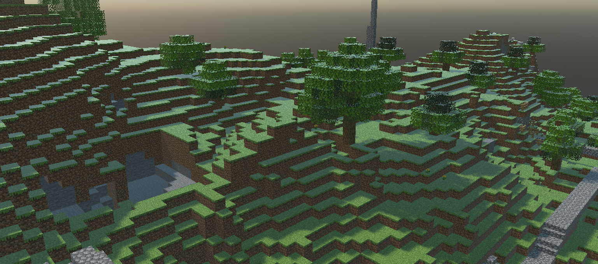
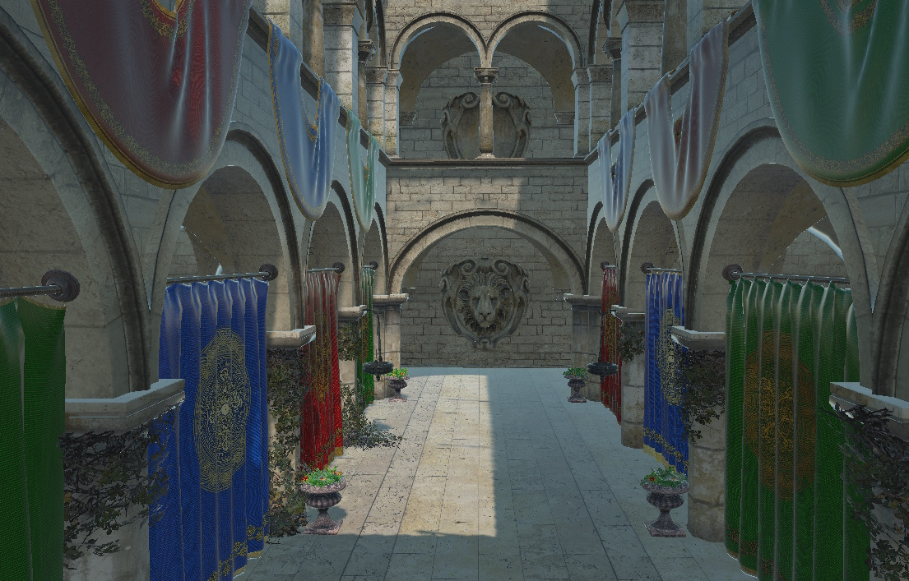

# OBJ Runtime Models  

---

  

The **Evergine.Runtime.OBJ** NuGet package provides a **powerful and efficient solution** for dynamically loading OBJ models at runtime. It is designed for real-time 3D applications and integrates seamlessly into your Evergine projects.

## Supported OBJ Features

The `Evergine.Runtime.OBJ` namespace includes a robust OBJ file loader that supports a comprehensive range of mesh and material features:

### ✅ Features

#### 1. Geometry
- **Vertices**, **normals**, and **UVs** (texture coordinates)
- Supports:
  - Triangles and quads (auto-triangulated)
  - Arbitrary polygon faces
  - Multiple mesh groups per file

#### 2. Basic Materials
- Supports `.mtl` files:
  - Ambient (`Ka`), Diffuse (`Kd`), and Specular (`Ks`) colors
  - Shininess (`Ns`) and transparency

#### 3. PBR Materials
- Metallic–roughness and specular–glossiness workflows
- Support for roughness, metallic, and normal maps

#### 4. Textures
- Diffuse/albedo, normal, specular/metallic, and emissive textures
- Common formats supported: PNG, JPG, BMP

#### 5. Transparency
- Parses `d` and `Tr` values from `.mtl` for alpha transparency
- Automatic blend mode configuration

#### 6. Points & Lines
- Point cloud and wireframe geometry support
- Renders `v` and `l` commands directly from `.obj` files

---
## Getting Started  

To start using the **Evergine.Runtimes.GLB** or **Evergine.Runtimes.STL** libraries, simply install the NuGet package and use the following code to load your assets:  

```csharp
protected async override void CreateScene()
{    
    var model = await GLBRuntime.Instance.Read("MyModel.obj");

    var assetsService = Application.Current.Container.Resolve<AssetsService>();
    var entity = model.InstantiateModelHierarchy(assetsService);
    this.manager.EntityManager.Add(entity);
}
```

</br>

### Custom Shader Support

By default, models are loaded using the Standard Effect (Evergine’s built-in shader). However, if you want to load models using your custom shader, you must pass an additional **CustomMaterialAssigner** function to the Read method:

```csharp
protected async override void CreateScene()
{
    var assetsService = Application.Current.Container.Resolve<AssetsService>();

    var model = await GLBRuntime.Instance.Read("Models/orc.obj", this.CustomMaterialAssigner);

    var entity = model.InstantiateModelHierarchy(assetsService);
    this.Managers.EntityManager.Add(entity);
}
```

## Samples

This OBJ loader has been extensively tested against the full [Comprehensive 3D Models dataset](http://casual-effects.com/data/index.html), ensuring compatibility with a wide variety of real‑world meshes, materials, and topology cases. Below are a few representative screenshots of models loaded and rendered at runtime:

### Some screenshots

  
*Stanford Bunny was created by Greg Turk and Marc Levoy from multiple range scans of a real object using a Cyberware 3030 MS scanner.*

  
*The Atrium Sponza Palace in Dubrovnik, re-modeled by Frank Meinl at Crytek with inspiration from Marko Dabrovic's original.*

  
*This is the standard material test object provided with the Mitsuba renderer. we converted it to a single OBJ file and separated the backdrop.*

  
*This orc was originally created on zbrush and exported as obj file.*