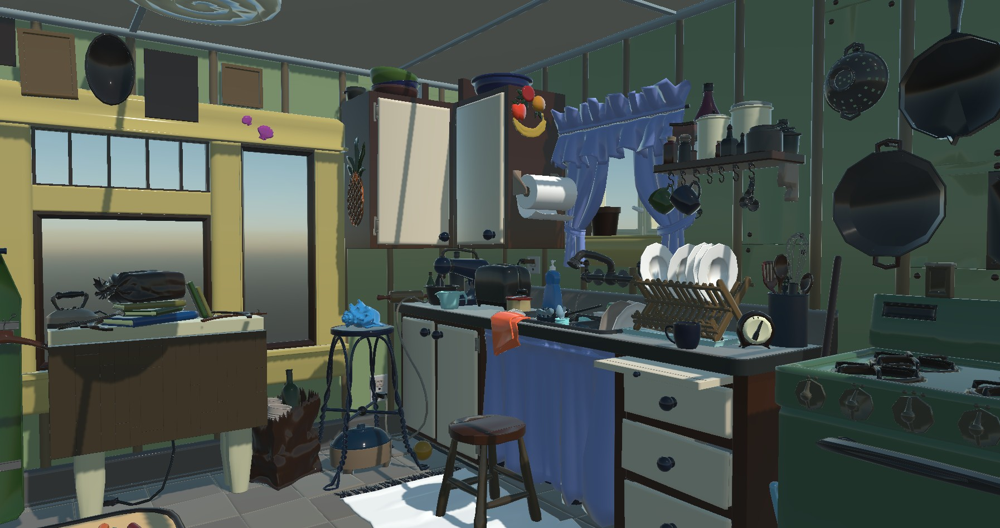
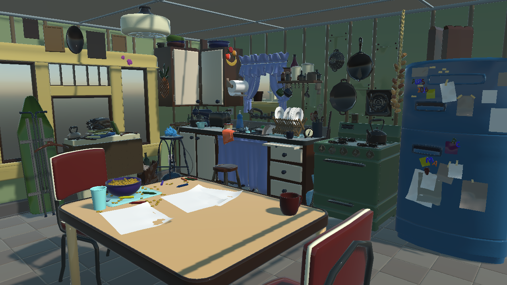
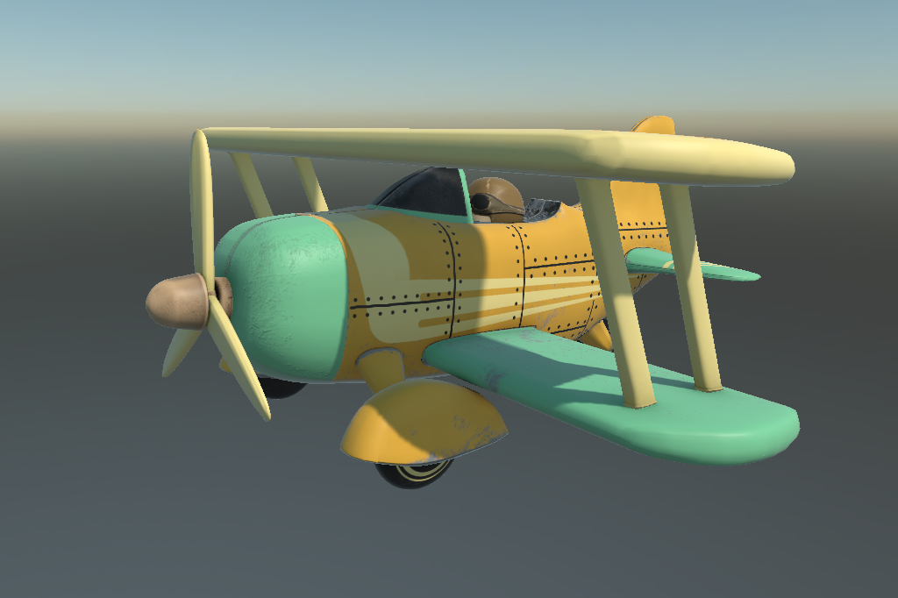
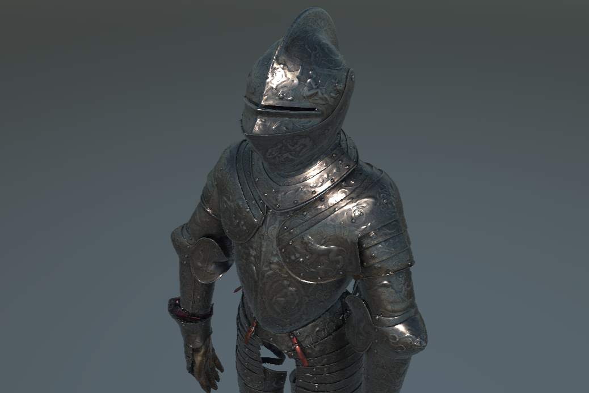
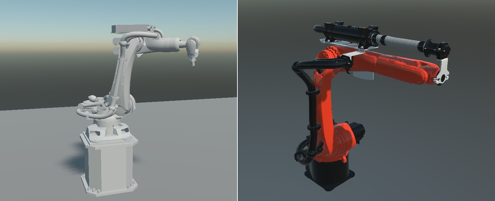

# USD Runtime

---


*Kitchen Set from Pixar Assets.*

The **Evergine.Runtimes.USD** package reads Universal Scene Description files (`.usd`, `.usda`, `.usdc` and `.usdz`) while the application runs and returns a `Model`. Use it to bring in scenes from USD pipelines, such as NVIDIA Omniverse or Apple Reality Composer, without converting them first.

The runtime does not parse USD itself. It runs the official OpenUSD Python library (`usd-core`) in an embedded Python interpreter, extracts the meshes, transforms and materials, and builds the Evergine model in C#.

| | |
| --- | --- |
| **Package** | `Evergine.Runtimes.USD` |
| **Namespace** | `Evergine.Runtimes.USD` |
| **Class** | `USDRuntime` (derives from `ModelRuntime`) |
| **Formats** | `.usd`, `.usda`, `.usdc`, `.usdz` |
| **Returns** | `Task<Model>` |
| **Platforms** | Windows desktop |
| **Reads from** | A file path only |

## Requirements

The package brings its Python environment with it, but that environment has three consequences for your application:

* **Windows only.** The runtime uses [CSnakes](https://github.com/tonybaloney/CSnakes) 1.2.1 to host Python 3.12.6 from the `python` NuGet package. That package, and the CSnakes locator that finds it, only exist for Windows.
* **Python comes from the NuGet packages folder.** CSnakes looks for Python 3.12.6 in the NuGet package cache of the machine: `%NUGET_PACKAGES%` when that variable is set, `%USERPROFILE%\.nuget\packages` otherwise. A development machine that restored the project already has it. On any other machine the folder must exist before the first read.
* **The first read installs packages.** The package copies its Python scripts to a `Python` folder next to the application and creates a virtual environment in `Python\.venv-Python`. The first time a file is read, it installs the packages listed in `requirements.txt` (`usd-core` and `orjson`) into that environment, which needs Internet access and takes a while. Later reads reuse the environment.

> [!IMPORTANT]
> Test the USD runtime on a clean machine before you ship it. A missing Python package cache or a blocked package download makes every read fail with the message *could not be read by Python OpenUSD API*.

## What the runtime reads

**Scene**

* The transform hierarchy, converted to the Y-up convention of Evergine whatever the `upAxis` of the stage.
* The `metersPerUnit` of the stage, applied as the scale of the root node.

**Geometry**

* Vertex positions, normals, texture coordinates and vertex colors, with vertex and face-varying interpolation.
* Triangles, quads and larger polygons. Polygons with more than four vertices are tessellated.

**Materials**

* `UsdPreviewSurface` materials: diffuse color, metallic, roughness, emissive color and opacity.
* Clearcoat, clearcoat roughness, and a reflectance derived from `ior` or the specular color when the material authors them.
* Base color, normal, metallic-roughness, emissive and occlusion textures, packed inside a `.usdz` or referenced as files, in any format the [Image runtime](image_runtime.md) decodes.
* Double-sided rendering. A material with an opacity below 1 uses alpha blending, with the opacity as its alpha.

Animation data (skeletal animation and animated transforms) is not read. The model loads in its rest pose.

## Load a model from a file

`Read(string filePath, Func<MaterialData, Task<Material>> materialAssigner = null)` combines the path with the `Content` folder of the running application, so a relative path is resolved inside `Content` and an absolute path is used as it is. Mark USD files that you ship in `Content` with **Set to export as raw** in the [Assets Details panel](../evergine_studio/assets/edit.md) so they are copied unchanged.

```csharp
using System;
using Evergine.Framework;
using Evergine.Framework.Graphics;
using Evergine.Framework.Services;
using Evergine.Runtimes.USD;

public class MyScene : Scene
{
    protected override async void CreateScene()
    {
        var assetsService = Application.Current.Container.Resolve<AssetsService>();

        try
        {
            Model model = await USDRuntime.Instance.Read("Models/Kitchen_set.usd");

            Entity entity = model.InstantiateModelHierarchy("kitchen", assetsService);
            this.Managers.EntityManager.Add(entity);
        }
        catch (Exception ex)
        {
            // Python environment problems surface here, wrapped by the runtime.
            Console.WriteLine($"USD load failed: {ex.InnerException?.Message ?? ex.Message}");
        }
    }
}
```

## Load a model downloaded from the Internet

`Read(Stream, ...)` exists because `USDRuntime` derives from `ModelRuntime`, but it always throws an `ArgumentException`: OpenUSD resolves layers, references and textures relative to a file on disk. To load a download, save it to a file and read that file by its absolute path.

```csharp
using System;
using System.IO;
using System.Net.Http;
using Evergine.Framework;
using Evergine.Framework.Graphics;
using Evergine.Framework.Services;
using Evergine.Framework.Threading;
using Evergine.Runtimes.USD;

public class MyScene : Scene
{
    private static readonly HttpClient httpClient = new HttpClient();

    protected override async void CreateScene()
    {
        // A .usdz packs the stage and its textures in one file, so a single download is enough.
        string localPath = Path.Combine(Path.GetTempPath(), "toy_biplane.usdz");

        using (var response = await httpClient.GetAsync("https://example.com/models/toy_biplane.usdz"))
        {
            response.EnsureSuccessStatusCode();
            using var file = File.Create(localPath);
            await response.Content.CopyToAsync(file);
        }

        Model model = await USDRuntime.Instance.Read(localPath);

        var assetsService = Application.Current.Container.Resolve<AssetsService>();
        Entity entity = model.InstantiateModelHierarchy("biplane", assetsService);

        // Scene changes must happen on the Evergine main thread.
        await EvergineForegroundTask.Run(() => this.Managers.EntityManager.Add(entity));
    }
}
```

> [!TIP]
> A `.usd` or `.usda` file that references other layers or textures needs those files next to it. Download them to the same folder, or prefer `.usdz` packages for anything you fetch at run time.

## Custom materials

Pass a material assigner as the second argument of `Read` to create the materials yourself. The runtime describes every material as a `USDMaterialData` and your function returns the `Material` to use. The [GLB and STL page](models_runtime.md#materials-and-the-material-assigner) describes `MaterialData` and has a complete assigner.

```csharp
Model model = await USDRuntime.Instance.Read("Models/Kitchen_set.usd", this.AssignMaterial);
```

`USDMaterialData` adds three values that `MaterialData` does not have: `ClearcoatFactor`, `ClearcoatRoughnessFactor` and `Reflectance`. Cast to it when your material needs them.

## Performance

* Very large stages take a long time to read and use a lot of memory, because the whole scene passes through Python before Evergine builds it.
* Each call to `Read` starts a Python host. Load several files one after another rather than in parallel.

## Samples

The USD runtime has been tested with these public collections:

* [Pixar USD assets](https://openusd.org/release/dl_downloads.html#assets)
* [Apple AR Quick Look gallery](https://developer.apple.com/augmented-reality/quick-look/)
* [Sketchfab](https://sketchfab.com/feed)
* [NVIDIA Omniverse USD asset packs](https://docs.omniverse.nvidia.com/usd/latest/usd_content_samples/downloadable_packs.html)


*Kitchen Set from Pixar Assets.*


*Toy biplane, Copyright 2023 Apple Inc.*


*The Parade Armour of King Erik XIV of Sweden. The Royal Armoury (Livrustkammaren).*


*Robot arm from the NVIDIA Omniverse USD asset packs.*
