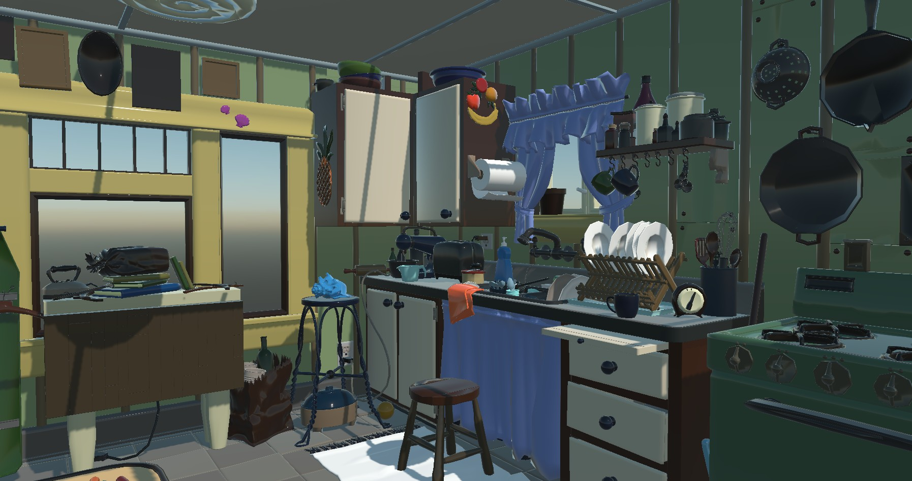

# USD Runtime Models  

---

  
*Kitchen Set from Pixar Assets.*

The **Evergine.Runtime.USD** NuGet package provides a **powerful and efficient solution** for dynamically loading USD models at runtime. It is designed for real-time 3D applications and integrates seamlessly into your Evergine projects.

## Supported USD Features

The `Evergine.Runtime.USD` namespace includes a robust USD file loader that supports a comprehensive range of mesh and material features:

### ✅ Features

#### 1. File Formats
- Supports all Universal Scene Description formats: **.usd**, **.usdc**, **.usda**, and **.usdz**

#### 2. Geometry
- **Vertices**, **indices**, **normals**, and **UVs** (texture coordinates)
- Supports:
  - Triangles, quads and N-gons (auto-triangulated)
  - Arbitrary polygon faces
  - Multiple mesh groups per file

#### 3. Basic Materials
- Supports `UsdPreviewSurface` as the standard material
  - Base color, specular, roughness, metallic, and emissive properties
  - Vertex color properties

#### 4. PBR Materials
- Fully compatible with Physically-Based Rendering (PBR)
- Metallic–roughness workflow support
- Advanced parameters supported if authored:
  - Clearcoat, clearcoat roughness, and specular IOR

#### 5. Textures
- Supports both embedded textures and external file references
- Map types: base color, normal, metallic, roughness, emissive, occlusion and opacity
- Compatible formats: PNG, JPG, BMP

#### 6. Transparency
- Automatically parses `opacity` and `opacityThreshold` inputs
- Blend mode is configured based on material values

---
### Limitations  
#### 1. Platform
- The USD runtime is currently supported only on Windows desktop platforms.

#### 2. USD File Handling
- Very large USD files may not be readable in the current version.
- Importing very large USD files may lead to increased memory consumption and reduced performance.

#### 3. Animation Support
- Animation data (e.g., skeletal or transform animations) is not yet supported in the current version.

⚠️ *These limitations are subject to change in future updates.*

---
## Getting Started  

To start using the **Evergine.Runtimes.USD** libraries, simply install the NuGet package and use the following code to load your assets:  

```csharp
protected async override void CreateScene()
{    
    var model = await USDRuntime.Instance.Read("MyModel.usd");

    var assetsService = Application.Current.Container.Resolve<AssetsService>();
    var entity = model.InstantiateModelHierarchy(assetsService);
    this.manager.EntityManager.Add(entity);
}
```

</br>

### Custom Shader Support

By default, models are loaded using the Standard Effect (Evergine’s built-in shader). However, if you want to load models using your custom shader, you must pass an additional **CustomMaterialAssigner** function to the Read method:

```csharp
protected async override void CreateScene()
{
    var assetsService = Application.Current.Container.Resolve<AssetsService>();

    var model = await USDRuntime.Instance.Read("Models/Kitchen_set.usd", this.CustomMaterialAssigner);

    var entity = model.InstantiateModelHierarchy(assetsService);
    this.Managers.EntityManager.Add(entity);
}
```

## Samples

The USD Runtime has been extensively tested with the following publicly available datasets:
 - [Pixar Assets](https://openusd.org/release/dl_downloads.html#assets)
 - [Apple 3D models](https://developer.apple.com/augmented-reality/quick-look/)
 - [Sketchfab models](https://sketchfab.com/feed)
 - [Nvidia Omniverse USD Asset Packs](https://docs.omniverse.nvidia.com/usd/latest/usd_content_samples/downloadable_packs.html)

These tests help ensure compatibility with a wide range of real-world meshes, materials, and topology configurations. 
Below are several representative screenshots of models successfully loaded and rendered at runtime:

### Sample screenshots

  
*Kitchen Set from Pixar Assets.*

  
*Toy biplane, Copyright 2023 Apple Inc.*

  
*The Parade Armour of King Erik XIV of Sweden. The Royal Armoury (Livrustkammaren).*

  
*Mechanic arms from Nvidia Omniverse USD Asset packages.*