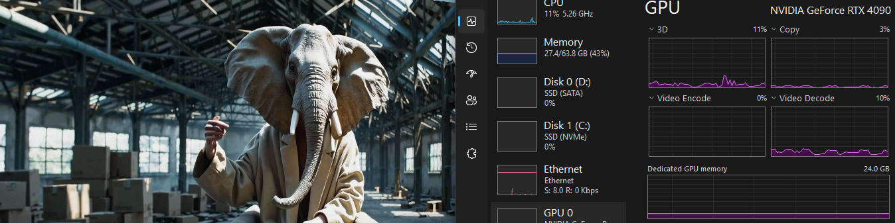
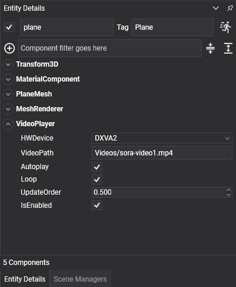
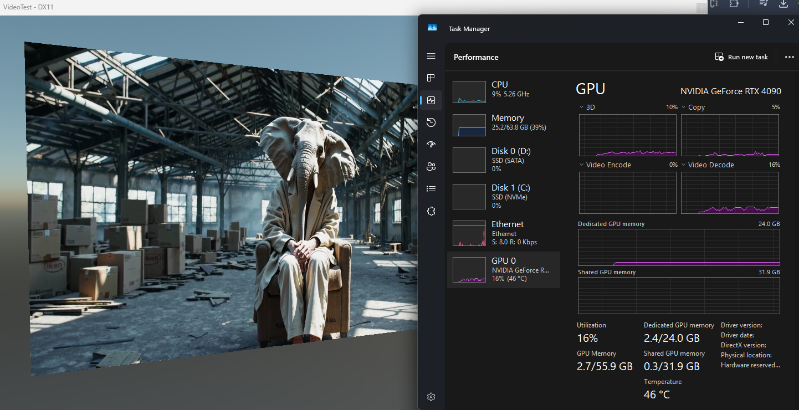

# Video Runtime

---



The **Evergine.Runtimes.Video** package plays video files on any surface of your scene: a screen in a virtual showroom, a billboard, or the background of a menu. Its `VideoPlayer` component decodes the video with [FFmpeg](https://www.ffmpeg.org/) frame by frame, uploads each frame to a GPU texture, and shows that texture through the material of its entity.

<!-- CAPTURE: video_runtime_app.png; a Windows desktop app built from the complete example on this page, with a video playing on a 16:9 plane in front of the camera -->

| | |
| --- | --- |
| **Package** | `Evergine.Runtimes.Video` |
| **Namespace** | `Evergine.Runtimes.Video` |
| **Component** | `VideoPlayer` (a `Behavior`) |
| **Formats** | Containers and codecs supported by FFmpeg 7.1, tested with MP4 (H.264), MOV, WMV and FLV |
| **Output** | A `Texture` in `R8G8B8A8_UNorm`, updated at the frame rate of the video |
| **Reads from** | A file path only |
| **Platforms** | Windows x64 |

## Platform support

`FFmpegBinariesHelper.RegisterFFmpegBinaries()`, which the component calls when it is attached, decides where the FFmpeg libraries come from:

| Operating system | FFmpeg libraries |
| --- | --- |
| **Windows** | The package ships FFmpeg 7.1 for x64 and copies it to `runtimes\win-x64\native` in the output folder. Set `FFmpegBinariesHelper.WindowsLibraryPath` before the component is attached to load them from another folder. |
| **Linux** | The libraries installed on the system, from `/lib/x86_64-linux-gnu/`. They must be the FFmpeg 7.x versions the bindings expect. |
| **Any other** | `NotSupportedException`. |

Evergine project templates target Windows, Web, Android and iOS, so in practice the video runtime is a **Windows x64** feature.

> [!NOTE]
> FFmpeg is only initialized when the application runs. In the Evergine Studio viewport the component does nothing, and the entity shows its material without the video.

## Add a video in Evergine Studio

1. Add the `Evergine.Runtimes.Video` NuGet package to the main project of your application.
2. Copy the video to the `Content` folder and mark it with **Set to export as raw** in the [Assets Details panel](../evergine_studio/assets/edit.md), so the file reaches the output unchanged.
3. Create an entity with a mesh (for example a plane), a `MeshRenderer`, and a `MaterialComponent` whose material uses the standard effect.
4. Add a **VideoPlayer** component and set **VideoPath** to the path of the video inside `Content`.



When playback starts, the component opens the video, creates the video texture and puts it in the **base color texture** of the entity's material. For any other material, or to show the video somewhere else, read the `VideoTexture` property and assign it yourself.

> [!IMPORTANT]
> The component writes to the material in the `MaterialComponent`, not to a copy. If that material is shared, every entity that uses it shows the video. Give each screen its own material.

## Properties

| Property | Default | Description |
| --- | --- | --- |
| **VideoPath** | `null` | Path of the video file, combined with the `Content` folder of the application; an absolute path is used as it is. Setting it at run time closes the current video and opens the new one. |
| **Autoplay** | `false` | Starts playback when the component is attached, without calling `Play()`. |
| **Loop** | `false` | Rewinds to the first frame when the video ends. Without it, the last frame stays on screen. |
| **HWDevice** | `DXVA2` | Decoder device. `NONE` decodes on the CPU; the other values select an FFmpeg hardware decoder. See [Hardware decoding](#hardware-decoding). |

These are read only, and valid once playback has started:

| Property | Description |
| --- | --- |
| **VideoTexture** | The texture that receives the frames. |
| **VideoWidth** | Width of the video in pixels. |
| **VideoHeight** | Height of the video in pixels. |
| **VideoState** | `Stopped`, `Playing` or `Paused`. |

## Playback control

| Method | Effect | Event |
| --- | --- | --- |
| **Play()** | Starts or resumes playback. | `Playing` |
| **Pause()** | Holds the current frame. | `Paused` |
| **Stop()** | Stops playback and rewinds to the first frame. Only acts while the video is playing. | `Stopped` |

The events are raised by the methods only. Playback started by `Autoplay` does not raise `Playing` and leaves `VideoState` at `Stopped` until you call one of the methods. Reaching the end of a video that does not loop leaves `VideoState` at `Playing` without raising `Stopped`.

> [!TIP]
> When code needs to follow the playback state, leave `Autoplay` off and call `Play()` yourself, so that `VideoState` and the events stay in step with what is on screen.

## Hardware decoding

Decoding high-resolution video on the CPU is expensive. A hardware decoder moves that work to the GPU, which lets several videos play at once without slowing the application down.



*A video decoded through DXVA2 on Windows. Video generated with OpenAI Sora.*

| HWDevice | Decoder |
| --- | --- |
| `NONE` | CPU decoding. Works for every codec FFmpeg supports. |
| `DXVA2` | DirectX Video Acceleration 2 on Windows. The default. |
| `D3D11VA` | Direct3D 11 video decoding on Windows. |
| `CUDA`, `QSV`, `VDPAU`, `VAAPI`, `DRM`, `OPENCL`, `VULKAN`, `VIDEOTOOLBOX`, `MEDIACODEC` | FFmpeg device types for other GPUs and operating systems. Whether they work depends on the FFmpeg build and the driver. |

Only `DXVA2` and `D3D11VA` are mapped to the NV12 frames that Windows hardware decoders return, so on Windows use one of those two, or `NONE`.

If the hardware decoder cannot be created, the component throws an exception the first time it updates; it does not fall back to the CPU. Set `HWDevice` to `NONE` on machines without a compatible GPU.

## Complete example

The scene below creates a 16:9 screen with its own unlit material and plays a video from the `Content` folder. A behavior on the same entity starts playback, toggles it with the space bar and stops it with `S`.

```csharp
using System;
using Evergine.Common.Graphics;
using Evergine.Common.Input;
using Evergine.Common.Input.Keyboard;
using Evergine.Components.Graphics3D;
using Evergine.Framework;
using Evergine.Framework.Graphics;
using Evergine.Framework.Graphics.Effects;
using Evergine.Framework.Graphics.Materials;
using Evergine.Framework.Services;
using Evergine.Mathematics;
using Evergine.Runtimes.Video;

public class VideoScene : Scene
{
    protected override void CreateScene()
    {
        var assetsService = Application.Current.Container.Resolve<AssetsService>();
        var effect = assetsService.Load<Effect>(DefaultResourcesIDs.StandardEffectID);

        // A material of its own, so no other entity shows the video.
        var screenMaterial = new StandardMaterial(effect)
        {
            // Video frames already contain their final colors.
            LightingEnabled = false,
            IBLEnabled = false,
            LayerDescription = assetsService.Load<RenderLayerDescription>(DefaultResourcesIDs.OpaqueRenderLayerID),
            BaseColorSampler = assetsService.Load<SamplerState>(DefaultResourcesIDs.LinearClampSamplerID),
        };

        Entity screen = new Entity("screen")
            .AddComponent(new Transform3D() { Position = new Vector3(0, 1, 0) })
            .AddComponent(new MaterialComponent() { Material = screenMaterial.Material })
            .AddComponent(new PlaneMesh() { PlaneNormal = PlaneMesh.NormalAxis.ZPositive, Width = 1.6f, Height = 0.9f })
            .AddComponent(new MeshRenderer())
            .AddComponent(new VideoPlayer()
            {
                VideoPath = "Videos/intro.mp4",
                Loop = true,
            })
            .AddComponent(new VideoKeyboardControl());

        this.Managers.EntityManager.Add(screen);
    }
}

public class VideoKeyboardControl : Behavior
{
    [BindComponent]
    private VideoPlayer videoPlayer = null;

    [BindService]
    private GraphicsPresenter graphicsPresenter = null;

    protected override void OnActivated()
    {
        base.OnActivated();

        // Play() instead of Autoplay keeps VideoState accurate from the start.
        this.videoPlayer.Play();
    }

    protected override void Update(TimeSpan gameTime)
    {
        KeyboardDispatcher keyboard = this.graphicsPresenter.FocusedDisplay?.KeyboardDispatcher;
        if (keyboard == null)
        {
            return;
        }

        if (keyboard.ReadKeyState(Keys.Space) == ButtonState.Pressing)
        {
            if (this.videoPlayer.VideoState == VideoPlayer.VideoStateType.Playing)
            {
                this.videoPlayer.Pause();
            }
            else
            {
                this.videoPlayer.Play();
            }
        }
        else if (keyboard.ReadKeyState(Keys.S) == ButtonState.Pressing)
        {
            // Stop only acts on a playing video, so resume a paused one first.
            this.videoPlayer.Play();
            this.videoPlayer.Stop();
        }
    }
}
```

## Play a video downloaded from the Internet

`VideoPlayer` only opens files, so download the video to a local file first and assign its absolute path to `VideoPath`:

```csharp
using System.IO;
using System.Net.Http;
using System.Threading.Tasks;
using Evergine.Framework.Threading;
using Evergine.Runtimes.Video;

public static class VideoDownloader
{
    private static readonly HttpClient httpClient = new HttpClient();

    public static async Task PlayFromUrlAsync(VideoPlayer player, string url)
    {
        string localPath = Path.Combine(Path.GetTempPath(), Path.GetFileName(new System.Uri(url).LocalPath));

        using (var response = await httpClient.GetAsync(url, HttpCompletionOption.ResponseHeadersRead))
        {
            response.EnsureSuccessStatusCode();
            using var file = File.Create(localPath);
            await response.Content.CopyToAsync(file);
        }

        // The component reads VideoPath from its Update, on the Evergine main thread.
        await EvergineForegroundTask.Run(() =>
        {
            player.VideoPath = localPath;
            player.Play();
        });
    }
}
```
