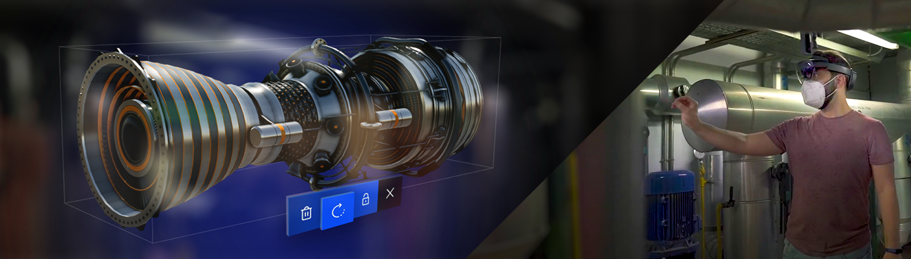
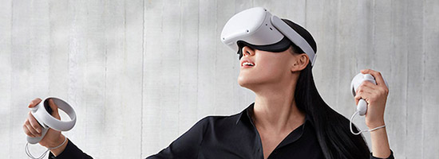
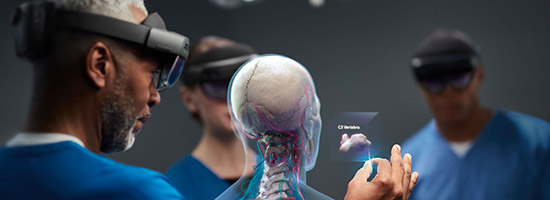

# XR (Extended Reality)

---

**XR** (Extended Reality) covers every application that mixes the user's view with computer-generated content, from fully virtual worlds to digital objects placed in a real room. Evergine gives all of them one API: a scene written for a desktop window runs in a headset by changing the launcher project, not the scene.

This section explains that API, the XR runtimes Evergine integrates with, and the components that bring headsets, controllers and hands into your entities.

## Types of XR experience

### Virtual Reality (VR)

The application replaces the user's surroundings with a completely virtual environment.

### Mixed Reality (MR)

The application combines its virtual content with the user's real environment, and lets both interact. On Meta Quest this is built on [passthrough](passthrough.md).

### Augmented Reality (AR)

The application draws its content over a live view of the real world, usually through a phone camera. In Evergine this is what the [WebXR](webxr.md) integration provides.

## How Evergine XR works

XR support is built into the **Evergine.Framework** and **Evergine.Components** packages. The framework defines one abstract service, [`XRPlatform`](xrplatform.md). Each XR runtime integration is a separate package that implements it:

| Package | Service | Runtime | Project template |
| --- | --- | --- | --- |
| **Evergine.OpenXR** | [`OpenXRPlatform`](openxr/openxr_platform.md) | Any OpenXR runtime: Meta Quest, Pico, and PC headsets through their OpenXR runtime | [Android Meta Quest](openxr/metaquest.md), [Android Pico](openxr/pico.md), [Windows OpenXR](openxr/windows.md) |
| **Evergine.OpenVR** | [`OpenVRPlatform`](openvr.md) | SteamVR on Windows | None |
| **Evergine.WebXR** | [`WebXRPlatform`](webxr.md) | Browsers that implement the WebXR Device API | WebXR (Experimental AR) |

*Your scene only depends on `XRPlatform`. The launcher project of each profile creates one implementation and registers it, and the platform moves the active `Camera3D` with the headset every frame.*

## Feature support

What each platform implements in this release. A cell with an extension name means the feature works when that OpenXR extension is in the list passed to the `OpenXRPlatform` constructor. **Runtime-dependent** means the template does not request the extension: you can add it to the list, and the feature then works only if the headset's OpenXR runtime supports it.

| Feature | OpenXR · Meta Quest | OpenXR · Pico | OpenXR · Windows PC | OpenVR (SteamVR) | WebXR |
| --- | --- | --- | --- | --- | --- |
| Head tracking and stereo rendering | Yes | Yes | Yes | Yes | Single view (`EyeCount` is 1) |
| Mirror window on the desktop | Off in the template | Off in the template | Yes | Yes | No |
| Controllers ([`TrackXRController`](input_tracking/trackxrcontroller.md)) | Yes | Yes | Yes | Yes | No |
| Generic trackers and base stations ([`AdvancedTrackXRDevice`](input_tracking/advancedtrackxrdevice.md)) | No | No | No | Yes | No |
| Articulated hands ([`TrackXRArticulatedHand`](input_tracking/trackxrarticulatedhand.md)) | `XR_EXT_hand_tracking` | `XR_EXT_hand_tracking` | Runtime-dependent | No | No |
| Pinch and aim gestures on hands | `XR_FB_hand_tracking_aim` | Runtime-dependent | Runtime-dependent | No | No |
| Hand meshes ([`XRDeviceRenderableModel`](input_tracking/trackxrarticulatedhand.md#render-the-hands)) | `XR_FB_hand_tracking_mesh` | Runtime-dependent | Runtime-dependent | No | No |
| Controller models (`XRDeviceRenderableModel`) | No | No | No | Yes | No |
| Hands and controllers at the same time | `XR_META_simultaneous_hands_and_controllers` | Runtime-dependent | Runtime-dependent | No | No |
| [Passthrough](passthrough.md) | `XR_FB_passthrough` | Runtime-dependent | Runtime-dependent | No | No |
| Passthrough projected on meshes | `XR_FB_triangle_mesh` | Runtime-dependent | Runtime-dependent | No | No |
| Camera see-through on a phone (AR) | No | No | No | No | Yes (`immersive-ar`) |

> [!NOTE]
> `XRPlatform` also declares spatial mapping, spatial anchors, trackable items, light estimation, feature points and eye gaze members. No platform in this release implements them, so they return `null` (or `false`) everywhere.

## In this section

* [XR Platform](xrplatform.md)
* [OpenXR](openxr/index.md)
* [OpenVR](openvr.md)
* [WebXR](webxr.md)
* [Input Devices](input_tracking/index.md)
* [Passthrough](passthrough.md)
