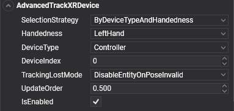

# AdvancedTrackXRDevice



`AdvancedTrackXRDevice` makes an entity follow **any** tracked device, not only controllers and hands: the headset itself, Vive trackers strapped to props or people, or the base stations of the play area. You choose the device by type, handedness, index, or a combination of them.

It exposes the union of the other tracking components: the controller state of [`TrackXRController`](trackxrcontroller.md) and the joints of [`TrackXRArticulatedHand`](trackxrarticulatedhand.md). Use those simpler components when they fit, and this one for everything else.

## Selecting the device

`SelectionStrategy` decides which properties pick the device:

| SelectionStrategy | Uses | Picks |
| --- | --- | --- |
| `ByDeviceTypeAndHandedness` (default) | `DeviceType`, `Handedness`, `DeviceIndex` | The `DeviceIndex`-th device of that type and handedness. The left controller, for example. |
| `ByDeviceType` | `DeviceType`, `DeviceIndex` | The `DeviceIndex`-th device of that type, whatever its handedness. The second generic tracker, for example. |
| `ByHandedness` | `Handedness`, `DeviceIndex` | The `DeviceIndex`-th device with that handedness, whatever its type. |
| `ByDeviceIndex` | `DeviceIndex` | The device at that position in the platform's list of tracked devices. The order depends on the platform. |

## Properties

| Property | Default | Description |
| --- | --- | --- |
| **SelectionStrategy** | `ByDeviceTypeAndHandedness` | How the device is selected, from the table above. |
| **DeviceType** | `Controller` | The `XRTrackedDeviceType` to look for. See the values below. |
| **Handedness** | `LeftHand` | `LeftHand`, `RightHand`, or `Undefined` for devices with no side, such as the HMD or a tracker. |
| **DeviceIndex** | 0 | A `uint`. With the type and handedness strategies, which of the matching devices to take (0 is the first). With `ByDeviceIndex`, the position in the platform's list. |
| **TrackingLostMode** | `DisableEntityOnPoseInvalid` | What happens to the entity when tracking fails. See [common properties](index.md#common-properties). |
| **ControllerState** | Read-only | The input state, when the device is a controller or a hand. See [controller state](trackxrcontroller.md#controller-state). |
| **SupportedHandJointKind** | Read-only | The joints the device tracks, when it is a hand. |

It also has the members every tracking component shares, listed in [common properties](index.md#common-properties), and `TryGetArticulatedHandJoint(XRHandJointKind jointKind, out XRHandJoint joint)`, which returns the joint as the platform reports it, in tracking space.

### Device types

| XRTrackedDeviceType | Device | Platforms |
| --- | --- | --- |
| `HMD` | The headset. | OpenXR, OpenVR |
| `Controller` | A motion controller. | OpenXR, OpenVR |
| `Hand` | A tracked hand. | OpenXR with `XR_EXT_hand_tracking` |
| `GenericTracker` | A tracker without its own input, such as a Vive Tracker. | OpenVR |
| `TrackingReference` | A device that supplies tracking ground truth, such as a base station or a tracking camera. | OpenVR |
| `DisplayRedirect` | An accessory that is not tracked itself but can redirect video output from another tracked device. | OpenVR |

## Using AdvancedTrackXRDevice

This scene tracks both controllers and two generic trackers. The trackers keep their last pose when tracking is lost, so a prop does not vanish when it is briefly occluded:

```csharp
using Evergine.Components.XR;
using Evergine.Framework;
using Evergine.Framework.Graphics;
using Evergine.Framework.XR;
using Evergine.Framework.XR.TrackedDevices;

public class TrackersScene : Scene
{
    protected override void CreateScene()
    {
        base.CreateScene();

        // The two controllers.
        var leftController = new Entity("LeftController")
            .AddComponent(new Transform3D())
            .AddComponent(new AdvancedTrackXRDevice()
            {
                SelectionStrategy = TrackXRDevice.SelectionDeviceStrategy.ByDeviceTypeAndHandedness,
                DeviceType = XRTrackedDeviceType.Controller,
                Handedness = XRHandedness.LeftHand,
            });

        var rightController = new Entity("RightController")
            .AddComponent(new Transform3D())
            .AddComponent(new AdvancedTrackXRDevice()
            {
                SelectionStrategy = TrackXRDevice.SelectionDeviceStrategy.ByDeviceTypeAndHandedness,
                DeviceType = XRTrackedDeviceType.Controller,
                Handedness = XRHandedness.RightHand,
            });

        // Two generic trackers, told apart by their order of appearance.
        var firstTracker = new Entity("Tracker0")
            .AddComponent(new Transform3D())
            .AddComponent(new AdvancedTrackXRDevice()
            {
                SelectionStrategy = TrackXRDevice.SelectionDeviceStrategy.ByDeviceType,
                DeviceType = XRTrackedDeviceType.GenericTracker,
                DeviceIndex = 0,
                TrackingLostMode = TrackXRDevice.XRTrackingLostMode.KeepLastPose,
            });

        var secondTracker = new Entity("Tracker1")
            .AddComponent(new Transform3D())
            .AddComponent(new AdvancedTrackXRDevice()
            {
                SelectionStrategy = TrackXRDevice.SelectionDeviceStrategy.ByDeviceType,
                DeviceType = XRTrackedDeviceType.GenericTracker,
                DeviceIndex = 1,
                TrackingLostMode = TrackXRDevice.XRTrackingLostMode.KeepLastPose,
            });

        this.Managers.EntityManager.Add(leftController);
        this.Managers.EntityManager.Add(rightController);
        this.Managers.EntityManager.Add(firstTracker);
        this.Managers.EntityManager.Add(secondTracker);
    }
}
```

### Attach content to the head

The camera renders from the head, but on stereo platforms its own transform does not move with it. To place something that follows the head, such as a reticle or a head-mounted light, track the HMD:

```csharp
using Evergine.Components.XR;
using Evergine.Framework;
using Evergine.Framework.Graphics;
using Evergine.Framework.XR;
using Evergine.Framework.XR.TrackedDevices;

public class HeadScene : Scene
{
    protected override void CreateScene()
    {
        base.CreateScene();

        var head = new Entity("Head")
            .AddComponent(new Transform3D())
            .AddComponent(new AdvancedTrackXRDevice()
            {
                SelectionStrategy = TrackXRDevice.SelectionDeviceStrategy.ByDeviceType,
                DeviceType = XRTrackedDeviceType.HMD,
            });

        this.Managers.EntityManager.Add(head);
    }
}
```

Children of `Head` then move with the user's head, and `Transform3D.Forward` of the entity is the view direction. Use it rather than `Pointer`, which `OpenXRPlatform` does not fill for the HMD.
