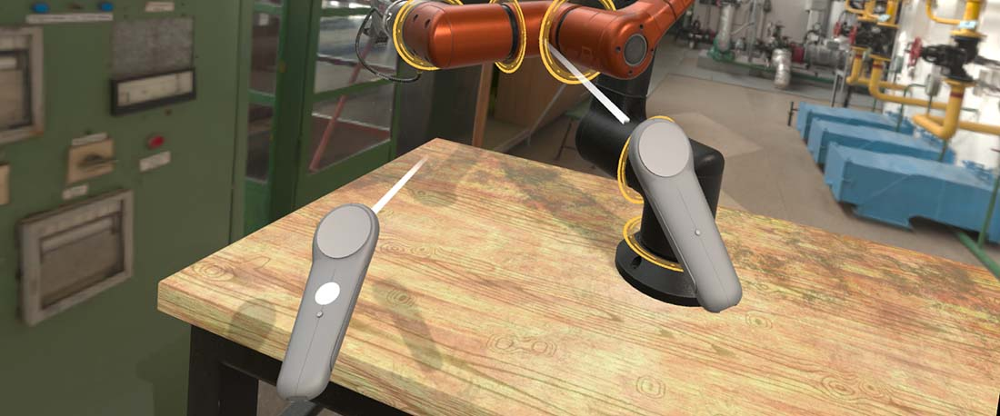

# XR Input Tracking



XR users interact through devices the platform tracks in space: motion controllers, their own hands, and on SteamVR also trackers and base stations. The `InputTracking` subsystem of [`XRPlatform`](../xrplatform.md) knows every one of them.

You rarely talk to it directly. Evergine provides components that pick a device, move their entity with it every frame, and expose its input state. Put one on an entity and give the entity a mesh, and the mesh follows the device.

## Tracking components

All of them derive from `TrackXRDevice`, which selects a device and copies its pose into the entity's `Transform3D`:

| Component | Tracks | Adds |
| --- | --- | --- |
| [`TrackXRController`](trackxrcontroller.md) | A left or right motion controller | The controller input state: trigger, grip, thumbstick and buttons. |
| [`TrackXRArticulatedHand`](trackxrarticulatedhand.md) | A left or right hand, where hand tracking is available | The pose of each hand joint, plus the controller state (a pinch reports as the trigger on Meta Quest). |
| [`AdvancedTrackXRDevice`](advancedtrackxrdevice.md) | Any device, selected by type, handedness or index | Everything above, for devices such as the HMD, generic trackers or base stations. |

[`XRDeviceRenderableModel`](trackxrarticulatedhand.md#render-the-hands) complements them: added next to a tracking component, it loads the model the platform provides for that device, such as the Meta hand mesh or the SteamVR controller model.

> [!NOTE]
> The tracking components require the `XRPlatform` service. In a profile without an XR platform they do not attach, so their entities stay where you placed them.

## Common properties

Every tracking component has these members, inherited from `TrackXRDevice`:

| Property | Default | Description |
| --- | --- | --- |
| **TrackingLostMode** | `DisableEntityOnPoseInvalid` | What happens to the entity when tracking fails. `DisableEntityOnPoseInvalid` disables it while the pose is invalid and enables it again when tracking recovers. `DisableEntityOnDisconnection` only disables it when the device disconnects. `KeepLastPose` keeps it enabled at the last valid pose. |
| **IsConnected** | Read-only | Whether a real device is connected. |
| **PoseIsValid** | Read-only | Whether the pose of this frame is valid. |
| **TrackingState** | Read-only | The `XRTrackingState` of the device. |
| **Pose** | Read-only | The pose of the entity in world space, as a `ViewPose` (position and orientation). |
| **LocalPose** | Read-only | The raw device pose, in tracking space. |
| **Pointer** | Read-only | The pointing ray of the device in world space, for example the aim ray of a controller. Use it to raycast or draw a laser pointer. |
| **LocalPointer** | Read-only | The pointing ray in tracking space. |
| **Velocity** | Read-only | Linear velocity reported by the device, in tracking space. |
| **AngularVelocity** | Read-only | Angular velocity reported by the device, in tracking space. |
| **TrackedDevice** | Read-only | The `XRTrackedDevice` currently selected, or `null` while no device matches. |
| **OnTrackedDeviceChanged** | Event | Raised when the component starts tracking another device, for example when a controller is replaced. |

The component writes the device pose into the **local** position and orientation of the entity. Devices are tracked relative to the tracking space, which is the parent of the camera, so place tracked entities as siblings of the camera. Then moving the tracking space moves the camera and the devices together. `Pose` and `Pointer` already include the transform of the parent.

## Querying devices without a component

`XRPlatform.InputTracking` finds devices with `GetDeviceByType`, `GetDeviceByHandedness`, `GetDeviceByTypeAndHandedness` and `GetDeviceByIndex`. Each returns an `XRTrackedDevice` you can read every frame. This behavior measures the height of the user's eyes above the floor:

```csharp
using System;
using Evergine.Framework;
using Evergine.Framework.Services;
using Evergine.Framework.XR;
using Evergine.Framework.XR.TrackedDevices;

public class HeadHeight : Behavior
{
    [BindService]
    private XRPlatform xrPlatform = null;

    private XRTrackedDevice hmd;

    // Height of the eyes above the tracking space origin (the floor, with the Stage reference space).
    public float Height { get; private set; }

    protected override void Update(TimeSpan gameTime)
    {
        // Devices can appear after the session starts: keep asking until there is one.
        this.hmd ??= this.xrPlatform.InputTracking?.GetDeviceByType(XRTrackedDeviceType.HMD);

        if (this.hmd != null && this.hmd.GetTrackingState(out XRTrackedDeviceState state) && state.PoseIsValid)
        {
            this.Height = state.Pose.Position.Y;
        }
    }
}
```

`XRInputTracking` also has `OnDeviceAdded` and `OnDeviceRemoved` events. `OpenVRPlatform` raises them as SteamVR devices appear and disappear. `OpenXRPlatform` creates its devices (HMD, two controllers and, with hand tracking, two hands) once at startup and never raises them: watch `IsConnected` or the `OnConnectionChanged` event of each device instead.

## In this section

- [Tracking Controllers (TrackXRController)](trackxrcontroller.md)
- [Tracking Hands (TrackXRArticulatedHand)](trackxrarticulatedhand.md)
- [Advanced Tracking Devices (AdvancedTrackXRDevice)](advancedtrackxrdevice.md)
