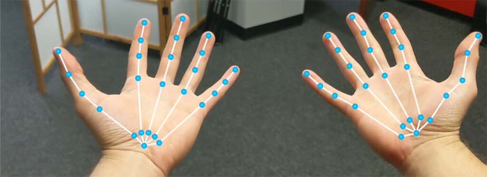
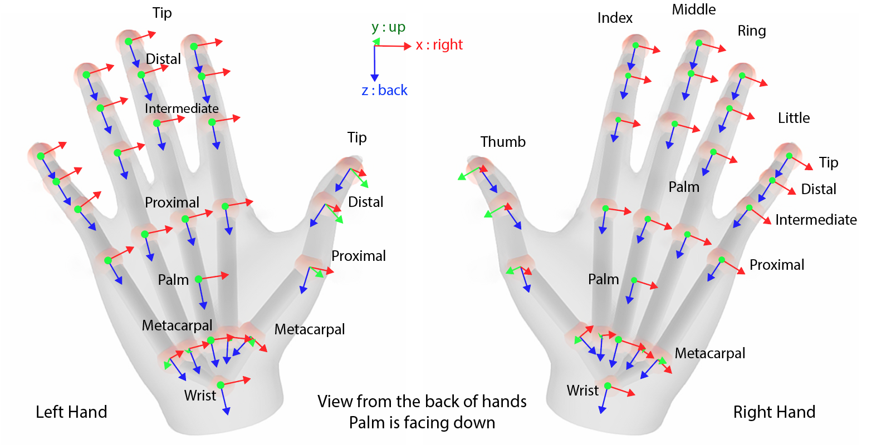
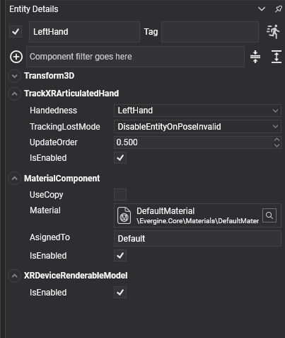

# TrackXRArticulatedHand



`TrackXRArticulatedHand` makes an entity follow one of the user's hands, and gives you the pose of every joint of that hand. Use it to build hand interactions without controllers: touching buttons with a fingertip, grabbing with a pinch, or drawing the hand yourself.

Hand tracking comes from the OpenXR `XR_EXT_hand_tracking` extension, which the [Meta Quest](../openxr/metaquest.md) and [Pico](../openxr/pico.md) templates enable. On platforms or runtimes without it, the component never connects.

## Hand joints

Joints are identified by the `XRHandJointKind` enumeration: `Palm`, `Wrist`, and four joints per finger from the metacarpal to the tip (`ThumbMetacarpal` to `ThumbTip`, `IndexMetacarpal` to `IndexTip`, and so on for the middle, ring and little fingers).



The entity follows the `Palm` joint.

Each joint is an `XRHandJoint`:

| Field | Description |
| --- | --- |
| **Pose** | Position and orientation of the joint, as a `ViewPose`. |
| **Radius** | Radius of the joint in metres: roughly half the thickness of the finger at that point. Use it to size colliders or visual markers. |
| **Accuracy** | Tracking accuracy of the joint, as reported by the platform. |

## Properties

| Property | Default | Description |
| --- | --- | --- |
| **Handedness** | `LeftHand` | The hand to track: `LeftHand` or `RightHand`. |
| **TrackingLostMode** | `DisableEntityOnPoseInvalid` | What happens to the entity when tracking fails. See [common properties](index.md#common-properties). |
| **SupportedHandJointKind** | Read-only | The `XRHandJointKind[]` joints this device tracks, or `null` while no hand is selected. Some devices track fewer joints. |
| **ControllerState** | Read-only | The hand as a controller. With `XR_FB_hand_tracking_aim` (Meta Quest), a pinch between thumb and index sets `Trigger` to the pinch strength and drives `TriggerButton`, and `Pointer` follows the aim ray. |

It also has the members every tracking component shares, listed in [common properties](index.md#common-properties).

| Method | Description |
| --- | --- |
| `bool TryGetArticulatedHandJoint(XRHandJointKind jointKind, out XRHandJoint joint)` | Gets a joint in **world space**, including the transform of the entity's parent. Returns `false` when the joint is not available. |
| `bool TryGetArticulatedHandJointLocal(XRHandJointKind jointKind, out XRHandJoint joint)` | Gets a joint in **tracking space**, as the platform reports it. Enough to compare two joints of the same hand. |

## Using TrackXRArticulatedHand

### Draw the joints

This scene tracks the left hand and draws an axis at every joint, sized by the joint radius:

```csharp
using System;
using Evergine.Components.XR;
using Evergine.Framework;
using Evergine.Framework.Graphics;
using Evergine.Framework.Managers;
using Evergine.Framework.XR;
using Evergine.Mathematics;

public class HandScene : Scene
{
    protected override void CreateScene()
    {
        base.CreateScene();

        var leftHand = new Entity("LeftHand")
            .AddComponent(new Transform3D())
            .AddComponent(new TrackXRArticulatedHand()
            {
                Handedness = XRHandedness.LeftHand,
            })
            .AddComponent(new DrawHandJoints());

        this.Managers.EntityManager.Add(leftHand);
    }
}

public class DrawHandJoints : Behavior
{
    [BindComponent]
    private TrackXRArticulatedHand hand = null;

    protected override void Update(TimeSpan gameTime)
    {
        var joints = this.hand.SupportedHandJointKind;
        if (!this.hand.IsConnected || joints == null)
        {
            return;
        }

        var lineBatch = ((RenderManager)this.Managers.RenderManager).LineBatch3D;
        foreach (var jointKind in joints)
        {
            // World-space pose, so the axes stay on the hand when the tracking space moves.
            if (this.hand.TryGetArticulatedHandJoint(jointKind, out XRHandJoint joint))
            {
                Matrix4x4.CreateFromTR(ref joint.Pose.Position, ref joint.Pose.Orientation, out var jointTransform);
                lineBatch.DrawAxis(jointTransform, joint.Radius * 2);
            }
        }
    }
}
```

### Detect a pinch from the joints

The pinch gesture of `ControllerState` needs a Meta extension. The joints alone are enough to detect it on any device with hand tracking:

```csharp
using System;
using Evergine.Components.XR;
using Evergine.Framework;
using Evergine.Framework.XR;
using Evergine.Mathematics;

public class PinchDetector : Behavior
{
    [BindComponent]
    private TrackXRArticulatedHand hand = null;

    // Fingertips closer than this count as a pinch, in metres.
    public float Threshold { get; set; } = 0.02f;

    public bool IsPinching { get; private set; }

    protected override void Update(TimeSpan gameTime)
    {
        // Both joints come from the same hand, so tracking space is enough to compare them.
        if (this.hand.TryGetArticulatedHandJointLocal(XRHandJointKind.ThumbTip, out var thumb) &&
            this.hand.TryGetArticulatedHandJointLocal(XRHandJointKind.IndexTip, out var index))
        {
            this.IsPinching = Vector3.Distance(thumb.Pose.Position, index.Pose.Position) < this.Threshold;
        }
        else
        {
            this.IsPinching = false;
        }
    }
}
```

## Render the hands

`XRDeviceRenderableModel` loads the 3D model the platform provides for a tracked device and adds it under the entity. Add it next to any tracking component:

* With `TrackXRArticulatedHand` on Meta Quest, the model is a skinned hand mesh that follows the user's fingers. It needs `XR_FB_hand_tracking_mesh`.
* With `TrackXRController` or `AdvancedTrackXRDevice` on [OpenVR](../openvr.md), the model is the SteamVR render model of the device.
* OpenXR provides no controller models, so draw your own mesh for controllers there.

<video autoplay loop muted playsinline width="512" height="512"><source src="images/renderhandsvideo.mp4" type="video/mp4"></video>



| Member | Description |
| --- | --- |
| **RenderableEntity** | The entity created for the model, or `null` until it loads. The model loads asynchronously when the component starts, and again when the tracked device changes. |

If the entity also has a `MaterialComponent`, its material replaces every material of the model. Without one, the model keeps the materials the platform gives it.

```csharp
using Evergine.Components.Graphics3D;
using Evergine.Components.XR;
using Evergine.Framework;
using Evergine.Framework.Graphics;
using Evergine.Framework.XR;

public class HandsScene : Scene
{
    protected override void CreateScene()
    {
        base.CreateScene();

        var material = this.Managers.AssetSceneManager.Load<Material>(DefaultResourcesIDs.DefaultMaterialID);

        foreach (var handedness in new[] { XRHandedness.LeftHand, XRHandedness.RightHand })
        {
            var hand = new Entity($"{handedness}")
                .AddComponent(new Transform3D())
                // Optional: every material of the hand model is replaced by this one.
                .AddComponent(new MaterialComponent() { Material = material })
                .AddComponent(new TrackXRArticulatedHand() { Handedness = handedness })
                .AddComponent(new XRDeviceRenderableModel());

            this.Managers.EntityManager.Add(hand);
        }
    }
}
```

## See also

* [TrackXRController](trackxrcontroller.md): the controller state that hands also expose.
* [Meta Quest](../openxr/metaquest.md#simultaneous-hands-and-controllers): tracking hands and controllers at the same time.
