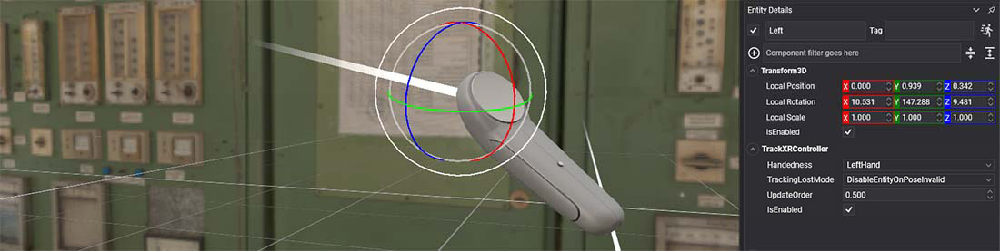
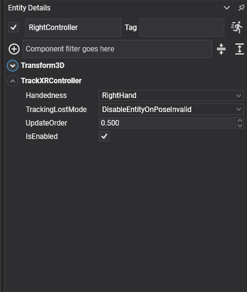

# TrackXRController



`TrackXRController` makes an entity follow a left or right motion controller, such as the Meta Quest Touch controllers, the Pico controllers, the Vive wands or the Valve Index controllers, and exposes the state of its trigger, grip, thumbstick and buttons.

Use it for anything held in the hand: a rendered controller, a tool, a laser pointer, or a behavior that reacts to the buttons.

## Properties

When you add the component to an entity in Evergine Studio, it shows these properties:

<!-- CAPTURE: trackxrcontroller.png (replace the current one); Entity Details panel of Evergine Studio from develop with TrackXRController expanded (403x477 crop, other components collapsed), Handedness RightHand -->


| Property | Default | Description |
| --- | --- | --- |
| **Handedness** | `LeftHand` | The controller to track: `LeftHand` or `RightHand`. |
| **TrackingLostMode** | `DisableEntityOnPoseInvalid` | What happens to the entity when tracking fails. See [common properties](index.md#common-properties). |
| **ControllerState** | Read-only | The input state of this frame, as an `XRControllerGenericState`. |

The component also has the members every tracking component shares, listed in [common properties](index.md#common-properties): `IsConnected`, `PoseIsValid`, `Pose`, `Pointer`, `Velocity`, `AngularVelocity`, `TrackedDevice` and the `OnTrackedDeviceChanged` event.

> [!NOTE]
> On OpenXR a controller only connects when one of the [interaction profiles](../openxr/openxr_platform.md#interaction-profiles) registered in the launcher matches it. If `IsConnected` stays `false` with the controller in your hand, add its profile.

## Controller state

`ControllerState` is an `XRControllerGenericState` structure:

| Field | Type | Description |
| --- | --- | --- |
| **IsConnected** | `bool` | Whether the controller is connected. |
| **Trigger** | `float` | Analog value of the trigger, from 0 (released) to 1 (fully pressed). |
| **TriggerButton** | `ButtonState` | The trigger as a button. |
| **Grip** | `ButtonState` | The grip (squeeze) button. |
| **ThumbStick** | `Vector2` | Position of the thumbstick, from -1 to 1 on each axis. On Vive wands, the touchpad. |
| **ThumbStickButton** | `ButtonState` | Thumbstick click. |
| **Menu** | `ButtonState` | The menu button. On Meta Touch controllers, only the left controller has one. |
| **Button1** | `ButtonState` | The first face button: A on the right controller, X on the left. |
| **Button2** | `ButtonState` | The second face button: B on the right controller, Y on the left. Not mapped on OpenVR. |
| **Touchpad** | `Vector2` | Declared for touchpad controllers. No platform in this release fills it: touchpads report through `ThumbStick`. |

A `ButtonState` goes through four values: `Released`, then `Pressing` for exactly one frame, then `Pressed` while held, then `Releasing` for one frame. Compare with `Pressing` to react once per press. The structure also has two helpers:

| Method | Returns |
| --- | --- |
| `IsButtonPressed(XRButtons button)` | `true` while the button is `Pressed`, that is held, from the second frame on. It is `false` on the `Pressing` frame. |
| `IsButtonReleased(XRButtons button)` | `!IsButtonPressed(button)`. |

`XRButtons` has the values `ThumbStick`, `Trigger`, `Menu`, `Grip`, `Button1` and `Button2`.

## Using TrackXRController

### Create a tracked controller from code

This scene puts a teapot in the left hand and scales it with the trigger:

```csharp
using System;
using Evergine.Components.Graphics3D;
using Evergine.Components.XR;
using Evergine.Framework;
using Evergine.Framework.Graphics;
using Evergine.Framework.XR;
using Evergine.Mathematics;

public class ControllerScene : Scene
{
    protected override void CreateScene()
    {
        base.CreateScene();

        var material = this.Managers.AssetSceneManager.Load<Material>(DefaultResourcesIDs.DefaultMaterialID);

        // A teapot that follows the left controller.
        var leftController = new Entity("LeftController")
            .AddComponent(new Transform3D())
            .AddComponent(new MaterialComponent() { Material = material })
            .AddComponent(new TeapotMesh() { Size = 0.15f })
            .AddComponent(new MeshRenderer())
            .AddComponent(new TrackXRController()
            {
                Handedness = XRHandedness.LeftHand,
            })
            .AddComponent(new ScaleWithTrigger());

        this.Managers.EntityManager.Add(leftController);
    }
}

public class ScaleWithTrigger : Behavior
{
    [BindComponent]
    private Transform3D transform = null;

    [BindComponent]
    private TrackXRController controller = null;

    protected override void Update(TimeSpan gameTime)
    {
        if (!this.controller.IsConnected)
        {
            return;
        }

        // Trigger is an analog value from 0 to 1, so the teapot grows from 1x to 2x.
        this.transform.LocalScale = Vector3.One * (1 + this.controller.ControllerState.Trigger);
    }
}
```

### React to buttons and draw a pointer

This behavior hides the entity's mesh with a press of the first face button, and draws the controller's pointer ray while the grip is held:

```csharp
using System;
using Evergine.Common.Graphics;
using Evergine.Common.Input;
using Evergine.Components.Graphics3D;
using Evergine.Components.XR;
using Evergine.Framework;
using Evergine.Framework.Managers;
using Evergine.Framework.XR;

public class ControllerButtons : Behavior
{
    [BindComponent]
    private TrackXRController controller = null;

    [BindComponent]
    private MeshRenderer meshRenderer = null;

    protected override void Update(TimeSpan gameTime)
    {
        var state = this.controller.ControllerState;

        // Pressing lasts exactly one frame, so this toggles once per press.
        if (state.Button1 == ButtonState.Pressing)
        {
            this.meshRenderer.IsEnabled = !this.meshRenderer.IsEnabled;
        }

        // IsButtonPressed is true while the button is held.
        if (state.IsButtonPressed(XRButtons.Grip))
        {
            // Pointer is already in world space: draw two metres of it.
            var pointer = this.controller.Pointer;
            var lineBatch = ((RenderManager)this.Managers.RenderManager).LineBatch3D;
            lineBatch.DrawLine(pointer.Position, pointer.GetPoint(2), Color.Yellow);
        }
    }
}
```

### Know when the device changes

`OnTrackedDeviceChanged` fires when the component picks up a different device. It is the place to reset anything tied to the previous one:

```csharp
using System.Diagnostics;
using Evergine.Components.XR;
using Evergine.Framework;
using Evergine.Framework.XR.TrackedDevices;

public class ControllerWatcher : Component
{
    [BindComponent]
    private TrackXRController controller = null;

    protected override bool OnAttached()
    {
        this.controller.OnTrackedDeviceChanged += this.OnDeviceChanged;
        return base.OnAttached();
    }

    protected override void OnDetached()
    {
        this.controller.OnTrackedDeviceChanged -= this.OnDeviceChanged;
        base.OnDetached();
    }

    private void OnDeviceChanged(object sender, XRTrackedDevice device)
    {
        Trace.TraceInformation($"Now tracking {device?.Name ?? "no device"}");
    }
}
```

## See also

* [TrackXRArticulatedHand](trackxrarticulatedhand.md): tracking hands, and rendering device models with `XRDeviceRenderableModel`.
* [Button states](../../input/index.md): the same `ButtonState` values used by keyboard, mouse and gamepad input.
