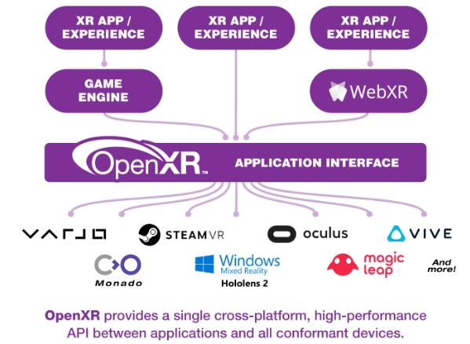
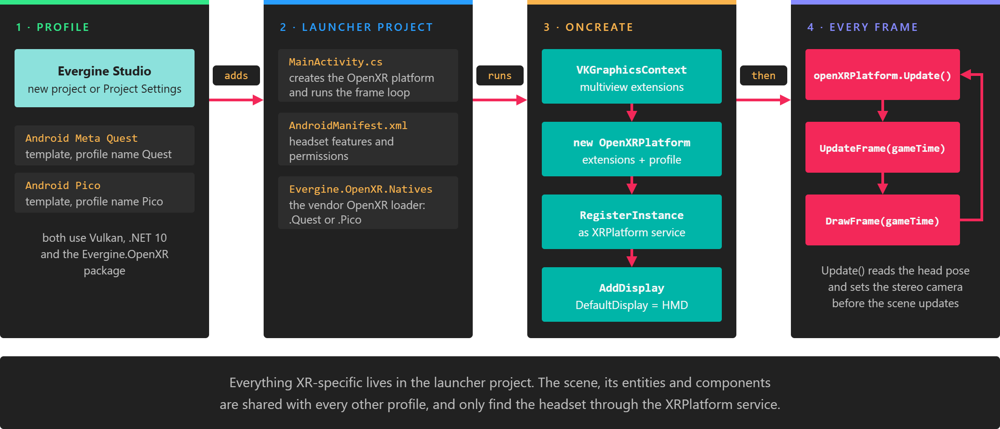

# OpenXR

**OpenXR** is an open, royalty-free API standard from the [Khronos Group](https://www.khronos.org/openxr/). Headset vendors ship an OpenXR runtime, and an application written against OpenXR runs on any of them without a vendor SDK.

Evergine implements OpenXR in the **Evergine.OpenXR** package, through the [`OpenXRPlatform`](openxr_platform.md) service. It is the recommended way to build VR and mixed reality applications with Evergine: the same service drives standalone Android headsets and PC headsets, and Evergine Studio has a project template for each.

| Target | Template | Graphics backend | Page |
| --- | --- | --- | --- |
| Meta Quest headsets | Android Meta Quest (OpenXR) | Vulkan | [Meta Quest](metaquest.md) |
| Pico headsets | Android Pico (OpenXR) | Vulkan | [Pico](pico.md) |
| PC headsets (through the OpenXR runtime installed on Windows) | Windows OpenXR (DirectX11) | DirectX 11 | [Windows (PC VR)](windows.md) |

*Choosing the profile is the only step you take in Evergine Studio. The template writes the launcher code that creates `OpenXRPlatform`, and your scene stays the same for every profile.*

> [!NOTE]
> `OpenXRPlatform` supports the DirectX 11, Vulkan and OpenGL graphics backends. It does not support DirectX 12, the default backend of the regular Windows template, which is why PC VR has its own **Windows OpenXR (DirectX11)** template.

## In this section

* [OpenXR Platform](openxr_platform.md)
* [Meta Quest](metaquest.md)
* [Pico](pico.md)
* [Windows (PC VR)](windows.md)
