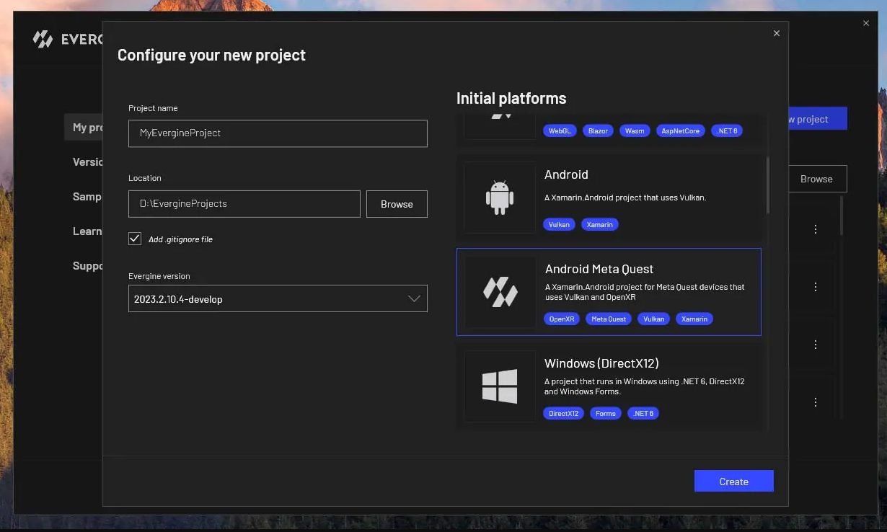
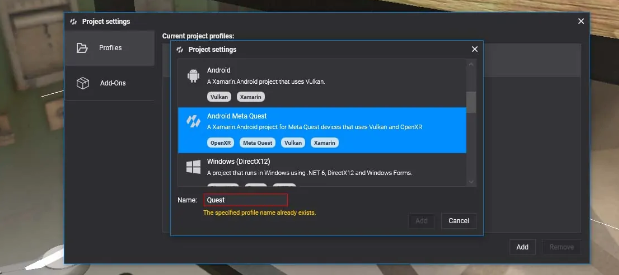
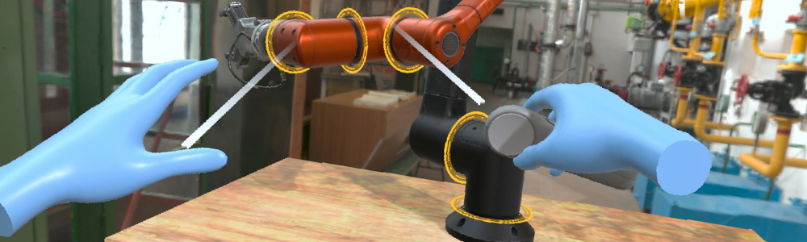

# Meta Quest


Meta Quest headsets are standalone Android devices with inside-out tracking, Touch controllers and hand tracking. Evergine targets them through [OpenXR](openxr_platform.md), with Vulkan as the graphics backend, and adds the Meta extensions for hand meshes, pinch gestures, [passthrough](../passthrough.md) and simultaneous hands and controllers.

## Create a Meta Quest project

Select the **Android Meta Quest (OpenXR)** template when you create a project:



To add Meta Quest to an existing project, open **Project Settings**, add a profile and choose the same template. The profile is named **Quest** by default.

<!-- CAPTURE: openxr_addprofile.png (replace the current one); Project Settings > Profiles > Add dialog in Evergine Studio from develop, with "Android Meta Quest (OpenXR)" selected (Android filter) and the Name field showing "Quest" -->



*The profile adds a launcher project. Everything headset-specific is in it, and the scene is shared with the other profiles.*

## What the template contains

| File | Purpose |
| --- | --- |
| `MainActivity.cs` | Creates the Vulkan graphics context with the multiview and external memory extensions OpenXR needs, creates and registers `OpenXRPlatform`, and runs the frame loop. |
| `AndroidManifest.xml` | Declares a VR-only application (`com.oculus.intent.category.VR`), the head tracking and hand tracking features, and the hand tracking permission. |
| `*.csproj` | References `Evergine.OpenXR` and `Evergine.OpenXR.Natives.Quest`, the Meta OpenXR loader. |

The template creates the platform with hand tracking, the Meta hand gestures and hand meshes already enabled, and with the Touch controller profile:

```csharp
openXRPlatform = new OpenXRPlatform(
    new string[]
    {
            "XR_EXT_hand_tracking",         // Enable hand tracking in OpenXR application
            "XR_FB_hand_tracking_aim",      // Allow to use hand gestures in Meta Quest devices
            "XR_FB_hand_tracking_mesh",     // Obtain hand mesh in Meta Quest devices

        // "XR_FB_passthrough",         // Enable Passthrough in Meta Quest devices
        // "XR_FB_triangle_mesh",       // Allow to project Passthrough on Meshes

        // "XR_META_simultaneous_hands_and_controllers", // Allow to use hands and controllers simultaneously
    },
    new OpenXRInteractionProfile[]
    {
            DefaultInteractionProfiles.OculusTouchProfile
    })
{
    // UseSimultaneousHandsAndControllers = true, // Enable using simultaneously the hands and controllers
    RenderMirrorTexture = false,
    ReferenceSpace = ReferenceSpaceType.Stage,
    MirrorDisplay = mirrorDisplay,
};
```

`RenderMirrorTexture` is `false` because nothing shows the Android surface while the headset is on, so copying the image there would only cost GPU time.

## Run on the headset

1. Enable developer mode on the headset. Meta does this from the Meta Horizon app on the phone paired with it.
2. Connect the headset to the PC with a USB cable and accept the USB debugging prompt inside the headset.
3. Open the solution of the Quest profile in Visual Studio, select the headset as the target device, and start debugging.

## Optional features

Each of these features is one or two commented lines in the template. Uncomment them and rebuild.

### Passthrough

Passthrough shows the real room around the user, behind or in front of the scene. It needs two changes:

1. In `MainActivity.cs`, enable `XR_FB_passthrough`, and `XR_FB_triangle_mesh` if you want to [project passthrough on your own meshes](../passthrough.md#project-passthrough-on-a-mesh):

   ```csharp
   "XR_FB_passthrough",         // Enable Passthrough in Meta Quest devices
   "XR_FB_triangle_mesh",       // Allow to project Passthrough on Meshes
   ```

2. In `AndroidManifest.xml`, uncomment the passthrough feature. The Meta runtime requires it, and without it no passthrough layer is created:

   ```xml
   <uses-feature android:name="com.oculus.feature.PASSTHROUGH" android:required="true" />
   ```

Then add an `XRPassthroughLayerComponent` to the scene, as described in [Passthrough](../passthrough.md).

### Simultaneous hands and controllers



By default a Quest tracks either the controllers or the hands. With multimodal input it tracks both at once, and reports a hand while the other holds a controller. Users get the immersion of hands and the precision and haptics of controllers. Meta describes the feature in its [multimodal input documentation](https://developers.meta.com/horizon/documentation/native/android/native-multimodal/).

1. In `MainActivity.cs`, enable the extension:

   ```csharp
   "XR_META_simultaneous_hands_and_controllers", // Allow to use hands and controllers simultaneously
   ```

2. In the same file, turn the feature on in the object initializer:

   ```csharp
   UseSimultaneousHandsAndControllers = true, // Enable using simultaneously the hands and controllers
   ```

`UseSimultaneousHandsAndControllers` can also be changed at run time, from launcher code that keeps a reference to the `OpenXRPlatform`.

## See also

* [OpenXR Platform](openxr_platform.md): every `OpenXRPlatform` property, reference spaces and interaction profiles.
* [Input Devices](../input_tracking/index.md): tracking controllers and hands in the scene.
