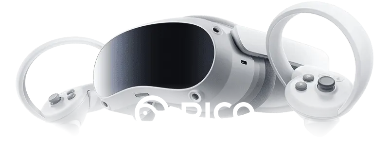
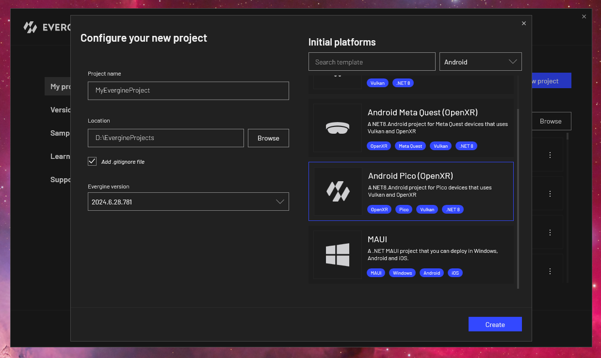
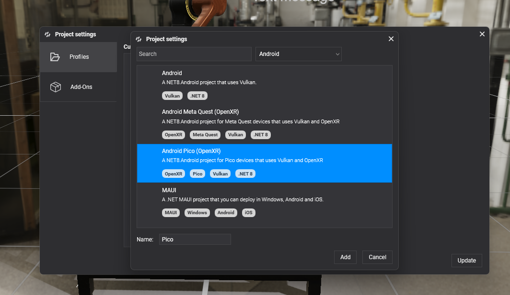

# Pico



Pico headsets, such as the Pico 4, are standalone Android VR devices with inside-out tracking, their own controllers and hand tracking. Evergine targets them through [OpenXR](openxr_platform.md) with Vulkan, in the same way as [Meta Quest](metaquest.md). The two templates share almost all of their code, so a project can have both profiles side by side.

## Create a Pico project

Select the **Android Pico (OpenXR)** template when you create a project:



To add Pico to an existing project, open **Project Settings**, add a profile and choose the same template. The profile is named **Pico** by default.

<!-- CAPTURE: openxr_addpicoprofile.png (replace the current one); Project Settings > Profiles > Add dialog in Evergine Studio from develop, with "Android Pico (OpenXR)" selected (Android filter) and the Name field showing "Pico" -->


## What the template contains

The launcher project follows the [same four steps](index.md) as the Meta Quest one. What differs is the vendor-specific part:

| | Android Pico | Android Meta Quest |
| --- | --- | --- |
| OpenXR loader package | `Evergine.OpenXR.Natives.Pico` | `Evergine.OpenXR.Natives.Quest` |
| Interaction profile | `DefaultInteractionProfiles.PicoNeo3Profile` | `DefaultInteractionProfiles.OculusTouchProfile` |
| Extensions requested | `XR_EXT_hand_tracking` | `XR_EXT_hand_tracking`, `XR_FB_hand_tracking_aim`, `XR_FB_hand_tracking_mesh`, plus commented passthrough and multimodal extensions |
| Manifest | `pvr.app.type` set to `vr` | Meta VR intent category and hand tracking feature |

This is how the Pico template creates the platform, in `MainActivity.cs`:

```csharp
openXRPlatform = new OpenXRPlatform(
    new string[]
    {
            "XR_EXT_hand_tracking",         // Enable hand tracking in OpenXR application
    },
    new OpenXRInteractionProfile[]
    {
            DefaultInteractionProfiles.PicoNeo3Profile
    })
{
    RenderMirrorTexture = false,
    ReferenceSpace = ReferenceSpaceType.Stage,
    MirrorDisplay = mirrorDisplay,
};
```

> [!NOTE]
> With only `XR_EXT_hand_tracking`, hands are tracked and their joints are available to [`TrackXRArticulatedHand`](../input_tracking/trackxrarticulatedhand.md), but there is no hand mesh and no pinch gesture: those come from Meta extensions. Draw the hands yourself from the joint poses.

## Run on the headset

Enable developer mode on the headset, connect it to the PC with a USB cable, allow USB debugging inside the headset, and start the Pico profile from Visual Studio with the headset selected as the target device.

## See also

* [OpenXR Platform](openxr_platform.md): every `OpenXRPlatform` property, reference spaces and interaction profiles.
* [Input Devices](../input_tracking/index.md): tracking controllers and hands in the scene.
