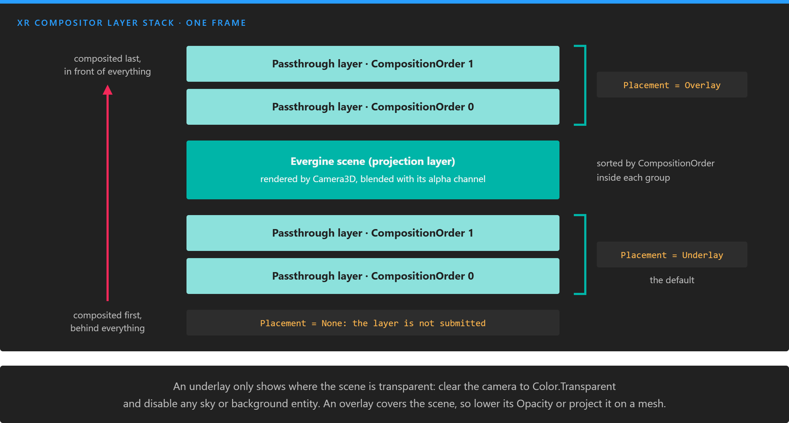
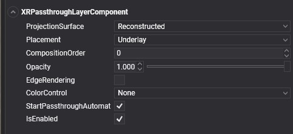
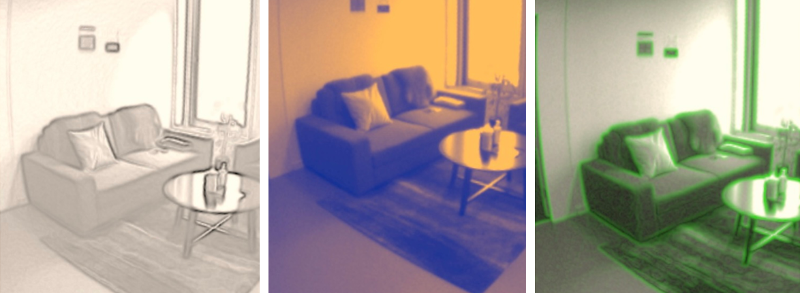

# Passthrough

<video autoplay loop muted playsinline width="100%" height="auto">
  <source src="images/xrpassthrough.mp4" type="video/mp4">
</video>

**Passthrough** shows the user's real surroundings inside the headset, reconstructed from the headset's cameras in real time. Mixing it with the scene turns a VR application into a mixed reality one: virtual objects on a real desk, a window into the room from inside a virtual world, or a stylized outline of the walls so the user does not walk into them.

In Evergine you add passthrough with one component, `XRPassthroughLayerComponent`, and style it with its properties.

## Supported devices

| Device | Platform | Requirement |
| --- | --- | --- |
| Meta Quest headsets | [OpenXR](openxr/metaquest.md) | The `XR_FB_passthrough` extension and the passthrough feature in the Android manifest |

On any other platform or device, `XRPlatform.Passthrough` is `null` and the component does nothing.

## How it works

Your application never receives the camera images. It submits a **passthrough layer**, a placeholder, and the XR compositor fills it with the camera feed when it assembles the final image. What you control is where that layer sits relative to the scene and how it looks:

* **Composition**: the layer goes behind the scene (underlay) or in front of it (overlay), and several layers are ordered by `CompositionOrder`.
* **Projection surface**: the feed is projected either on the room as the runtime reconstructs it, or only on meshes you provide.
* **Style**: opacity, edge highlighting, and color adjustments or color maps.



*The compositor draws the stack from the bottom up, every frame. Underlays sort below the scene and overlays above it; inside each group, a larger `CompositionOrder` is drawn later, in front.*

## Enable passthrough in a Meta Quest project

The Meta Quest template ships with passthrough disabled. Enable it in the launcher project:

1. In `MainActivity.cs`, uncomment the passthrough extensions in the `OpenXRPlatform` constructor. `XR_FB_triangle_mesh` is only needed to [project passthrough on a mesh](#project-passthrough-on-a-mesh):

   ```csharp
   "XR_FB_passthrough",         // Enable Passthrough in Meta Quest devices
   "XR_FB_triangle_mesh",       // Allow to project Passthrough on Meshes
   ```

2. In `AndroidManifest.xml`, uncomment the passthrough feature:

   ```xml
   <uses-feature android:name="com.oculus.feature.PASSTHROUGH" android:required="true" />
   ```

Keep the headset's operating system up to date: passthrough capabilities, such as color passthrough, depend on it.

## XRPassthroughLayerComponent

Add an `XRPassthroughLayerComponent` to any entity to create a passthrough layer. It needs no other component.

<!-- CAPTURE: xrpassthroughlayercomponent.jpg (replace the current one); Entity Details panel of Evergine Studio from develop with XRPassthroughLayerComponent expanded (403x477 crop, other components collapsed), EdgeRendering on so EdgeColor shows, ColorControl set to ColorAdjustment so Brightness, Contrast and Saturation show -->


The layer is created when the component attaches and starts when it activates. Disabling the component or its entity pauses the layer, and removing it destroys the layer.

### Layer properties

| Property | Default | Description |
| --- | --- | --- |
| **ProjectionSurface** | `Reconstructed` | `Reconstructed` projects the feed on the room as the runtime reconstructs it, which is what you want when you know nothing about the room. `UserDefined` shows the feed only on the meshes you register, and leaves the rest of the layer transparent. |
| **Placement** | `Underlay` | `Underlay` puts the layer behind the scene, `Overlay` in front of it. `None` keeps the layer out of the composition. |
| **CompositionOrder** | 0 | Order among layers with the same placement. A larger value is drawn in front of a smaller one. |
| **StartPassthroughAutomatically** | `true` | Starts the layer when the component activates. Set it to `false` to start it yourself. |
| **IsRunning** | Read-only | Whether the layer is currently showing the feed. `false` when there is no layer. |
| **PassthroughLayer** | Read-only | The underlying `XRPassthroughLayer`. `null` when the platform has no passthrough. Use it to call `StartPassthrough()` and `PausePassthrough()`. |

<video autoplay loop muted playsinline width="250px" height="auto"><source src="images/xrpassthroughreconstructed.mp4" type="video/mp4"></video>

*A reconstructed layer: the whole room, projected on the geometry the runtime estimates.*

> [!IMPORTANT]
> An underlay is only visible where the scene is transparent. Set the camera's `BackgroundColor` to `Color.Transparent` and disable or remove anything that fills the background, such as a sky atmosphere or a skybox. Otherwise the scene covers the passthrough completely.

### Create a passthrough background from code

```csharp
using Evergine.Common.Graphics;
using Evergine.Components.XR;
using Evergine.Framework;
using Evergine.Framework.Graphics;
using Evergine.Framework.XR.Passthrough;

public class MixedRealityScene : Scene
{
    protected override void CreateScene()
    {
        base.CreateScene();

        // The passthrough underlay is only visible where the scene is transparent.
        var camera = new Entity("Camera")
            .AddComponent(new Transform3D())
            .AddComponent(new Camera3D() { BackgroundColor = Color.Transparent });

        var passthrough = new Entity("Passthrough")
            .AddComponent(new XRPassthroughLayerComponent()
            {
                Placement = XROverlayType.Underlay,
                EdgeRendering = true,
                EdgeColor = Color.Cyan,
            });

        this.Managers.EntityManager.Add(camera);
        this.Managers.EntityManager.Add(passthrough);
    }
}
```

### Project passthrough on a mesh

With a user-defined surface, the feed only appears on meshes you choose. This is steadier than the reconstruction when you already know the geometry, and it lets you cut windows into a virtual world.

1. Enable `XR_FB_triangle_mesh` in `MainActivity.cs`.
2. Add `XRPassthroughLayerComponent` to an entity that has a mesh component (for example `PlaneMesh`, or a model's meshes).
3. Add `XRPassthroughSurfaceMeshComponent` to the same entity. It registers the entity's meshes as projection surfaces, follows the entity's transform, and switches the layer's `ProjectionSurface` to `UserDefined`.

```csharp
using Evergine.Components.Graphics3D;
using Evergine.Components.XR;
using Evergine.Framework;
using Evergine.Framework.Graphics;
using Evergine.Framework.XR.Passthrough;
using Evergine.Mathematics;

public class PassthroughWindowScene : Scene
{
    protected override void CreateScene()
    {
        base.CreateScene();

        // A 1 x 1 m window to the real room, two metres in front of the start position.
        // The plane has no MeshRenderer: its mesh is only the projection surface.
        var window = new Entity("PassthroughWindow")
            .AddComponent(new Transform3D() { Position = new Vector3(0, 1.5f, -2) })
            .AddComponent(new PlaneMesh() { PlaneNormal = PlaneMesh.NormalAxis.ZPositive, Width = 1, Height = 1 })
            .AddComponent(new XRPassthroughLayerComponent() { Placement = XROverlayType.Overlay })
            .AddComponent(new XRPassthroughSurfaceMeshComponent());

        this.Managers.EntityManager.Add(window);
    }
}
```

<video autoplay loop muted playsinline width="250px" height="auto"><source src="images/xrpassthroughuserdefined.mp4" type="video/mp4"></video>

*A user-defined layer: the feed only appears on the registered mesh.*

`XRPassthroughSurfaceMeshComponent` can also feed a layer on another entity:

| Property | Default | Description |
| --- | --- | --- |
| **SearchPassthroughLayer** | `OwnerEntity` | Where to find the layer: `OwnerEntity` uses the `XRPassthroughLayerComponent` of the same entity, `Scene` the one at `PassthroughLayerEntityPath`. |
| **PassthroughLayerEntityPath** | `null` | Entity path of the layer entity, when `SearchPassthroughLayer` is `Scene`. Several surface entities can share one layer this way. |

> [!NOTE]
> Projection on meshes needs both `XR_FB_passthrough` and `XR_FB_triangle_mesh`. Without them `XRPassthroughSurfaceMeshComponent` does not attach.

## Style properties

These properties change how the feed looks. They apply to the layer immediately, also while it runs.



| Property | Default | Description |
| --- | --- | --- |
| **Opacity** | 1 | Opacity of the passthrough image, clamped to [0, 1]. Edges drawn by `EdgeRendering` are not affected. |
| **EdgeRendering** | `false` | Detects edges in the camera image and draws them over it. |
| **EdgeColor** | `Color.White` | Color of the edges. Only shown in Evergine Studio when `EdgeRendering` is on. |
| **ColorControl** | `None` | How the colors of the image are modified: `None`, `ColorAdjustment`, `ColorMap` or `GrayscaleMap`. Each mode uses the properties described below. |

<video autoplay loop muted playsinline width="250px" height="auto"><source src="images/xrpassthrough_edgerendering.mp4" type="video/mp4"></video>

*Edge rendering over the camera image.*

### ColorAdjustment

Adjusts brightness, contrast and saturation. Saturation only has an effect on devices with color passthrough.

| Property | Default | Description |
| --- | --- | --- |
| **Brightness** | 0 | Brightness offset in the range [-100, 100]. 0 leaves the image unchanged. |
| **Contrast** | 1 | Contrast factor, 0 or greater. 1 leaves the image unchanged. |
| **Saturation** | 1 | Saturation factor, 0 or greater. 1 leaves the image unchanged. |

### ColorMap

Converts the image to grayscale and replaces each luminance value with a color from a curve.

| Property | Default | Description |
| --- | --- | --- |
| **ColorMapMonoToRGBA** | `null` | A `ColorCurve` with keys between 0 (black) and 1 (white). |

```csharp
using Evergine.Common.Curves;
using Evergine.Common.Graphics;
using Evergine.Framework.XR.Passthrough;

// Map dark areas to blue, mid tones to green and red, highlights to yellow and white.
var colorMap = new ColorCurve();
colorMap.Keyframes.Clear();
colorMap.AddKey(0, Color.Black);
colorMap.AddKey(0.1f, Color.Blue);
colorMap.AddKey(0.4f, Color.Green);
colorMap.AddKey(0.6f, Color.Red);
colorMap.AddKey(0.8f, Color.Yellow);
colorMap.AddKey(1, Color.White);

passthroughLayer.ColorControl = XRPassthroughColorControlType.ColorMap;
passthroughLayer.ColorMapMonoToRGBA = colorMap;
```

<video autoplay loop muted playsinline width="250px" height="auto"><source src="images/xrpassthrough_colormap.mp4" type="video/mp4"></video>

*The color map above applied to the room.*

### GrayscaleMap

Converts the image to grayscale and remaps each luminance value through a curve.

| Property | Default | Description |
| --- | --- | --- |
| **ColorMapMonoToMono** | `null` | A `FloatCurve` with keys between 0 and 1, and values between 0 and 1. |

```csharp
using Evergine.Common.Curves;
using Evergine.Framework.XR.Passthrough;

// Invert the grayscale image.
var monoMap = new FloatCurve();
monoMap.Keyframes.Clear();
monoMap.AddKey(0, 1);
monoMap.AddKey(1, 0);

passthroughLayer.ColorControl = XRPassthroughColorControlType.GrayscaleMap;
passthroughLayer.ColorMapMonoToMono = monoMap;
```

<video autoplay loop muted playsinline width="250px" height="auto"><source src="images/xrpassthrough_monomap.mp4" type="video/mp4"></video>

*The inverted grayscale map.*

In both examples, `passthroughLayer` is the `XRPassthroughLayerComponent`, for example obtained with `[BindComponent]` in a behavior on the same entity.

## Pause and resume passthrough

A layer shows the feed while its component is active. To stop the feed without removing the component, call `PausePassthrough()` on the layer, and `StartPassthrough()` to resume it. `XRPlatform.Passthrough` has the same two methods, which act on the passthrough as a whole.

```csharp
using Evergine.Components.XR;
using Evergine.Framework;

public class PassthroughToggle : Component
{
    [BindComponent]
    private XRPassthroughLayerComponent layer = null;

    // Call it from a button or a controller input.
    public void Toggle()
    {
        if (this.layer.IsRunning)
        {
            this.layer.PassthroughLayer?.PausePassthrough();
        }
        else
        {
            this.layer.PassthroughLayer?.StartPassthrough();
        }
    }
}
```
