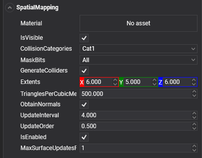
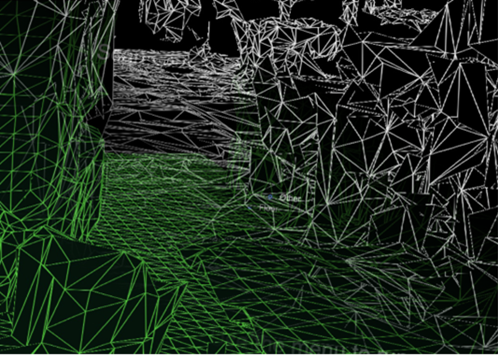

# XR Spatial Mapping


Some XR devices have built-in cameras that continuously scan the environment, allowing them to construct virtual world geometry for real-world objects. This ability allows developers to create convincing interactions between virtual content and the real world (such as occluding and physically interacting with real-world objects). The process of mapping real-world surfaces into the virtual world is called **Spatial Mapping**.

## Supported Devices

Currently, in Evergine, the following devices have **Spatial Mapping** support:

| Device | XR Platform |
| --- | --- |
| **HoloLens 2** | Windows Mixed Reality |

## SpatialMapping Component

To start using Spatial Mapping in your application, you only need to create an Entity and add the `SpatialMapping` component:



This component will request from the XR Platform a collection of Spatial Mapping surfaces, which consist of meshes that conform to the detected environment by the XR Device. Internally, this component will create a collection of child entities, each one responsible for maintaining and rendering a single surface with the given properties, which will be described later.



### Properties

#### Mesh Generation Properties

The following properties specify how the spatial mapping meshes will be generated:

| Property | Description |
| --- | --- |
| **TrianglesPerCubicMeter** (Default 500) | The triangles per cubic meter of the generated Spatial Mapping Meshes. With this property, you can control the overall quality of the generated meshes. <br/> Lower values generate meshes with less quality but increase overall performance, while greater values provide better spatial mapping quality but with a performance penalty. *Default value is 500* |
| **ObtainNormals** (Default true) | Indicates that the generated mesh will provide normals. *Default value is `true`* |
| **Extents** (Default [6, 5, 6]) | This property defines a volume area (measured in meters) centered around the XR Device user in which all spatial mapping surfaces are updated and generated. Distant surfaces are discarded to prevent a performance penalty. *Default value is an area of 6m x 5m x 6m* |
| **Material** | Specifies which material will be used to render the Spatial Mapping meshes. If no material is provided, the spatial mapping surfaces won't be rendered. *Default value is `null`* |

#### Update Mesh Properties

The following properties indicate how often the spatial mapping surfaces will be updated or generated:

| Property | Description |
| --- | --- |
| **UpdateInterval** (Default 0) | Frequency (in seconds) at which the SpatialMapping component will update its surfaces. In the case of 0, the spatial mapping will not be updated (keeping the first requested spatial mapping surfaces). Increase this value for more frequent updates. *Default value is 0* |
| **MaxSurfaceUpdatesPerFrame** (Default 1) | Indicates how many surfaces will be processed per frame. When SpatialMapping requests an update, it gives a list of surfaces that require an update. Setting this value allows you to control how many surfaces will be processed in a single frame. This prevents the application from increasing CPU usage and causing a drop in FPS. *Default value is 1* |

#### Collision Mesh Properties

One of the most important utilities for Spatial Mapping is to generate Physics colliders for the detected surfaces, allowing physical interaction with the environment.

| Property | Description |
| --- | --- |
| **GenerateColliders** (Default false) | Indicates if physics colliders will be generated for detected spatial mapping surfaces. Generating colliders has a significant performance penalty, so we recommend enabling colliders only if necessary. *Default value is `false`* |
| **CollisionCategory** (Default Cat1) | Specifies the CollisionCategory property of spatial mapping physics colliders (It has no effect if the GenerateColliders value is false). Please, read [Collision Filtering](../physics/physics_bodies/collisions.md#collision-filtering) for further details. *Default value is `Cat1`* |
| **MaskBits** (Default All) | Specifies the MaskBits property of spatial mapping physics colliders (It has no effect if the GenerateColliders value is false). Please, read [Collision Filtering](../physics/physics_bodies/collisions.md#collision-filtering) for further details. *Default value is `All`* |

## Using SpatialMapping from Code

```csharp
protected override void CreateScene()
{
    base.CreateScene();

    // Spatial Mapping entity
    var spatialMapping = new Entity()
        .AddComponent(new Transform3D())
        .AddComponent(new SpatialMapping() 
        { 
            UpdateInterval = 5, // Update spatial mapping surfaces every 5 seconds
            GenerateColliders = true // Generate colliders
        });

    this.Managers.EntityManager.Add(spatialMapping);
}
```