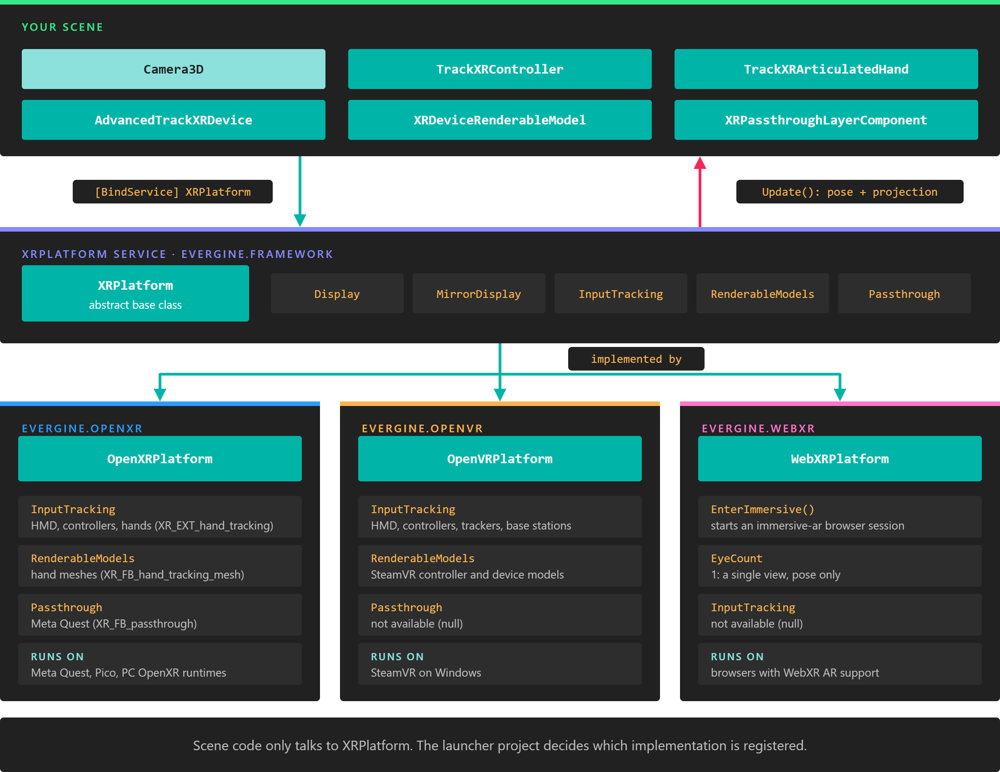

# XR Platform


`XRPlatform` is the service that connects an Evergine application to an XR runtime. It creates and runs the XR session, allocates the render targets the headset needs, moves the scene camera with the user's head, and exposes the subsystems the runtime offers, such as input tracking and passthrough.

`XRPlatform` is abstract. You never create it directly: the launcher project of an XR profile creates one of its implementations, [`OpenXRPlatform`](openxr/openxr_platform.md), [`OpenVRPlatform`](openvr.md) or [`WebXRPlatform`](webxr.md), and registers it in the application container. Scene code then reaches it as `XRPlatform`, so the same scene runs on any of them.



*Components ask for `XRPlatform`, never for a concrete platform. Which implementation they get is decided by the launcher project of the profile you run.*

> [!NOTE]
> Not every platform implements every subsystem. A subsystem the platform does not provide is `null`, so check it before use. The [feature support](index.md#feature-support) table lists what each platform offers.

## Creating and registering a platform

The launcher project of each XR profile does four things, in this order:

1. Create the `GraphicsContext` and register it. The XR platform binds to it to create its swapchains.
2. Create the platform, set its properties, and register it with `Container.RegisterInstance`. The container registers it under every base class, so `[BindService] XRPlatform` resolves to it.
3. Register the platform's `Display` as `DefaultDisplay`, so that cameras render into the headset. A window, if there is one, is registered as a second display that shows a mirror of the headset image.
4. Call `Update()` on the platform every frame, **before** `UpdateFrame`, so that every behavior in the frame sees the current head pose.

This is the relevant part of the **Windows OpenXR (DirectX11)** template (`Program.cs`):

```csharp
private static OpenXRPlatform openXRPlatform;

private static void ConfigureGraphicsContext(Application application, Window window)
{
    GraphicsContext graphicsContext = new global::Evergine.DirectX11.DX11GraphicsContext();
    graphicsContext.CreateDevice();
    SwapChainDescription swapChainDescription = new SwapChainDescription()
    {
        SurfaceInfo = window.SurfaceInfo,
        Width = window.Width,
        Height = window.Height,
        ColorTargetFormat = PixelFormat.R8G8B8A8_UNorm_SRgb,
        ColorTargetFlags = TextureFlags.RenderTarget | TextureFlags.ShaderResource,
        DepthStencilTargetFormat = PixelFormat.D32_Float_S8X24_UInt,
        DepthStencilTargetFlags = TextureFlags.DepthStencil,
        SampleCount = TextureSampleCount.None,
        IsWindowed = Windowed,
        RefreshRate = 60
    };
    var swapChain = graphicsContext.CreateSwapChain(swapChainDescription);
    swapChain.VerticalSync = VSync;
    application.Container.RegisterInstance(graphicsContext);

    // Create mirror display...
    var mirrorDisplay = new Display(window, swapChain);

    // Create OpenXR Platform
    openXRPlatform = new OpenXRPlatform(
        new string[]
        {
            // OpenXR extensions to enable...
            //"XR_EXT_hand_tracking",         // Enable hand tracking in OpenXR application
            //"XR_FB_hand_tracking_aim",      // Allow to use hand gestures in Meta Quest devices
            //"XR_FB_hand_tracking_mesh",     // Obtain hand mesh in Meta Quest devices
        }
        ,
        new OpenXRInteractionProfile[]
        {
                // Interaction profile to use...
                DefaultInteractionProfiles.OculusTouchProfile,
                DefaultInteractionProfiles.HTCViveControllerProfile,
                DefaultInteractionProfiles.MixedRealityMotionControllerProfile,
                DefaultInteractionProfiles.ValveIndexControllerProfile,
                DefaultInteractionProfiles.OculusGoProfile,
        })
    {
        RenderMirrorTexture = true,
        ReferenceSpace = ReferenceSpaceType.Stage,
        MirrorDisplay = mirrorDisplay
    };

    application.Container.RegisterInstance(openXRPlatform);

    // Register the displays...
    var graphicsPresenter = application.Container.Resolve<GraphicsPresenter>();
    graphicsPresenter.AddDisplay("DefaultDisplay", openXRPlatform.Display);
    graphicsPresenter.AddDisplay("MirrorDisplay", mirrorDisplay);
}
```

And its frame loop:

```csharp
windowsSystem.Run(
() =>
{
    application.Initialize();
},
() =>
{
    var gameTime = clockTimer.Elapsed;
    clockTimer.Restart();

    openXRPlatform.Update();
    application.UpdateFrame(gameTime);
    application.DrawFrame(gameTime);
});
```

The [Meta Quest](openxr/metaquest.md), [Pico](openxr/pico.md) and [WebXR](webxr.md) templates follow the same steps. [OpenVR](openvr.md) differs in one detail: its display only exists after the service attaches.

## The camera and the headset

You do not need a special XR camera. Add a regular [Camera 3D](../graphics/cameras.md) to the scene, and every frame `Update()` overwrites what the headset controls on the **active** `Camera3D` of each scene in the current screen context:

* On a stereo platform (`EyeCount` is 2), it hands the camera the pose and projection of both eyes. The camera renders both views and ignores its own field of view and clip settings.
* On a single-view platform (`EyeCount` is 1, WebXR), it sets the camera's position, orientation and projection.

Because the camera is ordinary, the same scene also runs on a desktop profile with no XR platform registered.

The eye poses are relative to the **parent** of the camera entity. That parent is your tracking space: move or rotate it to teleport the user or turn them around, and the head keeps moving freely inside it.

> [!TIP]
> Put tracked controllers and hands under the same parent as the camera. [`TrackXRDevice`](input_tracking/index.md) components write the device pose into the local transform, so they then stay aligned with the head when you move the tracking space.

## Properties

### General

| Property | Default | Description |
| --- | --- | --- |
| **Display** | Created by the platform | The `Display` that renders into the headset. Register it as `DefaultDisplay`. It is `null` on `WebXRPlatform`, which renders into the canvas display instead. |
| **MirrorDisplay** | `null` | A second display, usually the application window, that receives a copy of the headset image. Set it before you register the platform: the platform reads it while it starts. Its window also hosts the keyboard and mouse [input dispatchers](../input/index.md). |
| **RenderMirrorTexture** | `true` | Copies the headset image into `MirrorDisplay` every frame. The Android templates set it to `false`, because nobody looks at the phone surface and the copy costs GPU time. |
| **MirrorHMDTexture** | `true` | Declared on the base class. No platform in this release reads it; use `RenderMirrorTexture`. |
| **MSAASampleCount** | `None` (`Count4` on `OpenVRPlatform`) | Multisampling of the headset render targets. Changing it while the platform runs recreates them. |
| **NearClipDistance** | 0.1 | Distance to the near plane of the headset projection, in metres. It replaces the near plane of the camera. |
| **FarClipDistance** | 1000 | Distance to the far plane of the headset projection, in metres. It is always kept above `NearClipDistance`. |
| **EyeCount** | 2 (1 on `WebXRPlatform`) | Number of views the platform renders. Read-only. |

### Head tracking

| Property | Default | Description |
| --- | --- | --- |
| **TrackingState** | `Uninitialized` | Tracking status of the headset (`Running_OK`, `Running_OutOfRange`, `Calibrating_InProgress`...). Only `OpenVRPlatform` updates it. On OpenXR, read `TrackingState` from an [`AdvancedTrackXRDevice`](input_tracking/advancedtrackxrdevice.md) that tracks the HMD. |
| **HeadGaze** | Empty ray | Ray from the head along the view direction. No platform in this release updates it. To follow the head, track the HMD with an [`AdvancedTrackXRDevice`](input_tracking/advancedtrackxrdevice.md#attach-content-to-the-head) whose `DeviceType` is `HMD`. |

### Subsystems

| Property | Implemented by | Description |
| --- | --- | --- |
| **InputTracking** | OpenXR, OpenVR | The [`XRInputTracking`](input_tracking/index.md) subsystem, which finds tracked devices by type, handedness or index. `null` on WebXR. |
| **RenderableModels** | OpenXR (hand meshes), OpenVR (device models) | The `XRRenderableModels` subsystem, which provides 3D models of tracked devices. The [`XRDeviceRenderableModel`](input_tracking/trackxrarticulatedhand.md#render-the-hands) component uses it. |
| **Passthrough** | OpenXR with `XR_FB_passthrough` | The `XRPassthrough` subsystem, which creates [passthrough layers](passthrough.md). |
| **SpatialInputManager** | None | Declared for gesture input (tap, hold, manipulation, navigation). No platform in this release provides it, so it is always `null`. |

`XRPlatform` also declares `SpatialAnchorStore`, `TrackableItems`, `LightEstimation`, `FeaturePoints`, `EyeGaze`, `RequestEyeGazePermission()` and `CreateSpatialMappingObserver()`. They belong to platforms that are no longer part of Evergine, and return `null` or `false` on every current platform.

## Using XRPlatform from a component

Ask for the service with `[BindService]`. The binding is required by default, and a component whose required service is missing does not attach. Mark it as optional when the component must also work in profiles without XR:

```csharp
using System.Diagnostics;
using Evergine.Framework;
using Evergine.Framework.Services;

public class XRSettings : Component
{
    // Not required: in a desktop profile there is no XR platform and the field stays null.
    [BindService(isRequired: false)]
    private XRPlatform xrPlatform = null;

    protected override void OnActivated()
    {
        base.OnActivated();

        if (this.xrPlatform == null)
        {
            return;
        }

        // Keep the near plane close enough to see your own hands and controllers.
        this.xrPlatform.NearClipDistance = 0.05f;
        this.xrPlatform.FarClipDistance = 200;

        // Subsystems depend on the platform and the device: test before use.
        if (this.xrPlatform.Passthrough == null)
        {
            Trace.TraceWarning("Passthrough is not available on this device.");
        }
    }
}
```

> [!NOTE]
> The tracking components (`TrackXRController`, `TrackXRArticulatedHand`, `AdvancedTrackXRDevice`) and `XRPassthroughLayerComponent` require `XRPlatform`. In a profile without an XR platform they do not attach, and the rest of the scene runs as usual.

## In this section

* [OpenXR](openxr/index.md)
* [OpenVR](openvr.md)
* [WebXR](webxr.md)
* [Input Devices](input_tracking/index.md)
* [Passthrough](passthrough.md)
